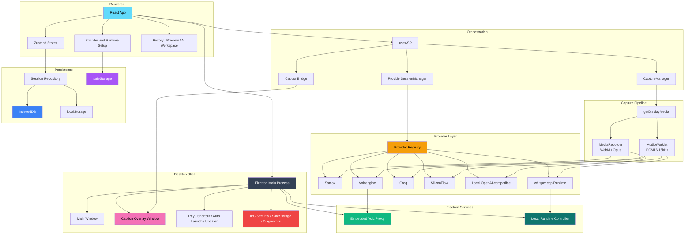

<div align="center">


# DeLive

**System Audio Capture | Multi-Provider ASR | Local-First AI Review Workspace**

English | [简体中文](./README_ZH.md) | [繁體中文](./README_TW.md) | [日本語](./README_JA.md)

[](https://github.com/XimilalaXiang/DeLive/releases)
[](https://github.com/XimilalaXiang/DeLive/blob/main/LICENSE)
[](https://github.com/XimilalaXiang/DeLive/releases)
[](https://github.com/XimilalaXiang/DeLive/releases)
[](https://github.com/XimilalaXiang/DeLive/releases)
[](https://github.com/XimilalaXiang/DeLive/releases)
[](https://github.com/XimilalaXiang/DeLive)
[](https://deepwiki.com/XimilalaXiang/DeLive)
[](https://ximilalaxiang.github.io/DeLive/)

</div>

DeLive is a desktop transcription workspace for system audio. It captures whatever your computer is playing, routes the audio through the ASR backend that fits the job, keeps everything on your machine, and turns completed transcripts into searchable history with a full AI Review Desk — rich Markdown-rendered chat, Q&A threads, structured briefings, and mind maps.

<div align="center">

#

| Live Transcription | Review & History | Topics |
|:---:|:---:|:---:|
| Real-time transcription with floating caption overlay | Session history with activity heatmap and search | Project-based session organization |
|  |  |  |

| AI Overview | AI Chat | Mind Map & Export |
|:---:|:---:|:---:|
| Summary, action items, keywords, and chapters | Multi-thread conversation with cited references | Caption style editor with live preview |
|  |  |  |

| Settings | Caption Overlay |
|:---:|:---:|
| Provider configuration with credential management | Draggable always-on-top floating caption window |
|  |  |

#

</div>

## Table of Contents

- [Core Features](#-core-features)
- [Download](#-download)
- [Supported ASR Providers](#-supported-asr-providers)
- [Quick Start](#-quick-start)
- [Usage](#-usage)
- [Project Map](#-project-map)
- [System Architecture](#-system-architecture)
- [Tech Stack](#-tech-stack)
- [Security](#-security)
- [Open API & MCP Ecosystem](#-open-api--mcp-ecosystem)
- [Extending Providers](#-extending-providers)
- [Notes](#%EF%B8%8F-notes)
- [License](#-license)
- [Acknowledgments](#-acknowledgments)

## 🎯 Core Features

- [x] **System-audio capture** for real desktop use — browser video, live streams, meetings, courses, podcasts, or any other playback source
- [x] **Six ASR backends behind one UI** — Soniox, Volcengine, Groq, SiliconFlow, OpenAI-compatible local services, and local `whisper.cpp`
- [x] **Provider-aware capture pipeline** — auto-switches between `MediaRecorder` and `AudioWorklet` PCM16 capture based on provider requirements
- [x] **Three execution modes** — true realtime streaming, windowed batch retranscription, and Electron-managed local runtime
- [x] **Session lifecycle management** — draft sessions, autosave while recording, interrupted-session recovery, and completed-session history
- [x] **Floating caption overlay** — separate always-on-top window with source / translated / dual display modes and style customization
- [x] **Soniox bilingual & speaker-aware flows** — realtime translation, dual-line captions, diarization tokens, speaker-grouped preview
- [x] **AI Review Desk** — full-page workspace with animated tab navigation (Overview, Transcript, Chat, Mind Map)
- [x] **Rich AI Chat** — multi-thread conversation with GFM Markdown rendering, syntax-highlighted code blocks, hover actions, and more
- [x] **Structured AI briefing** — summary, action items, keywords, chapters, title/tag suggestions, and cited Q&A
- [x] **Mind maps** — generate Markmap-compatible Markdown, edit live, export SVG or PNG
- [x] **Topics** — organize sessions into project-based containers with emoji icons
- [x] **Local model workflows** — detect local services, discover models, pull from Ollama, import/download `whisper.cpp` assets
- [x] **5 color themes** — Cyan, Violet, Rose, Green, Amber — each with full light and dark mode
- [x] **Local-first persistence** — sessions, tags, topics, and settings in IndexedDB/localStorage; secrets via Electron `safeStorage`
- [x] **Desktop integration** — tray, global shortcut, auto-launch, updater, diagnostics export
- [x] **Security hardening** — trusted-window IPC, CSP injection, navigation guard, path allowlist, encrypted secret storage
- [x] **Open API & MCP ecosystem** — local REST API, real-time WebSocket, MCP server for AI agents, token-based authentication, and agent skill definition
- [x] **Cross-platform** — Windows, macOS, and Linux

## 📥 Download

Get the latest release for your platform:

<div align="center">

[](https://github.com/XimilalaXiang/DeLive/releases/latest)
[](https://github.com/XimilalaXiang/DeLive/releases/latest)
[](https://github.com/XimilalaXiang/DeLive/releases/latest)

</div>

| Platform | Files |
|----------|-------|
| Windows | `.exe` installer, portable `.exe` |
| macOS | `.dmg` (Intel x64 and Apple Silicon arm64) |
| Linux | `.AppImage`, `.deb` |

> All downloads are available on the [Releases](https://github.com/XimilalaXiang/DeLive/releases/latest) page.

## 🔌 Supported ASR Providers

| Provider | Type | Transport | Audio path | Highlights |
|----------|------|-----------|------------|------------|
| **Soniox V4** | Cloud | Realtime streaming | `MediaRecorder` (`webm/opus`) → WebSocket | Token-level realtime transcription, realtime translation, bilingual captions, speaker diarization |
| **Volcengine** | Cloud | Realtime streaming | `AudioWorklet` PCM16 → embedded proxy → WebSocket | Chinese-oriented realtime path; proxy injects required headers from Electron |
| **Groq** | Cloud | Windowed batch retranscription | `AudioWorklet` PCM16 → WAV → REST | Whisper `large-v3-turbo` / `large-v3` style flow with quasi-realtime session updates |
| **SiliconFlow** | Cloud | Windowed batch retranscription | `AudioWorklet` PCM16 → WAV → REST | SenseVoice, TeleSpeech, and Qwen Omni-backed transcription flow |
| **Local OpenAI-compatible** | Local service | Windowed batch retranscription | `MediaRecorder` (`webm/opus`) → `/v1/audio/transcriptions` | Works with Ollama or other compatible gateways; supports service/model discovery and optional Ollama pull |
| **Local `whisper.cpp`** | Local runtime | Electron-managed local runtime | `AudioWorklet` PCM16 → local `/inference` | Starts `whisper-server`, manages binary/model assets, and stays fully local |

## 🚀 Quick Start

### Prerequisites

- Node.js 18+ (`release.yml` uses Node 20 in CI)
- One provider path:
  - **Soniox**: API key from [soniox.com](https://soniox.com)
  - **Volcengine**: APP ID and Access Token
  - **Groq**: API key from [groq.com](https://groq.com)
  - **SiliconFlow**: API key from [siliconflow.cn](https://siliconflow.cn)
  - **Local OpenAI-compatible**: local service exposing `/v1/models` and `/v1/audio/transcriptions`
  - **Local `whisper.cpp`**: `whisper-server` plus a local `.bin` or `.gguf` model, or let DeLive import/download them

### Installation

```bash
git clone https://github.com/XimilalaXiang/DeLive.git
cd DeLive
npm run install:all
```

### Development

```bash
npm run dev
```

`npm run dev` starts Vite and Electron together. The Volcengine proxy is embedded in the Electron main process, so normal desktop development does not need a separate backend.

For standalone proxy debugging:

```bash
npm run dev:server
```

### Quality Checks

```bash
npm run check
```

`npm run check` runs frontend lint, frontend tests, and a full app build.

To run just the frontend tests:

```bash
npm run test:frontend
```

Current suite status: **184 tests across 22 files** with coverage around provider config, transcript state/stabilization, subtitle export, session lifecycle/repository, storage, and AI post-process parsing.

### Build

```bash
npm run dist:win
npm run dist:mac
npm run dist:linux
npm run dist:all
```

Artifacts are written to `release/`.

### Optional: Stage `whisper.cpp` Into Packaged Builds

```bash
npm run fetch:whisper-runtime -- --target win32
npm run stage:whisper-runtime -- --binary /path/to/whisper-server --target linux
```

If `local-runtimes/whisper_cpp/whisper-server(.exe)` exists at build time, `electron-builder` packages it as an extra resource. End users can still import or download binaries and models later from the UI.

## 📖 Usage

### Typical Recording Flow

1. Open settings and choose a provider.
2. Fill in credentials or local runtime details, then run **Test Config**.
3. Click **Start Recording**.
4. Pick a screen or window and make sure audio sharing is enabled.
5. Watch partial and final text update in the main window and, optionally, the floating caption overlay.
6. Stop recording and open the saved session from History for review, AI actions, or export.

### Caption Overlay

- Toggle the floating caption window from the main UI.
- Adjust font, colors, width, line count, shadow, and position.
- Switch between source, translated, and dual modes when the provider supplies translation output.
- Use draggable/interactive states to reposition the overlay without closing it.

### Topics

Organize recordings into project-like containers:

1. Open the **Topics** tab from the navigation bar.
2. Create a topic with a name, emoji icon, and optional description.
3. Start recording into a topic in two ways:
   - Click **Record New** on a topic card — jumps to Live with the topic pre-selected.
   - In the Live view, click the **Select Topic** link above the recording controls and pick a topic.
4. The selected topic appears as a badge above the record button. Recordings are assigned automatically.
5. Existing sessions can be moved into (or out of) a topic from the **Overview** tab in Review.
6. Sessions inside a topic are hidden from the default Review list, but global search still finds them.

### AI Review Desk

Completed sessions open in a dedicated full-page Review Desk (not a modal) with an animated sliding tab bar and keyboard arrow navigation:

- **Overview tab**: AI briefing — summary, action items, keywords, chapters, title/tag suggestions, and one-click apply
- **Transcript tab**: Timestamped segments in a left gutter, color-coded speaker badges, consecutive same-speaker merging, hover highlight, and TXT/Markdown/SRT/VTT export
- **Chat tab**: Multi-thread AI conversation — GFM Markdown rendering with syntax-highlighted code blocks (one-click copy), user/AI avatars, hover Copy/Regenerate actions, animated thinking-dots indicator, auto-resizing composer (Enter to send), floating scroll-to-bottom button, and per-thread delete
- **Mind Map tab**: Generate Markmap-compatible Markdown, edit it live, and export SVG or PNG
- **Metadata actions**: apply suggested title/tags and rename speaker labels for diarized sessions

### Local OpenAI-compatible Services

1. Select **Local OpenAI-compatible**.
2. Fill in `Base URL` and `Model`.
3. Use the local-model guide to probe the service and list installed models.
4. If the detected service is Ollama, DeLive can pull the selected model directly from the app.

### Local `whisper.cpp` Runtime

1. Select **Local whisper.cpp**.
2. Prepare the runtime binary by importing an existing `whisper-server` file or downloading a recommended official release asset.
3. Prepare the model by choosing, importing, or downloading a `.bin` / `.gguf` file.
4. Start the runtime or run **Test Config**.
5. Record normally; Electron manages the runtime lifecycle through IPC.

### History, Backup, and Recovery

- Sessions can be renamed, tagged, organized by topic, searched, and exported as TXT, Markdown, SRT, or VTT.
- Recording drafts are autosaved and incomplete sessions can be restored after an interrupted launch.
- Full local data can be exported/imported for backup or migration.
- Diagnostics export generates a redacted JSON bundle with system info and recent logs for troubleshooting.

## 🧩 Project Map

| Area | Key files | Responsibility |
|------|-----------|----------------|
| Desktop shell | `electron/main.ts`, `electron/mainWindow.ts`, `electron/captionWindow.ts`, `electron/tray.ts`, `electron/shortcuts.ts`, `electron/desktopSource.ts`, `electron/autoUpdater.ts`, `electron/ipcSecurity.ts` | Starts Electron, owns native windows, tray behavior, shortcuts, desktop source picking, updater lifecycle, IPC security, and app shutdown. |
| Renderer app | `frontend/src/App.tsx`, `frontend/src/components/*`, `frontend/src/i18n/*` | Main settings, recording, history, topics, preview, and caption-control UI. Workspace view (Live / Review Desk / Topics / Settings) is driven by Zustand. |
| ASR orchestration | `frontend/src/hooks/useASR.ts`, `frontend/src/services/captureManager.ts`, `frontend/src/services/providerSession.ts`, `frontend/src/services/captionBridge.ts` | Resolves provider setup, starts the right audio pipeline, forwards transcript events, and mirrors text to the caption overlay. |
| Provider abstraction | `frontend/src/providers/registry.ts`, `frontend/src/providers/implementations/*` | Normalizes six backends behind one contract and capability model. |
| State management | `frontend/src/stores/sessionStore.ts`, `frontend/src/stores/topicStore.ts`, `frontend/src/stores/uiStore.ts`, `frontend/src/stores/settingsStore.ts`, `frontend/src/stores/tagStore.ts`, `frontend/src/stores/transcriptStore.ts` | Zustand store slices for sessions, topics, UI state, settings, tags, and a unified facade for backward compatibility. |
| Session intelligence | `frontend/src/services/aiPostProcess.ts`, `frontend/src/components/ReviewDeskView.tsx`, `frontend/src/components/PreviewModal.tsx` | AI briefing, Q&A, mind maps, tagging, and speaker label editing. |
| Topics | `frontend/src/components/TopicsView.tsx`, `frontend/src/components/TopicDetailView.tsx`, `frontend/src/components/TopicDialog.tsx`, `frontend/src/components/TopicPicker.tsx` | Card-grid topic browser, per-topic session list, CRUD dialogs, and Live-view topic selection. |
| Review Desk UI | `frontend/src/components/review/SessionTabBar.tsx`, `frontend/src/components/review/SessionHeader.tsx`, `frontend/src/components/review/OverviewTab.tsx`, `frontend/src/components/review/TranscriptTab.tsx`, `frontend/src/components/review/ChatTab.tsx`, `frontend/src/components/review/MindMapTab.tsx`, `frontend/src/components/review/MarkdownRenderer.tsx` | Animated tab bar with keyboard navigation, session header with multi-format export (TXT/Markdown/SRT/VTT), per-tab content views, GFM Markdown rendering with syntax highlighting, and mind map editing. |
| Settings UI | `frontend/src/components/settings/ServiceSettingsPanel.tsx`, `frontend/src/components/settings/GeneralSettingsPanel.tsx` | Provider credential configuration and general app settings (language, theme, AI config, backup/restore). |
| Runtime UI | `frontend/src/components/runtime/BundledRuntimeSummaryCard.tsx`, `frontend/src/components/runtime/BundledRuntimeAdvancedPanel.tsx` | Status card and advanced panel for managing bundled `whisper.cpp` runtime assets. |
| Shared UI system | `frontend/src/components/ui/*` | Button, Badge, Switch, EmptyState, StatusIndicator, DialogShell primitives with semantic color tokens across five themes. |
| Local model/runtime tooling | `frontend/src/utils/localModelSetup.ts`, `frontend/src/utils/localRuntimeManager.ts`, `frontend/src/components/LocalModelSetupGuide.tsx`, `frontend/src/components/BundledRuntimeSetupGuide.tsx`, `electron/localRuntime.ts`, `electron/localRuntimeFiles.ts`, `electron/localRuntimeShared.ts`, `electron/localRuntimeIpc.ts` | Detects local services, checks models, supports Ollama pull, imports/downloads `whisper.cpp` assets, manages runtime files, and starts/stops the local runtime. |
| Electron IPC layer | `electron/appIpc.ts`, `electron/captionIpc.ts`, `electron/safeStorageIpc.ts`, `electron/updaterIpc.ts`, `electron/diagnosticsIpc.ts`, `electron/apiIpc.ts` | Modular IPC handlers for app lifecycle, caption window control, secret storage, auto-update, diagnostics, and Open API data bridge. |
| Open API layer | `electron/apiServer.ts`, `electron/apiBroadcast.ts`, `frontend/src/hooks/useApiIpcResponder.ts` | REST API endpoints, WebSocket live transcript broadcasting, and renderer-side IPC responder for session data queries. |
| MCP & agent ecosystem | `mcp/delive-mcp-server.js`, `skills/delive-transcript-analyzer/SKILL.md` | Standalone MCP server exposing DeLive as tools/resources and agent skill definition. |
| Shared contracts | `shared/electronApi.ts`, `electron/preload.ts`, `shared/volcProxyCore.ts` | Typed bridge between renderer and main process plus shared protocol helpers for the embedded Volcengine proxy. |
| Debug and release support | `server/`, `scripts/`, `.github/workflows/release.yml`, `.github/workflows/ci.yml` | Standalone Volc proxy debugging, icon/runtime staging scripts, continuous integration, and tagged multi-platform release builds. |
| Design references | `design-system/delive/MASTER.md` | Product and visual reference material used during UI iteration. Not part of the runtime path. |

## 🔄 Recording Lifecycle

1. `App.tsx` initializes storage, theme, settings, tags, and saved sessions.
2. `useASR` asks `ProviderSessionManager` to resolve the selected provider's capabilities and connect.
3. `CaptureManager` requests system audio through `getDisplayMedia` and chooses either `MediaRecorder` or `AudioWorklet` PCM16 capture.
4. Provider events flow into `sessionStore`, while `CaptionBridge` mirrors stable and non-final text to the floating caption window.
5. `sessionStore` builds session snapshots, autosaves drafts, and restores interrupted work on next launch.
6. Completed sessions open in the preview workspace for transcript review, AI briefing, Q&A, mind map generation, tagging, and export.

## 🏗 System Architecture



### Architecture Overview

| Layer | Main components | Notes |
|-------|-----------------|-------|
| Desktop shell | Electron main process, main window, caption window, tray, updater, diagnostics | Owns native lifecycle, source picking, caption overlay, and OS integration. |
| Renderer | React UI, Zustand stores, history/preview workspace, topics, settings panels | Handles recording flow, configuration, topic management, session review, and user actions. |
| Orchestration | `useASR`, `CaptureManager`, `ProviderSessionManager`, `CaptionBridge` | Keeps provider logic separate from capture and UI. |
| Provider layer | Registry plus 6 implementations | Unifies realtime cloud, windowed batch cloud, local service, and local runtime flows. |
| Electron services | Embedded Volc proxy, local runtime controller, safe-storage IPC, diagnostics IPC | Provides features that the browser environment cannot do directly. |
| Persistence | Session repository, IndexedDB, localStorage, `safeStorage` | Autosaves drafts, restores interrupted sessions, and stores secrets separately from general settings. |
| Shared contracts | Typed preload bridge and shared helper modules | Keeps renderer/main contracts explicit and safer to evolve. |

## 📁 Project Structure

```text
DeLive/
├── electron/                         # Electron main process, windows, tray, IPC, updater, runtime control, Open API server
├── frontend/                         # React renderer app, providers, stores, UI components, tests
├── shared/                           # Shared TypeScript contracts for preload/renderer/main and proxy helpers
├── server/                           # Standalone Volcengine proxy used mainly for debugging
├── mcp/                              # Standalone MCP server for AI agents (Claude, Cursor, etc.)
├── skills/                           # Agent skill definitions
├── local-runtimes/                   # Optional packaged runtime assets (for whisper.cpp staging)
├── scripts/                          # Icon generation, runtime fetch/stage, release notes
├── design-system/                    # Design reference material
├── assets/                           # README and branding assets
├── build/                            # Electron-builder icons and packaging resources
├── .github/workflows/ci.yml          # Push/PR continuous integration pipeline
├── .github/workflows/release.yml     # Tag-triggered quality + release pipeline
├── README.md
└── package.json
```

Generated outputs such as `dist-electron/`, `release/`, and dependency folders are omitted here.

## 🔧 Tech Stack

| Layer | Technology |
|-------|------------|
| Desktop app | Electron 40 |
| Frontend | React 18.3 + TypeScript 5.6 + Vite 6 |
| Styling | Tailwind CSS 3.4 |
| State management | Zustand 4.5 |
| Testing | Vitest 4 |
| Audio processing | `MediaRecorder`, `AudioWorklet`, WAV conversion utilities |
| Desktop services | Electron main-process IPC, Express, `ws` |
| Persistence | IndexedDB, localStorage, Electron `safeStorage` |
| AI review | OpenAI-compatible chat completions for briefing, Q&A, and mind maps |
| Packaging | `electron-builder` |
| Release automation | GitHub Actions tag workflow |

## 🔒 Security

| Feature | Description |
|---------|-------------|
| Context isolation | `contextIsolation: true`, `nodeIntegration: false` |
| Trusted IPC senders | Sensitive handlers verify the caller belongs to a registered trusted window |
| Content Security Policy | CSP is injected at the Electron layer and allows only the required connect targets |
| Navigation guard | Unexpected renderer navigation is blocked |
| Path allowlist | File-path checks are limited to safe roots such as `userData`, home, desktop, downloads, and documents |
| Secret storage | API keys are stored through Electron `safeStorage` when OS encryption is available |
| Open API gating | Local REST API and WebSocket are disabled by default; optional Bearer token authentication when enabled |
| Diagnostics hygiene | Exported diagnostics redact secret-looking fields before writing the JSON bundle |

## ⌨️ Keyboard Shortcut

| Shortcut | Function |
|----------|----------|
| `Ctrl+Shift+D` / `Cmd+Shift+D` | Show or hide the main window |

## 🌐 Open API & MCP Ecosystem

DeLive exposes its transcription data through a local API, enabling external tools, scripts, and AI agents to programmatically access session history, live captions, and recording status.

### Enabling the API

1. Go to **Settings > General > Open API**.
2. Toggle **Enable Open API** to on.
3. Optionally set an **Access Token** for authentication (recommended).

### REST API

When enabled, the following endpoints are available at `http://localhost:23456/api/v1/`:

| Endpoint | Description |
|----------|-------------|
| `GET /health` | Health check (always accessible, even when API is disabled) |
| `GET /sessions` | List sessions with search, filter, and pagination |
| `GET /sessions/:id` | Full session detail including transcript and AI summary |
| `GET /sessions/:id/transcript` | Plain text transcript only |
| `GET /sessions/:id/summary` | AI summary, action items, and mind map |
| `GET /topics` | List all topics |
| `GET /tags` | List all tags |
| `GET /status` | Current recording status |

If a token is set, include it as `Authorization: Bearer <token>`.

### WebSocket

Real-time transcript streaming is available at `ws://localhost:23456/ws/live`. Authenticate via `?token=<token>` query parameter or `Authorization` header.

### MCP Server

A standalone MCP server (`mcp/delive-mcp-server.js`) exposes DeLive's API as tools and resources for AI agents. It uses **stdio** transport and works with any MCP-compatible client.

Before configuring, install the MCP server dependencies:

```bash
cd mcp && npm install
```

#### Claude Desktop / Claude Code

Add to `claude_desktop_config.json`:

```json
{
  "mcpServers": {
    "delive": {
      "command": "node",
      "args": ["C:/path/to/DeLive/mcp/delive-mcp-server.js"],
      "env": {
        "DELIVE_API_URL": "http://localhost:23456",
        "DELIVE_API_TOKEN": "your-token-from-settings"
      }
    }
  }
}
```

#### Cursor

Add to `.cursor/mcp.json` (project-level) or `~/.cursor/mcp.json` (global):

```json
{
  "mcpServers": {
    "delive": {
      "command": "node",
      "args": ["C:/path/to/DeLive/mcp/delive-mcp-server.js"],
      "env": {
        "DELIVE_API_URL": "http://localhost:23456",
        "DELIVE_API_TOKEN": "your-token-from-settings"
      }
    }
  }
}
```

#### Cherry Studio

1. Open **Settings > MCP Servers > Add**.
2. Select **stdio** type.
3. Fill in:
   - **Command**: `node`
   - **Args**: `C:/path/to/DeLive/mcp/delive-mcp-server.js`
   - **Env**: `DELIVE_API_URL=http://localhost:23456`, `DELIVE_API_TOKEN=your-token`
4. Save and enable.

#### OpenAI Codex CLI / Other MCP Clients

Any MCP client that supports stdio transport can use the same pattern:

```bash
DELIVE_API_URL=http://localhost:23456 \
DELIVE_API_TOKEN=your-token \
node /path/to/DeLive/mcp/delive-mcp-server.js
```

| Variable | Default | Description |
|----------|---------|-------------|
| `DELIVE_API_URL` | `http://localhost:23456` | DeLive REST API base URL |
| `DELIVE_API_TOKEN` | *(empty)* | Bearer token for authentication |

> **Note**: DeLive must be running with **Open API enabled** for the MCP server to function. Set the token in DeLive **Settings > General > Open API**.

See [`mcp/`](./mcp/) for the full tools and resources reference.

### Agent Skill

An agent skill definition is available at [`skills/delive-transcript-analyzer/SKILL.md`](./skills/delive-transcript-analyzer/SKILL.md), providing structured guidance for AI agents to use DeLive's capabilities.

## 🔧 Extending Providers

1. Add a provider implementation under `frontend/src/providers/implementations/`.
2. Define accurate `ASRProviderInfo` metadata, required fields, and capability flags.
3. Register the provider in `frontend/src/providers/registry.ts`.
4. Add config-test logic in `frontend/src/utils/providerConfigTest.ts` if the provider supports validation.
5. For local-service or local-runtime flows, wire model/runtime helpers in `frontend/src/utils/localModelSetup.ts` or `frontend/src/utils/localRuntimeManager.ts`.
6. If the provider needs custom headers or native process control, add the Electron-side support in `electron/`.

## ⚠️ Notes

1. **System requirements**: Windows 10+, macOS 13+, or Linux with PulseAudio loopback support.
2. **Volcengine proxy**: normal desktop usage does not require a separate backend process; Electron starts the proxy internally.
3. **Local OpenAI-compatible mode**: discovery expects `/v1/models`, while transcription expects `/v1/audio/transcriptions`.
4. **`whisper.cpp` mode**: packaged binaries are optional; users can also import or download runtime assets later.
5. **Tray behavior**: closing the main window hides to tray instead of exiting the app.
6. **Auto-launch**: currently supported on Windows and macOS.
7. **Auto-update**: supported on Windows, macOS, and Linux AppImage builds.

### 🛡️ Windows SmartScreen Warning

Windows may show a SmartScreen warning the first time you launch DeLive. That is expected for unsigned or newly distributed apps.

1. Click **More info**.
2. Click **Run anyway**.

You can also inspect the source code directly and verify released binaries independently.

## 📄 License

Apache License 2.0

## 🙏 Acknowledgments

- [Soniox](https://soniox.com) for realtime speech recognition APIs
- [Volcengine](https://www.volcengine.com) for Chinese-focused speech recognition
- [Groq](https://groq.com) for high-performance Whisper inference
- [SiliconFlow](https://siliconflow.cn) for speech and multimodal ASR services
- [Ollama](https://ollama.com) for local model workflows
- [`whisper.cpp`](https://github.com/ggml-org/whisper.cpp) for local open-source runtime support
- [BiBi-Keyboard](https://github.com/BryceWG/BiBi-Keyboard) for multi-provider architecture inspiration

---

<div align="center">

[](https://www.star-history.com/#XimilalaXiang/DeLive&type=date&legend=top-left)

**Made by [XimilalaXiang](https://github.com/XimilalaXiang)**

</div>
