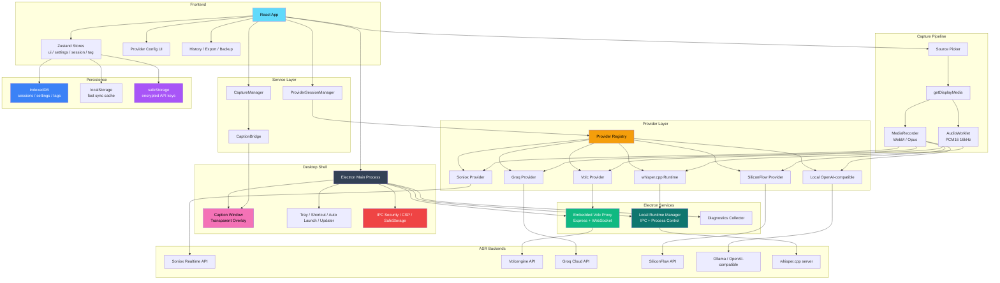

<div align="center">

# DeLive

**System-Level Audio Capture | Cloud and Local ASR in One Desktop App**

English | [简体中文](./README_ZH.md) | [繁體中文](./README_TW.md) | [日本語](./README_JA.md)

[](https://github.com/XimilalaXiang/DeLive/releases)
[](https://github.com/XimilalaXiang/DeLive/blob/main/LICENSE)
[](https://github.com/XimilalaXiang/DeLive/releases)
[](https://github.com/XimilalaXiang/DeLive/releases)
[](https://github.com/XimilalaXiang/DeLive/releases)
[](https://github.com/XimilalaXiang/DeLive/releases)
[](https://github.com/XimilalaXiang/DeLive)

[Core Features](#-core-features) • [Quick Start](#-quick-start) • [Architecture](#-system-architecture) • [Providers](#-supported-asr-providers)

</div>

DeLive captures system audio output directly. If your computer can play the sound, DeLive can capture it, feed it into the ASR backend you choose, and keep the resulting transcript on your machine for review, export, and reuse.

<div align="center">

</div>

## 🎯 Core Features

- **System-level audio capture** for browser video, live streams, meetings, courses, and any other playback source that exposes shareable system audio.
- **6 ASR backends** in one app: Soniox, Volcengine, Groq, SiliconFlow, OpenAI-compatible local services, and `whisper.cpp`.
- **Provider-aware audio pipeline** that switches between `MediaRecorder` and `AudioWorklet`-based PCM16 processing based on backend requirements.
- **Local model workflows** including service detection, installed-model discovery, optional Ollama one-click pull, and `whisper.cpp` binary/model import or download.
- **Floating caption overlay** with always-on-top transparent window, draggable mode, and style customization.
- **Soniox bilingual captions and speaker-aware transcript views** with source / translated / dual-line display modes and speaker-grouped history preview.
- **History, tags, search, and export** with TXT / SRT / VTT in the current UI.
- **Desktop integration** with tray behavior, global shortcut, auto-launch, update checks, and bilingual UI (Chinese / English).
- **Security hardening** with IPC sender verification, Content Security Policy, navigation guard, path allowlists, and API key encryption via OS-level `safeStorage`.
- **One-click diagnostics export** for troubleshooting, collecting system info, redacted config, and recent logs into a single JSON file.

## 🏗️ System Architecture



### Architecture Overview

| Layer | Main Components | Notes |
|-------|-----------------|-------|
| Desktop shell | Electron main process, tray, updater, caption window, IPC security, diagnostics | Owns native desktop behavior, IPC, and OS-level encryption |
| Frontend | React, Zustand (4 stores), provider config UI, history/export UI | Manages recording flow, settings, session state |
| Service layer | `CaptureManager`, `CaptionBridge`, `ProviderSessionManager` | Decomposed from monolithic hooks for single-responsibility |
| Capture pipeline | `getDisplayMedia`, `MediaRecorder`, `AudioWorklet` processor | Picks encoding path based on provider capability |
| Provider layer | Registry + 6 provider implementations | Normalizes cloud and local ASR usage behind one interface |
| Electron services | Embedded Volc proxy, bundled runtime manager, diagnostics collector | Handles custom-header WebSocket proxying, local process lifecycle, and diagnostics |
| Persistence | IndexedDB (primary) + localStorage (sync cache) + safeStorage (secrets) | Dual-write with auto-restore; API keys encrypted via OS keychain |

## 🔌 Supported ASR Providers

| Provider | Type | Audio Path | Highlights |
|----------|------|------------|------------|
| **Soniox V4** | Cloud | `MediaRecorder` → WebSocket | Token-level realtime transcription, real-time translation, bilingual captions, speaker diarization |
| **Volcengine** | Cloud | PCM16 → embedded proxy → WebSocket | Chinese-optimized flow, proxy handles required headers |
| **Groq** | Cloud | `MediaRecorder` → REST API | Whisper large-v3-turbo / large-v3 via Groq, session-based retranscription |
| **SiliconFlow** | Cloud | `MediaRecorder` → REST API | SenseVoice, TeleSpeech, Qwen Omni models, session-based retranscription |
| **Local OpenAI-compatible** | Local service | `MediaRecorder` → `/v1/audio/transcriptions` | Works with Ollama or compatible gateways, model discovery and optional Ollama pull |
| **Local whisper.cpp** | Local runtime | PCM16 → local `/inference` | Bundled or user-imported `whisper-server` binary with `.bin` / `.gguf` models |

## 🚀 Quick Start

### Prerequisites

- Node.js 18+
- Choose one backend path:
  - **Soniox**: API key from [soniox.com](https://soniox.com)
  - **Volcengine**: APP ID and Access Token
  - **Groq**: API key from [groq.com](https://groq.com)
  - **SiliconFlow**: API key from [siliconflow.cn](https://siliconflow.cn)
  - **Local OpenAI-compatible**: a service exposing `/v1/models` and `/v1/audio/transcriptions` (e.g., Ollama)
  - **Local whisper.cpp**: a `whisper-server` binary plus a local model file, or let DeLive download/import them

### Installation

```bash
git clone https://github.com/XimilalaXiang/DeLive.git
cd DeLive
npm run install:all
```

### Development

```bash
npm run dev
```

`npm run dev` starts Vite and Electron together. The Volcengine proxy is embedded in the Electron main process — no separate backend needed.

For standalone proxy debugging:

```bash
npm run dev:server
```

### Build

```bash
npm run dist:win     # Windows (NSIS installer + portable)
npm run dist:mac     # macOS (DMG + zip, x64 + arm64)
npm run dist:linux   # Linux (AppImage + deb)
npm run dist:all     # All platforms
```

Artifacts are written to `release/`.

### Testing

```bash
cd frontend && npm test
```

Runs 155 unit tests via Vitest covering provider config, subtitle export, transcript stabilization, windowed batching, storage utilities, and the base ASR provider event system.

### Optional: Stage `whisper.cpp` Into Packaged Builds

```bash
npm run fetch:whisper-runtime -- --target win32
npm run stage:whisper-runtime -- --binary /path/to/whisper-server --target linux
```

If `local-runtimes/whisper_cpp/whisper-server(.exe)` exists at build time, `electron-builder` packages it as an extra resource. End users can still import or download binaries and models later from the UI.

## 📖 Usage

### Cloud Providers

1. Open settings and pick a cloud provider (Soniox V4, Volcengine, Groq, or SiliconFlow).
2. Enter the required credentials and run **Test Config**.
3. Click **Start Recording**.
4. Choose a screen or window and make sure audio sharing is enabled.
5. Watch partial and final transcripts update in the main window or caption overlay. With Soniox, you can also use translated / dual-line caption modes and speaker-grouped transcript views.

### Local OpenAI-compatible Services

1. Select **Local OpenAI-compatible**.
2. Fill in **Base URL** and **Model**.
3. Use the local setup guide to detect the service and list installed models.
4. If the detected service is Ollama, you can pull the selected model directly from the app.

### Local `whisper.cpp` Runtime

1. Select **Local whisper.cpp**.
2. Prepare a runtime binary by importing an existing `whisper-server` file or downloading a recommended official asset.
3. Prepare a model by selecting, importing, or downloading a local `.bin` or `.gguf` file.
4. Start the runtime or run **Test Config**.
5. Record normally; DeLive will launch and talk to the local runtime through Electron IPC.

### Captions, History, and Export

- Toggle the floating caption window and adjust font, colors, size, width, shadow, and position.
- With Soniox, switch captions between source, translated, and dual-line modes, and review speaker-grouped transcript segments in history preview.
- Review saved sessions in the history panel, rename them, and organize them with tags.
- Export transcripts as TXT, SRT, or VTT from the current UI.
- Import or export all local data from the settings panel for backup or migration.

### Diagnostics

If something goes wrong, open **Settings → General → Diagnostics** and click **Export Diagnostics**. This generates a JSON file with system info, redacted config, and recent logs that you can share for troubleshooting.

## 📁 Project Structure

```text
DeLive/
├── electron/                         # Electron main process and IPC
│   ├── main.ts                       # App entry, window creation, IPC wiring
│   ├── preload.ts                    # Context bridge (renderer-safe API surface)
│   ├── mainWindow.ts                 # Main window creation, CSP injection
│   ├── captionWindow.ts              # Floating caption overlay controller
│   ├── captionIpc.ts                 # IPC handlers for caption operations
│   ├── appIpc.ts                     # App-level IPC (version, tray, auto-launch, file picker)
│   ├── desktopSource.ts              # getDisplayMedia handler for screen/window capture
│   ├── volcProxy.ts                  # Embedded Express + WebSocket proxy for Volcengine
│   ├── localRuntime.ts               # whisper.cpp runtime controller (start/stop/import/download)
│   ├── localRuntimeIpc.ts            # IPC handlers for local runtime operations
│   ├── autoUpdater.ts                # electron-updater setup
│   ├── updaterIpc.ts                 # IPC for update checks and downloads
│   ├── ipcSecurity.ts                # Trusted-window verification, CSP, navigation guard, path allowlist
│   ├── safeStorageIpc.ts             # API key encryption via Electron safeStorage
│   ├── diagnosticsIpc.ts             # Log interceptor and diagnostics bundle export
│   ├── tray.ts                       # System tray icon and menu
│   └── shortcuts.ts                  # Global keyboard shortcuts
├── frontend/
│   ├── caption.html                  # Caption overlay window entry
│   ├── src/
│   │   ├── components/               # UI components
│   │   ├── hooks/                    # useASR — ASR orchestration hook
│   │   ├── services/                 # CaptureManager, CaptionBridge, ProviderSessionManager
│   │   ├── providers/                # Provider registry + 6 implementations
│   │   ├── stores/                   # Zustand stores (ui, settings, session, tag)
│   │   ├── utils/                    # Audio, storage, provider config, subtitle export, etc.
│   │   ├── types/                    # ASR types and vendor-specific type definitions
│   │   └── i18n/                     # UI translations (Chinese, English)
│   ├── public/                       # Static assets (AudioWorklet processor, favicon)
│   └── vitest.config.ts              # Test configuration
├── local-runtimes/
│   └── whisper_cpp/                  # Optional packaged whisper.cpp runtime assets
├── scripts/                          # Icon generation, runtime fetching/staging, release notes
├── server/                           # Standalone Volcengine proxy for debugging
├── .github/workflows/release.yml     # CI/CD: tag-release pipeline (regular push/PR CI pending)
└── package.json
```

## 🔧 Tech Stack

| Layer | Technology |
|-------|------------|
| Desktop app | Electron 40 |
| Frontend | React 18 + TypeScript 5.6 + Vite 6 |
| Styling | Tailwind CSS 3.4 |
| State management | Zustand 4.5 (4 focused stores) |
| Testing | Vitest 4 (155 unit tests) |
| Audio processing | AudioWorklet (with ScriptProcessorNode fallback) |
| Desktop services | Express + ws inside Electron |
| Persistence | IndexedDB + localStorage + Electron safeStorage |
| ASR backends | Soniox V4, Volcengine, Groq, SiliconFlow, OpenAI-compatible local, whisper.cpp |
| Packaging | electron-builder (NSIS / DMG / AppImage) |
| CI/CD | GitHub Actions (tag-release pipeline) |

## 🔒 Security

| Feature | Description |
|---------|-------------|
| Context isolation | `contextIsolation: true`, `nodeIntegration: false` |
| IPC sender verification | All sensitive IPC handlers validate the caller is a trusted window |
| Content Security Policy | CSP injected via `webRequest.onHeadersReceived` with safe `connect-src` for local models |
| Navigation guard | `will-navigate` blocks unexpected URL loads |
| Path allowlist | `path-exists` IPC restricted to safe directories (userData, home, desktop, etc.) |
| API key encryption | Secrets stored via Electron `safeStorage` (Windows DPAPI / macOS Keychain) |

## ⌨️ Keyboard Shortcut

| Shortcut | Function |
|----------|----------|
| `Ctrl+Shift+D` / `Cmd+Shift+D` | Show or hide the main window |

## 🔧 Extending Providers

1. Add a provider implementation under `frontend/src/providers/implementations/`.
2. Define accurate `ASRProviderInfo` metadata, required fields, and capability flags.
3. Register the provider in `frontend/src/providers/registry.ts`.
4. Add config-test logic in `frontend/src/utils/providerConfigTest.ts` if the provider supports validation.
5. For local-service or local-runtime flows, wire model/runtime helpers in `frontend/src/utils/localModelSetup.ts` or `frontend/src/utils/localRuntimeManager.ts`.
6. If the provider needs custom headers or native process control, add a dedicated IPC module in `electron/`.

## ⚠️ Notes

1. **System requirements**: Windows 10+, macOS 13+, or Linux with PulseAudio loopback support.
2. **Volcengine proxy**: normal desktop usage does not require a separate backend process; Electron starts the proxy internally.
3. **Local OpenAI-compatible mode**: discovery expects both `/v1/models` and `/v1/audio/transcriptions`.
4. **`whisper.cpp` mode**: packaged binaries are optional; users can also import or download binaries and models at runtime.
5. **Tray behavior**: closing the main window minimizes to tray; use the tray menu to exit fully.
6. **Auto-launch**: supported on Windows and macOS.
7. **Auto-update**: supported on Windows, macOS, and Linux AppImage builds.

### 🛡️ Windows SmartScreen Warning

Windows may show a SmartScreen warning the first time you launch DeLive. That is expected for unsigned or newly distributed apps.

1. Click **More info**.
2. Click **Run anyway**.

You can also inspect the source code directly and verify released binaries independently.

## 📄 License

Apache License 2.0

## 🙏 Acknowledgments

- [Soniox](https://soniox.com) for realtime speech recognition APIs
- [Volcengine](https://www.volcengine.com) for Chinese-focused speech recognition
- [Groq](https://groq.com) for high-performance Whisper inference
- [SiliconFlow](https://siliconflow.cn) for SenseVoice and multimodal ASR
- [Ollama](https://ollama.com) for local model workflows
- [`whisper.cpp`](https://github.com/ggml-org/whisper.cpp) for local open-source runtime support
- [BiBi-Keyboard](https://github.com/BryceWG/BiBi-Keyboard) for multi-provider architecture inspiration

---

<div align="center">

[](https://www.star-history.com/#XimilalaXiang/DeLive&type=date&legend=top-left)

**Made by [XimilalaXiang](https://github.com/XimilalaXiang)**

</div>
