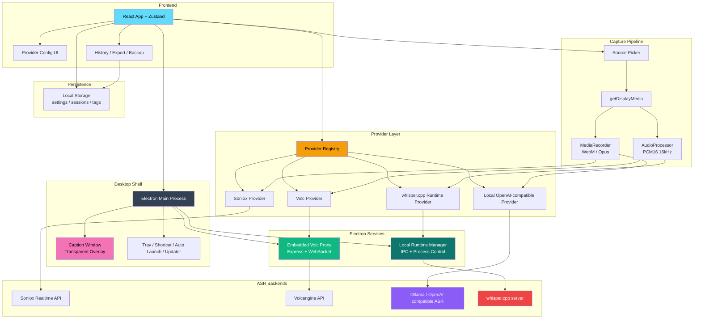

<div align="center">

# DeLive

**System-Level Audio Capture | Cloud and Local ASR in One Desktop App**

English | [简体中文](./README_ZH.md) | [繁體中文](./README_TW.md) | [日本語](./README_JA.md)

[](https://github.com/XimilalaXiang/DeLive/releases)
[](https://github.com/XimilalaXiang/DeLive/blob/main/LICENSE)
[](https://github.com/XimilalaXiang/DeLive/releases)
[](https://github.com/XimilalaXiang/DeLive/releases)
[](https://github.com/XimilalaXiang/DeLive/releases)
[](https://github.com/XimilalaXiang/DeLive/releases)
[](https://github.com/XimilalaXiang/DeLive)

[Core Features](#-core-features) • [Quick Start](#-quick-start) • [Architecture](#-system-architecture) • [Providers](#-supported-asr-providers)

</div>

DeLive captures system audio output directly. If your computer can play the sound, DeLive can capture it, feed it into the ASR backend you choose, and keep the resulting transcript on your machine for review, export, and reuse.

<div align="center">

</div>

## 🎯 Core Features

- **System-level audio capture** for browser video, live streams, meetings, courses, and any other playback source that exposes shareable system audio.
- **Cloud and local ASR backends** in one app: Soniox, Volcengine, OpenAI-compatible local services, and experimental `whisper.cpp`.
- **Provider-aware audio pipeline** that switches between `MediaRecorder` and PCM16 processing based on backend requirements.
- **Local model workflows** including service detection, installed-model discovery, optional Ollama one-click pull, and `whisper.cpp` binary/model import or download.
- **Floating caption overlay** with always-on-top transparent window, draggable mode, and style customization.
- **History, tags, search, and export** with TXT and SRT output.
- **Desktop integration** with tray behavior, global shortcut, auto-launch, update checks, and bilingual UI.

## 🏗️ System Architecture



### Architecture Overview

| Layer | Main Components | Notes |
|-------|-----------------|-------|
| Desktop shell | Electron main process, tray, updater, caption window | Owns native desktop behavior and IPC |
| Frontend | React, Zustand, provider config UI, history/export UI | Manages recording flow, settings, session state |
| Capture pipeline | `getDisplayMedia`, `MediaRecorder`, `AudioProcessor` | Picks encoding path based on provider capability |
| Provider layer | Registry + 4 provider implementations | Normalizes cloud and local ASR usage behind one interface |
| Electron services | Embedded Volc proxy, bundled runtime manager | Handles custom-header WebSocket proxying and local process lifecycle |
| Persistence | Browser local storage | Stores settings, transcript sessions, and tags locally |

## 🔌 Supported ASR Providers

| Provider | Type | Audio Path | Highlights |
|----------|------|------------|------------|
| **Soniox V4** | Cloud | `MediaRecorder` -> WebSocket | Token-level realtime transcription, multi-language |
| **Volcengine** | Cloud | PCM16 -> embedded proxy -> WebSocket | Chinese-optimized flow, proxy handles required headers |
| **Local OpenAI-compatible** | Local service | `MediaRecorder` -> `/v1/audio/transcriptions` | Works with Ollama or compatible gateways, model discovery and optional Ollama pull |
| **Local whisper.cpp** | Local runtime | PCM16 -> local `/inference` | Experimental; can import/download `whisper-server` binaries and local `.bin` / `.gguf` models |

## 🚀 Quick Start

### Prerequisites

- Node.js 18+
- Choose one backend path:
  - Soniox API key
  - Volcengine APP ID and Access Token
  - A local OpenAI-compatible ASR service that exposes `/v1/models` and `/v1/audio/transcriptions`
  - A `whisper.cpp` server binary plus a local model file, or let DeLive download/import them from the setup guide

### Installation

```bash
git clone https://github.com/XimilalaXiang/DeLive.git
cd DeLive
npm run install:all
```

### Development

```bash
npm run dev
```

`npm run dev` starts Vite and Electron together. The Volcengine proxy used by the desktop app is already embedded in `electron/main.ts`.

If you need the standalone proxy for debugging or non-Electron experiments, run:

```bash
npm run dev:server
```

### Build

```bash
npm run dist:win
npm run dist:mac
npm run dist:linux
```

Artifacts are written to `release/`.

### Optional: Stage `whisper.cpp` Into Packaged Builds

```bash
# Fetch an official release asset and stage it into local-runtimes/whisper_cpp/
npm run fetch:whisper-runtime -- --target win32

# Or stage your own binary explicitly
npm run stage:whisper-runtime -- --binary /path/to/whisper-server --target linux
```

If `local-runtimes/whisper_cpp/whisper-server(.exe)` exists at build time, `electron-builder` packages it as an extra resource. End users can still import or download binaries and models later from the UI.

## 📖 Usage

### Cloud Providers

1. Open settings and pick `Soniox V4` or `Volcengine`.
2. Enter the required credentials and run `Test Config`.
3. Click `Start Recording`.
4. Choose a screen or window and make sure audio sharing is enabled.
5. Watch partial and final transcripts update in the main window or caption overlay.

### Local OpenAI-compatible Services

1. Select `Local OpenAI-compatible`.
2. Fill in `Base URL` and `Model`.
3. Use the local setup guide to detect the service and list installed models.
4. If the detected service is Ollama, you can pull the selected model directly from the app.

### Local `whisper.cpp` Runtime

1. Select `Local whisper.cpp`.
2. Prepare a runtime binary by importing an existing `whisper-server` file or downloading a recommended official asset.
3. Prepare a model by selecting, importing, or downloading a local `.bin` or `.gguf` file.
4. Start the runtime or run `Test Config`.
5. Record normally; DeLive will launch and talk to the local runtime through Electron IPC.

### Captions, History, and Export

- Toggle the floating caption window and adjust font, colors, size, width, shadow, and position.
- Review saved sessions in the history panel, rename them, and organize them with tags.
- Export transcripts as TXT or SRT.
- Import or export all local data from the settings panel for backup or migration.

## 📁 Project Structure

```text
DeLive/
├── electron/                       # Electron main process and IPC bridge
│   ├── main.ts                     # Embedded proxy, runtime manager, tray, updater
│   └── preload.ts                  # Renderer-safe Electron API surface
├── frontend/
│   ├── caption.html                # Separate entry for the caption overlay window
│   ├── src/
│   │   ├── components/             # UI panels and setup guides
│   │   ├── hooks/                  # Recording and ASR orchestration
│   │   ├── providers/              # Registry + provider implementations
│   │   ├── stores/                 # Zustand transcript/settings store
│   │   ├── utils/                  # Audio, storage, provider, local-runtime helpers
│   │   └── i18n/                   # UI translations
├── local-runtimes/
│   └── whisper_cpp/                # Optional packaged whisper.cpp runtime assets
├── scripts/                        # Runtime staging/fetching and asset scripts
├── server/                         # Standalone proxy server for debugging / experiments
└── package.json
```

## 🔧 Tech Stack

| Layer | Technology |
|-------|------------|
| Desktop app | Electron 40 |
| Frontend | React 18 + TypeScript + Vite |
| Styling | Tailwind CSS |
| State | Zustand |
| Desktop services | Express + ws inside Electron |
| ASR backends | Soniox V4, Volcengine, OpenAI-compatible local ASR, `whisper.cpp` |
| Packaging | electron-builder |

## ⌨️ Keyboard Shortcut

| Shortcut | Function |
|----------|----------|
| `Ctrl+Shift+D` / `Cmd+Shift+D` | Show or hide the main window |

## 🔧 Extending Providers

1. Add a provider implementation under `frontend/src/providers/implementations/`.
2. Define accurate `ASRProviderInfo` metadata, required fields, and capability flags.
3. Register the provider in `frontend/src/providers/registry.ts`.
4. Add config-test logic in `frontend/src/utils/providerConfigTest.ts` if the provider supports validation.
5. For local-service or local-runtime flows, wire model/runtime helpers in `frontend/src/utils/localModelSetup.ts` or `frontend/src/utils/localRuntimeManager.ts`.
6. If the provider needs custom headers or native process control, extend `electron/main.ts`. Mirror that behavior in `server/` only if you still need a standalone proxy path.

## ⚠️ Notes

1. **System requirements**: Windows 10+, macOS 13+, or Linux with PulseAudio loopback support.
2. **Volcengine proxy**: normal desktop usage does not require a separate backend process; Electron starts the proxy internally.
3. **Local OpenAI-compatible mode**: discovery expects both `/v1/models` and `/v1/audio/transcriptions`.
4. **`whisper.cpp` mode**: packaged binaries are optional; users can also import or download binaries and models at runtime.
5. **Tray behavior**: closing the main window minimizes to tray; use the tray menu to exit fully.
6. **Auto-launch**: currently supported on Windows and macOS.
7. **Auto-update**: supported on Windows, macOS, and Linux AppImage builds.

### 🛡️ Windows SmartScreen Warning

Windows may show a SmartScreen warning the first time you launch DeLive. That is expected for unsigned or newly distributed apps.

1. Click **More info**.
2. Click **Run anyway**.

You can also inspect the source code directly and verify released binaries independently.

## 📄 License

Apache License 2.0

## 🙏 Acknowledgments

- [Soniox](https://soniox.com) for realtime speech recognition APIs
- [Volcengine](https://www.volcengine.com) for Chinese-focused speech recognition
- [Ollama](https://ollama.com) for local model workflows
- [`whisper.cpp`](https://github.com/ggml-org/whisper.cpp) for local open-source runtime support
- [BiBi-Keyboard](https://github.com/BryceWG/BiBi-Keyboard) for multi-provider architecture inspiration

---

<div align="center">

[](https://www.star-history.com/#XimilalaXiang/DeLive&type=date&legend=top-left)

**Made by [XimilalaXiang](https://github.com/XimilalaXiang)**

</div>
