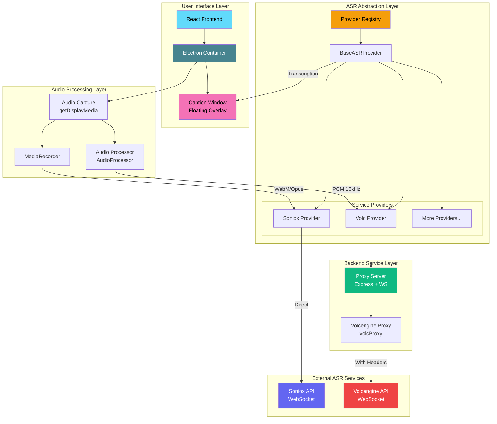

<div align="center">

# DeLive

**System-Level Audio Capture | Your Final Backup for Untranscribed Content**

English | [简体中文](./README_ZH.md) | [繁體中文](./README_TW.md) | [日本語](./README_JA.md)

[](https://github.com/XimilalaXiang/DeLive/releases)
[](https://github.com/XimilalaXiang/DeLive/blob/main/LICENSE)
[](https://github.com/XimilalaXiang/DeLive/releases)
[](https://github.com/XimilalaXiang/DeLive/releases)
[](https://github.com/XimilalaXiang/DeLive/releases)
[](https://github.com/XimilalaXiang/DeLive/releases)
[](https://github.com/XimilalaXiang/DeLive)

[Why DeLive](#-when-to-use-delive) • [Quick Start](#-quick-start) • [Architecture](#️-system-architecture)

</div>

Directly capture system audio output. No matter how platforms protect their content, how DRMs encrypt their videos, or how live streams broadcast in real-time — as long as your computer can output sound, DeLive can transcribe it to text.

<div align="center">

</div>

## 💡 When to Use DeLive

**Your last resort when all other paths are blocked.**

When subtitle export plugins fail, when platforms prevent downloads, when live streams have no captions, and when content is protected by DRM — system-level audio capture is your ultimate backup solution.

Need to export subtitles or transcribed content for building knowledge bases, analysis, research, or any other purpose, but the platform restricts access? DeLive captures system audio and delivers clean, exportable text you own.

### 🎯 Core Features

- **🎧 System-Level Audio Capture** - Directly capture system audio output, bypassing platform restrictions
- **🛡️ Bypass Protection Barriers** - Works on platforms with download restrictions, DRM protection, or no subtitle export
- **📺 Universal Scene Coverage** - Live streams, recorded videos, meetings, private courses, paid content... any audio scenario
- **⚡ Real-Time Transcription** - Convert speech to text instantly with minimal latency
- **📢 Live Caption Overlay** - Floating subtitle window, customizable font, color, size, and position
- **📤 Export to TXT/SRT** - Simple text files or timestamped subtitle files for any player
- **🌐 60+ Language Support** - Chinese, English, Japanese, and many more
- **🔄 Multiple ASR Providers** - Switch between providers for different accuracy and pricing needs

### 🎨 User Experience

- **Dark/Light Theme** - Comfortable viewing in any environment
- **Modern Interface** - Clean, frameless design with custom title bar
- **Auto-Start on Login** - Ready to use when your computer boots (Windows & macOS)
- **System Tray Integration** - Runs quietly in the background
- **Bilingual Interface** - Chinese and English UI language options
- **Auto Updates** - Automatic detection and download of latest versions

## 🏗️ System Architecture



### Architecture Overview

| Layer | Component | Description |
|-------|-----------|-------------|
| **User Interface** | React + Electron | Modern desktop application interface |
| **Caption Window** | Transparent BrowserWindow | Floating subtitle overlay with customizable style |
| **Audio Processing** | AudioProcessor / MediaRecorder | Process audio format based on ASR service requirements |
| **ASR Abstraction** | Provider Registry | Unified ASR service interface, supports dynamic provider switching |
| **Backend Service** | Express + WebSocket | Proxy for services requiring custom Headers |
| **External Services** | Soniox / Volcengine | Actual speech recognition cloud services |

## 🔌 Supported ASR Services

| Provider | Status | Features |
|----------|--------|----------|
| **Soniox** | ✅ Supported | High accuracy, multi-language, direct WebSocket |
| **Volcengine** | ✅ Supported | Chinese optimized, proxy connection |
| *More providers* | 🔜 Planned | Extensible architecture, easy to add new providers |

## 🚀 Quick Start

### Prerequisites

- Node.js 18+
- ASR Service API Key (choose one):
  - [Soniox API Key](https://console.soniox.com)
  - [Volcengine APP ID and Access Token](https://console.volcengine.com/speech/app)

### Installation

```bash
# Clone the project
git clone https://github.com/XimilalaXiang/DeLive.git
cd DeLive

# Install all dependencies
npm run install:all
```

### Development Mode

```bash
# Start backend server (required for Volcengine)
cd server && npm run dev

# In another terminal, start frontend + Electron
npm run dev
```

### Build

```bash
# Build for your current platform
npm run dist:win       # Windows: .exe installer + portable
npm run dist:mac       # macOS: .dmg + .zip
npm run dist:linux     # Linux: .AppImage + .deb
```

Built files are located in the `release/` directory.

## 📖 Usage

### Basic Transcription
1. **Select Provider** - Click settings and choose your ASR service provider
2. **Configure API Key** - Enter the corresponding API key for your provider
3. **Test Configuration** - Click "Test Config" to verify settings
4. **Start Recording** - Click the "Start Recording" button
5. **Select Audio Source** - Choose the screen/window to share (check "Share audio")
6. **Real-time Transcription** - The system will automatically capture audio and display results
7. **Stop Recording** - Click "Stop Recording", transcription will be saved to history

### Real-time Screen Captions (New)
1. **Enable Captions** - Click "Show Caption" button in settings
2. **Customize Style** - Click the settings icon to adjust font, color, background, etc.
3. **Move Caption** - Hover over the caption window, click the lock icon to unlock, then drag to reposition
4. **Lock Position** - Click the lock icon again to lock the caption in place
5. **Reset Position** - Click "Reset Position" button to restore default location

### Export Options
- **Export to TXT** - Click export button and select TXT format
- **Export to SRT** - Click export button and select SRT format for subtitle files

## 📁 Project Structure

```
DeLive/
├── electron/              # Electron main process
│   ├── main.ts               # Main process entry
│   └── preload.ts            # Preload script
├── frontend/              # React frontend
│   ├── src/
│   │   ├── components/       # UI components
│   │   │   ├── CaptionOverlay.tsx  # Caption window component
│   │   │   ├── CaptionControls.tsx # Caption settings controls
│   │   │   └── ...
│   │   ├── hooks/            # Custom Hooks
│   │   ├── providers/        # ASR provider implementations
│   │   │   ├── base.ts           # Base class
│   │   │   ├── registry.ts       # Provider registry
│   │   │   └── implementations/  # Provider implementations
│   │   ├── stores/           # Zustand state management
│   │   ├── types/            # TypeScript types
│   │   │   └── asr/              # ASR related type definitions
│   │   ├── utils/            # Utility functions
│   │   │   └── audioProcessor.ts # Audio processor
│   │   └── i18n/             # Internationalization
│   └── ...
├── server/                # Backend proxy service
│   └── src/
│       ├── index.ts          # Express server
│       └── volcProxy.ts      # Volcengine WebSocket proxy
├── build/                 # App icon resources
├── scripts/               # Build scripts
└── package.json
```

## 🔧 Tech Stack

| Layer | Technology |
|-------|------------|
| Desktop Framework | Electron 40 |
| Frontend | React 18 + TypeScript + Vite |
| Styling | Tailwind CSS |
| State Management | Zustand |
| Backend | Express + ws |
| ASR Engine | Soniox V4 / Volcengine |
| Bundler | electron-builder |

## ⌨️ Keyboard Shortcuts

| Shortcut | Function |
|----------|----------|
| `Ctrl+Shift+D` / `Cmd+Shift+D` | Show/Hide main window |

## 🔧 Adding New ASR Providers

DeLive uses an extensible provider architecture. To add a new provider:

1. Create a new Provider class in `frontend/src/providers/implementations/`
2. Extend `BaseASRProvider` and implement required methods
3. Register the new provider in `registry.ts`
4. If the service requires custom Headers, add a proxy in `server/src/`

Refer to existing implementations (`SonioxProvider.ts` and `VolcProvider.ts`) for detailed guidance.

## ⚠️ Notes

1. **System Requirements** - Windows 10+, macOS 13+ (Ventura), Linux (Ubuntu 20.04+ or equivalent)
2. **API Quota** - Be aware of each provider's API usage limits
3. **Volcengine** - Requires starting the backend server (`cd server && npm run dev`)
4. **Tray Behavior** - Clicking close minimizes to tray, right-click tray icon and select "Exit" to fully close
5. **Caption Window** - The caption window is always on top and mouse-transparent when locked
6. **macOS Audio** - System audio capture requires macOS 13+ (ScreenCaptureKit)
7. **Linux Audio** - Requires PulseAudio for system audio loopback capture
8. **Auto-Launch** - Supported on Windows and macOS only
9. **Auto-Update** - Supported on Windows, macOS, and Linux AppImage

### 🛡️ Windows SmartScreen Warning

When you first run DeLive, Windows may display a SmartScreen warning saying "Windows protected your PC". This is **normal behavior** for new applications that haven't yet established reputation with Microsoft.

**Why does this happen?**
- DeLive is an open-source project without a paid code signing certificate
- New applications without widespread usage will trigger this warning
- This does NOT mean the software is harmful

**How to proceed:**
1. Click **"More info"** on the warning dialog
2. Click **"Run anyway"** to start DeLive

**Verify Safety:**
- [VirusTotal Scan Results](https://www.virustotal.com/gui/file/cdc1680fd693ac7b1c08980e8af5b04edf42289a051f9e7ecd4d915db9bce24b/detection) - You can verify the application is safe
- The source code is fully open and auditable on GitHub

## 📄 License

Apache License 2.0

```
Apache 2.0 License - Free to use, modify, and distribute with attribution
```

## 🙏 Acknowledgments

- [Soniox](https://soniox.com) - Powerful speech recognition API
- [Volcengine](https://www.volcengine.com) - Chinese-optimized speech recognition service
- [BiBi-Keyboard](https://github.com/BryceWG/BiBi-Keyboard) - Multi-provider architecture reference
- [Electron](https://www.electronjs.org/) - Cross-platform desktop application framework
- [React](https://react.dev/) - User interface library
- [Tailwind CSS](https://tailwindcss.com/) - CSS framework

---

<div align="center">

[](https://www.star-history.com/#XimilalaXiang/DeLive&type=date&legend=top-left)

**Made with ❤️ by [XimilalaXiang](https://github.com/XimilalaXiang)**

</div>
