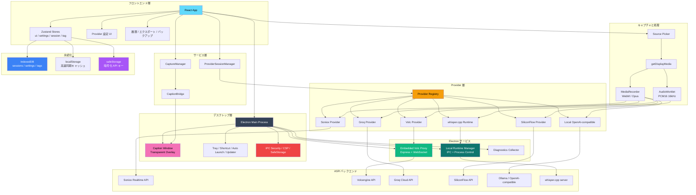

<div align="center">


# DeLive

**システム音声キャプチャ | クラウドとローカル ASR をまとめて扱うデスクトップアプリ**

[English](./README.md) | [简体中文](./README_ZH.md) | [繁體中文](./README_TW.md) | 日本語

[](https://github.com/XimilalaXiang/DeLive/releases)
[](https://github.com/XimilalaXiang/DeLive/blob/main/LICENSE)
[](https://github.com/XimilalaXiang/DeLive/releases)
[](https://github.com/XimilalaXiang/DeLive/releases)
[](https://github.com/XimilalaXiang/DeLive/releases)
[](https://github.com/XimilalaXiang/DeLive/releases)
[](https://github.com/XimilalaXiang/DeLive)

[主な機能](#-主な機能) • [クイックスタート](#-クイックスタート) • [システムアーキテクチャ](#-システムアーキテクチャ) • [対応 ASR プロバイダー](#-対応-asr-プロバイダー)

</div>

PC が音を再生できるなら、DeLive はそのシステム音声を取り込み、選択した ASR バックエンドへ送り、文字起こし結果をローカルに保存します。さらに、完了したセッションを AI briefing に変換して、レビュー・検索・エクスポートまで一つのアプリで完結できます。

<div align="center">

</div>

## 🎯 主な機能

- **システム音声キャプチャ**：ブラウザ動画、配信、会議、講座など、共有可能なシステム音声をそのまま取得。
- **6 つの ASR バックエンド**：Soniox、Volcengine、Groq、SiliconFlow、ローカル OpenAI-compatible、ローカル `whisper.cpp` を同じ UI で切り替え。
- **Provider ごとの音声パイプライン**：`MediaRecorder` と `AudioWorklet` PCM16 処理を自動で使い分け。
- **ローカルモデル運用**：サービス検出、モデル一覧、Ollama のワンクリック pull、`whisper.cpp` binary / モデルの導入とダウンロード。
- **フローティング字幕ウィンドウ**：透過・最前面・ドラッグ可能な字幕オーバーレイ、スタイルカスタマイズ対応。
- **セッション単位の AI 後処理**：OpenAI-compatible briefing 生成を設定し、完了済みセッションに対して要約、アクションアイテム、キーワード、章立て、タイトル提案、タグ提案を生成。
- **履歴とエクスポート**：AI briefing カード、タグ、検索、TXT / SRT / VTT エクスポート、ローカルデータのバックアップ。
- **デスクトップ統合**：システムトレイ、グローバルショートカット、自動起動、更新チェック、二言語 UI（中国語 / 英語）。
- **セキュリティ強化**：IPC 送信者検証、Content Security Policy、ナビゲーションガード、パスホワイトリスト、OS レベルの `safeStorage` による API キー暗号化。
- **ワンクリック診断エクスポート**：システム情報、マスク処理済みの設定、最近のログを JSON ファイルにまとめて出力。

## 🏗️ システムアーキテクチャ



### アーキテクチャ概要

| レイヤー | 主なコンポーネント | 説明 |
|----------|--------------------|------|
| デスクトップ層 | Electron メインプロセス、トレイ、更新、字幕ウィンドウ、IPC セキュリティ、診断モジュール | ネイティブ機能、IPC、OS レベル暗号化を担当 |
| フロントエンド層 | React、Zustand（4 Store）、設定 UI、履歴 UI | 録音フロー・設定・セッション状態を管理 |
| サービス層 | `CaptureManager`、`CaptionBridge`、`ProviderSessionManager` | 単体フックから分離した単一責任サービス |
| キャプチャ層 | `getDisplayMedia`、`MediaRecorder`、`AudioWorklet` | Provider の要件に応じて音声経路を切り替え |
| Provider 層 | Registry + 6 つの Provider 実装 | クラウド / ローカル ASR を統一インターフェース化 |
| Electron サービス | 内蔵 Volc proxy、ローカル runtime 管理、診断コレクター | ヘッダー付きプロキシ、ローカルプロセス制御、診断情報 |
| 永続化 | IndexedDB（プライマリ）+ localStorage（同期キャッシュ）+ safeStorage（秘密情報） | デュアルライト + 自動復元；API キーは OS キーチェーンで暗号化 |

## 🔌 対応 ASR プロバイダー

| プロバイダー | 種別 | 音声経路 | 特徴 |
|--------------|------|----------|------|
| **Soniox V4** | クラウド | `MediaRecorder` → WebSocket | 多言語のリアルタイム文字起こし |
| **Volcengine** | クラウド | PCM16 → 内蔵 proxy → WebSocket | 中国語向け最適化 |
| **Groq** | クラウド | `MediaRecorder` → REST API | Whisper large-v3-turbo / large-v3、セッション単位で再文字起こし |
| **SiliconFlow** | クラウド | `MediaRecorder` → REST API | SenseVoice、TeleSpeech、Qwen Omni、セッション単位で再文字起こし |
| **Local OpenAI-compatible** | ローカルサービス | `MediaRecorder` → `/v1/audio/transcriptions` | Ollama や互換ゲートウェイに対応、モデル検出とワンクリック pull |
| **Local whisper.cpp** | ローカル runtime | PCM16 → ローカル `/inference` | 同梱またはユーザー導入の `whisper-server`、`.bin` / `.gguf` モデル対応 |

## 🚀 クイックスタート

### 前提条件

- Node.js 18+
- 次のいずれかを用意：
  - **Soniox**：[soniox.com](https://soniox.com) の API Key
  - **Volcengine**：APP ID + Access Token
  - **Groq**：[groq.com](https://groq.com) の API Key
  - **SiliconFlow**：[siliconflow.cn](https://siliconflow.cn) の API Key
  - **ローカル OpenAI-compatible**：`/v1/models` と `/v1/audio/transcriptions` を提供するサービス（例：Ollama）
  - **ローカル whisper.cpp**：`whisper-server` binary + ローカルモデル、またはアプリ内の導入フロー

### インストール

```bash
git clone https://github.com/XimilalaXiang/DeLive.git
cd DeLive
npm run install:all
```

### 開発

```bash
npm run dev
```

通常のデスクトップ開発では、Volcengine 用 proxy は Electron メインプロセスに組み込まれています。単独で proxy を検証したい場合のみ：

```bash
npm run dev:server
```

### ビルド

```bash
npm run dist:win     # Windows (NSIS インストーラー + ポータブル)
npm run dist:mac     # macOS (DMG + zip, x64 + arm64)
npm run dist:linux   # Linux (AppImage + deb)
npm run dist:all     # 全プラットフォーム
```

成果物は `release/` に出力されます。

### テスト

```bash
cd frontend && npm test
```

Vitest で 180 のユニットテストを実行。Provider 設定、字幕エクスポート、文字起こし安定化、ウィンドウバッチ処理、AI 後処理解析、ストレージユーティリティ、BaseASRProvider イベントシステムをカバーしています。

### オプション: `whisper.cpp` を同梱する

```bash
npm run fetch:whisper-runtime -- --target win32
npm run stage:whisper-runtime -- --binary /path/to/whisper-server --target linux
```

ビルド時に `local-runtimes/whisper_cpp/whisper-server(.exe)` が存在すれば、`electron-builder` がパッケージに含めます。なくてもユーザーは UI から導入・ダウンロードできます。

## 📖 使い方

### クラウド Provider

1. 設定画面でクラウド Provider（Soniox V4、Volcengine、Groq、SiliconFlow）を選択。
2. 認証情報を入力して **Test Config** を実行。
3. **Start Recording** を押して、音声共有付きで画面やウィンドウを選択。
4. リアルタイムの文字起こし結果がメインウィンドウと字幕オーバーレイに表示されます。

### AI Briefing

1. **設定 → 一般設定** を開き、**AI 後処理** を有効化。
2. OpenAI-compatible の `Base URL`、`Model`、必要なら API Key を設定。
3. 履歴から任意の完了済みセッションを開く。
4. **Generate AI Briefing** をクリックして、要約、アクションアイテム、キーワード、章立て、タイトル提案、タグ提案を生成。
5. 提案内容が良ければ、セッションプレビューからタイトルやタグをそのまま適用。

### Local OpenAI-compatible

1. **Local OpenAI-compatible** を選択。
2. **Base URL** と **Model** を入力。
3. サービス検出とモデル確認を行う。Ollama ならアプリ内でモデル pull も可能。

### Local `whisper.cpp`

1. **Local whisper.cpp** を選択。
2. `whisper-server` binary を導入するか、推奨フローから公式資産をダウンロード。
3. `.bin` / `.gguf` モデルを選択、導入、またはダウンロード。
4. runtime を起動するか **Test Config** を実行してから録音開始。

### 字幕、履歴、エクスポート

- フローティング字幕ウィンドウを開き、フォント、色、サイズ、幅、影、位置をカスタマイズ。
- 履歴パネルでセッションの名前変更、タグ付け、検索、AI briefing カードの生成。
- 履歴プレビューから AI 提案のタイトルやタグを直接適用。
- TXT、SRT、VTT でエクスポート。
- 設定パネルからすべてのローカルデータをインポート / エクスポート（バックアップ・移行用）。

### 診断情報

問題が発生した場合は、**設定 → 一般 → 診断情報** を開き **診断バンドルをエクスポート** をクリック。システム情報、マスク処理済みの設定、最近のログを含む JSON ファイルが生成されます。

## 📁 プロジェクト構成

```text
DeLive/
├── electron/                         # Electron メインプロセスと IPC
│   ├── main.ts                       # アプリエントリ、ウィンドウ作成、IPC 配線
│   ├── preload.ts                    # Context Bridge（レンダラー安全 API）
│   ├── mainWindow.ts                 # メインウィンドウ作成、CSP 注入
│   ├── captionWindow.ts              # フローティング字幕ウィンドウコントローラー
│   ├── captionIpc.ts                 # 字幕操作 IPC ハンドラー
│   ├── appIpc.ts                     # アプリ IPC（バージョン、トレイ、自動起動、ファイル選択）
│   ├── volcProxy.ts                  # 内蔵 Express + WebSocket Volcengine プロキシ
│   ├── localRuntime.ts               # whisper.cpp runtime コントローラー
│   ├── localRuntimeIpc.ts            # ローカル runtime IPC ハンドラー
│   ├── ipcSecurity.ts                # 信頼ウィンドウ検証、CSP、ナビゲーションガード、パスホワイトリスト
│   ├── safeStorageIpc.ts             # API キー暗号化（Electron safeStorage）
│   ├── diagnosticsIpc.ts             # ログインターセプターと診断バンドルエクスポート
│   ├── tray.ts                       # システムトレイアイコンとメニュー
│   └── shortcuts.ts                  # グローバルキーボードショートカット
├── frontend/
│   ├── caption.html                  # 字幕ウィンドウエントリ
│   ├── src/
│   │   ├── components/               # UI コンポーネント（17 ファイル）
│   │   ├── hooks/                    # useASR — ASR オーケストレーションフック
│   │   ├── services/                 # CaptureManager、CaptionBridge、ProviderSessionManager
│   │   ├── providers/                # Provider レジストリ + 6 実装
│   │   ├── stores/                   # Zustand ストア（ui、settings、session、tag）
│   │   ├── utils/                    # 音声、ストレージ、Provider 設定、字幕エクスポートなど
│   │   ├── types/                    # ASR 型定義とベンダー固有型
│   │   └── i18n/                     # UI 翻訳（中国語、英語）
│   ├── public/                       # 静的アセット（AudioWorklet プロセッサー、favicon）
│   └── vitest.config.ts              # テスト設定
├── local-runtimes/
│   └── whisper_cpp/                  # オプションの同梱 whisper.cpp runtime アセット
├── scripts/                          # アイコン生成、runtime 取得/配置、リリースノート
├── server/                           # 単体 Volcengine プロキシ（デバッグ用）
├── .github/workflows/release.yml     # CI/CD：タグプッシュでビルド・GitHub Release 作成
└── package.json
```

## 🔧 技術スタック

| レイヤー | 技術 |
|----------|------|
| デスクトップアプリ | Electron 40 |
| フロントエンド | React 18 + TypeScript 5.6 + Vite 6 |
| スタイリング | Tailwind CSS 3.4 |
| 状態管理 | Zustand 4.5（4 つの専用 Store） |
| テスト | Vitest 4（180 ユニットテスト） |
| 音声処理 | AudioWorklet（ScriptProcessorNode フォールバック） |
| デスクトップサービス | Electron 内蔵 Express + ws |
| 永続化 | IndexedDB + localStorage + Electron safeStorage |
| ASR バックエンド | Soniox V4、Volcengine、Groq、SiliconFlow、OpenAI-compatible ローカル ASR、whisper.cpp |
| パッケージング | electron-builder (NSIS / DMG / AppImage) |
| CI/CD | GitHub Actions |

## 🔒 セキュリティ

| 機能 | 説明 |
|------|------|
| コンテキスト隔離 | `contextIsolation: true`、`nodeIntegration: false` |
| IPC 送信者検証 | 全てのセンシティブ IPC ハンドラーで呼び出し元が信頼ウィンドウか検証 |
| Content Security Policy | `webRequest.onHeadersReceived` で CSP を注入、ローカルモデル接続を安全に許可 |
| ナビゲーションガード | `will-navigate` で予期しない URL 読み込みをブロック |
| パスホワイトリスト | `path-exists` IPC をセーフディレクトリ（userData、home、desktop 等）に制限 |
| API キー暗号化 | Electron `safeStorage`（Windows DPAPI / macOS Keychain）で秘密情報を暗号化保存 |

## ⌨️ キーボードショートカット

| ショートカット | 機能 |
|----------------|------|
| `Ctrl+Shift+D` / `Cmd+Shift+D` | メインウィンドウの表示 / 非表示 |

## ⚠️ 注意

1. **システム要件**：Windows 10+、macOS 13+、または PulseAudio loopback 対応 Linux。
2. **Volcengine**：通常のデスクトップ利用では別プロセスの backend は不要です。
3. **Local OpenAI-compatible**：モデル一覧取得に `/v1/models`、文字起こしに `/v1/audio/transcriptions` が必要です。
4. **`whisper.cpp`**：同梱 binary は必須ではなく、実行時に導入 / ダウンロードできます。
5. **トレイ動作**：メインウィンドウを閉じるとトレイへ最小化されます。完全終了はトレイメニューから。
6. **自動起動**：Windows と macOS に対応。
7. **自動更新**：Windows、macOS、Linux AppImage に対応。

### 🛡️ Windows SmartScreen 警告

初回起動時に SmartScreen 警告が表示されることがあります。未署名または新規配布のアプリでは正常な動作です。

1. **詳細情報** をクリック。
2. **実行** をクリック。

## 📄 ライセンス

Apache License 2.0

## 🙏 謝辞

- [Soniox](https://soniox.com) — リアルタイム音声認識 API
- [Volcengine](https://www.volcengine.com) — 中国語音声認識
- [Groq](https://groq.com) — 高性能 Whisper 推論
- [SiliconFlow](https://siliconflow.cn) — SenseVoice とマルチモーダル ASR
- [Ollama](https://ollama.com) — ローカルモデルワークフロー
- [`whisper.cpp`](https://github.com/ggml-org/whisper.cpp) — ローカルオープンソース runtime
- [BiBi-Keyboard](https://github.com/BryceWG/BiBi-Keyboard) — マルチ Provider アーキテクチャのインスピレーション
