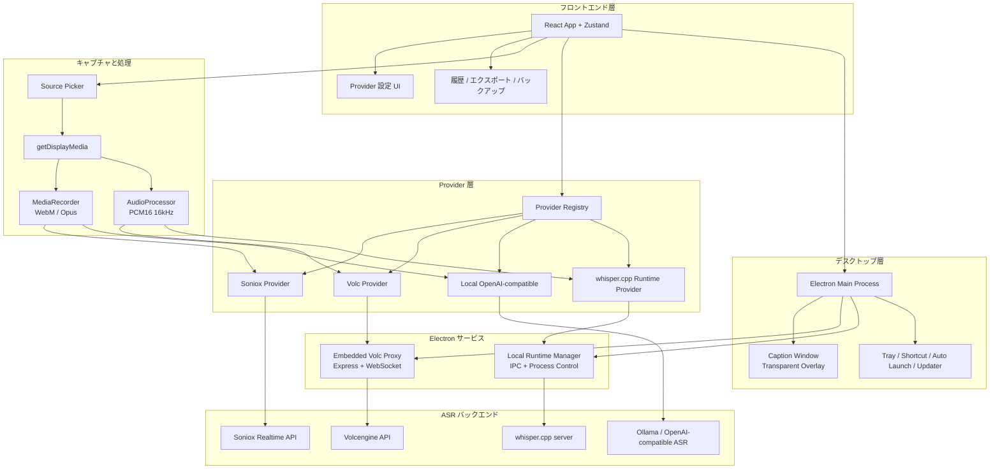

<div align="center">


# DeLive

**システム音声キャプチャ | クラウドとローカル ASR をまとめて扱うデスクトップアプリ**

[English](./README.md) | [简体中文](./README_ZH.md) | [繁體中文](./README_TW.md) | 日本語

[](https://github.com/XimilalaXiang/DeLive/releases)
[](https://github.com/XimilalaXiang/DeLive/blob/main/LICENSE)
[](https://github.com/XimilalaXiang/DeLive/releases)
[](https://github.com/XimilalaXiang/DeLive/releases)
[](https://github.com/XimilalaXiang/DeLive/releases)
[](https://github.com/XimilalaXiang/DeLive/releases)
[](https://github.com/XimilalaXiang/DeLive)

[主な機能](#-主な機能) • [クイックスタート](#-クイックスタート) • [システムアーキテクチャ](#-システムアーキテクチャ) • [対応-asr-プロバイダー](#-対応-asr-プロバイダー)

</div>

PC が音を再生できるなら、DeLive はそのシステム音声を取り込み、選択した ASR バックエンドへ送り、文字起こし結果をローカルに保存できます。

<div align="center">

</div>

## 🎯 主な機能

- **システム音声キャプチャ**：ブラウザ動画、配信、会議、講座など、共有可能なシステム音声をそのまま取得。
- **クラウドとローカルの両対応**：Soniox、Volcengine、ローカル OpenAI-compatible、ローカル `whisper.cpp` を同じ UI で切り替え。
- **Provider ごとの音声パイプライン**：`MediaRecorder` と PCM16 `AudioProcessor` を自動で使い分け。
- **ローカルモデル運用**：サービス検出、モデル一覧、Ollama のワンクリック pull、`whisper.cpp` binary / モデルの導入とダウンロード。
- **フローティング字幕ウィンドウ**：透過・最前面・ドラッグ可能な字幕オーバーレイ。
- **履歴とエクスポート**：タグ、検索、TXT / SRT エクスポート、ローカルデータのバックアップ。

## 🏗️ システムアーキテクチャ



### アーキテクチャ概要

| レイヤー | 主なコンポーネント | 説明 |
|----------|--------------------|------|
| デスクトップ層 | Electron、トレイ、更新、字幕ウィンドウ | ネイティブ機能と IPC を担当 |
| フロントエンド層 | React、Zustand、設定 UI、履歴 UI | 録音フローと状態管理 |
| キャプチャ層 | `getDisplayMedia`、`MediaRecorder`、`AudioProcessor` | Provider に応じて音声経路を切り替え |
| Provider 層 | Registry + 4 つの Provider 実装 | クラウド / ローカル ASR を統一インターフェース化 |
| Electron サービス | 内蔵 Volc proxy、ローカル runtime 管理 | ヘッダー付きプロキシとローカルプロセス制御 |

## 🔌 対応 ASR プロバイダー

| プロバイダー | 種別 | 音声経路 | 特徴 |
|--------------|------|----------|------|
| **Soniox V4** | クラウド | `MediaRecorder` -> WebSocket | 多言語のリアルタイム文字起こし |
| **Volcengine** | クラウド | PCM16 -> 内蔵 proxy -> WebSocket | 中国語向け最適化 |
| **Local OpenAI-compatible** | ローカルサービス | `MediaRecorder` -> `/v1/audio/transcriptions` | Ollama や互換ゲートウェイに対応 |
| **Local whisper.cpp** | ローカル runtime | PCM16 -> ローカル `/inference` | 実験的。binary / モデルの導入とダウンロードに対応 |

## 🚀 クイックスタート

### 前提条件

- Node.js 18+
- 次のいずれかを用意：
  - Soniox API Key
  - Volcengine APP ID + Access Token
  - `/v1/models` と `/v1/audio/transcriptions` を提供するローカル OpenAI-compatible ASR
  - `whisper.cpp` server binary とローカルモデル、またはアプリ内の導入フロー

### インストール

```bash
git clone https://github.com/XimilalaXiang/DeLive.git
cd DeLive
npm run install:all
```

### 開発

```bash
npm run dev
```

通常のデスクトップ開発では、Volcengine 用 proxy は `electron/main.ts` に組み込まれています。単独で proxy を動かして検証したい場合だけ次を使います。

```bash
npm run dev:server
```

### ビルド

```bash
npm run dist:win
npm run dist:mac
npm run dist:linux
```

### オプション: `whisper.cpp` を同梱する

```bash
npm run fetch:whisper-runtime -- --target win32
npm run stage:whisper-runtime -- --binary /path/to/whisper-server --target linux
```

## 📖 使い方

### クラウド Provider

1. 設定画面で `Soniox V4` または `Volcengine` を選択。
2. 認証情報を入力して `Test Config` を実行。
3. `Start Recording` を押して、音声共有付きで画面やウィンドウを選択。

### Local OpenAI-compatible

1. `Local OpenAI-compatible` を選択。
2. `Base URL` と `Model` を入力。
3. サービス検出とモデル確認を行う。Ollama ならアプリ内でモデル pull も可能。

### Local `whisper.cpp`

1. `Local whisper.cpp` を選択。
2. `whisper-server` binary を導入するか、推奨フローから公式資産をダウンロード。
3. `.bin` / `.gguf` モデルを選択、導入、またはダウンロード。
4. runtime を起動するか `Test Config` を実行してから録音開始。

## 📁 プロジェクト構成

```text
DeLive/
├── electron/                       # Electron main process と IPC
├── frontend/                       # React frontend と caption window エントリ
├── local-runtimes/whisper_cpp/    # 同梱可能な whisper.cpp 資産
├── scripts/                        # runtime の取得 / 配置スクリプト
├── server/                         # 単体 proxy 検証用
└── package.json
```

## ⚠️ 注意

1. **システム要件**：Windows 10+、macOS 13+、または PulseAudio loopback 対応 Linux。
2. **Volcengine**：通常のデスクトップ利用では別プロセスの backend は不要です。
3. **Local OpenAI-compatible**：モデル一覧取得に `/v1/models`、転写に `/v1/audio/transcriptions` が必要です。
4. **`whisper.cpp`**：同梱 binary は必須ではなく、実行時に導入 / ダウンロードできます。
5. **トレイ動作**：メインウィンドウを閉じるとトレイへ最小化されます。

## 📄 ライセンス

Apache License 2.0

## 🙏 謝辞

- [Soniox](https://soniox.com)
- [Volcengine](https://www.volcengine.com)
- [Ollama](https://ollama.com)
- [`whisper.cpp`](https://github.com/ggml-org/whisper.cpp)
- [BiBi-Keyboard](https://github.com/BryceWG/BiBi-Keyboard)
