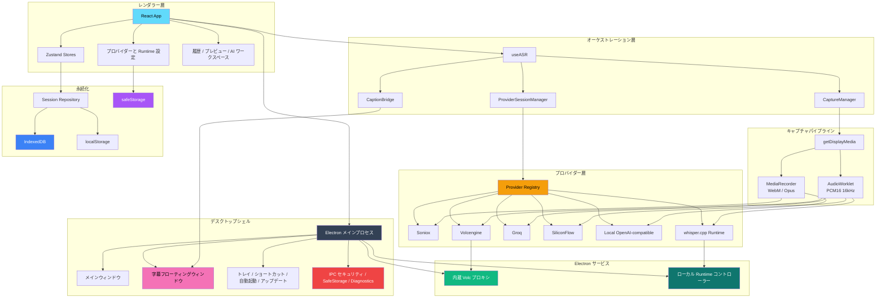

<div align="center">


# DeLive

**システム音声キャプチャ | マルチプロバイダー ASR | ローカルファーストの AI レビューワークスペース**

[English](./README.md) | [简体中文](./README_ZH.md) | [繁體中文](./README_TW.md) | 日本語

[](https://github.com/XimilalaXiang/DeLive/releases)
[](https://github.com/XimilalaXiang/DeLive/blob/main/LICENSE)
[](https://github.com/XimilalaXiang/DeLive/releases)
[](https://github.com/XimilalaXiang/DeLive/releases)
[](https://github.com/XimilalaXiang/DeLive/releases)
[](https://github.com/XimilalaXiang/DeLive/releases)
[](https://github.com/XimilalaXiang/DeLive)
[](https://docs.delive.me/)

</div>

<div align="center">

🌐 **[公式サイト](https://delive.me)** · 📖 **[ドキュメント](https://docs.delive.me/)** · ⬇️ **[ダウンロード](https://github.com/XimilalaXiang/DeLive/releases/latest)**

</div>

DeLive はシステム音声向けのデスクトップ文字起こしワークスペースです。PC が再生している音声をキャプチャし、選択した ASR バックエンドに最適なパイプラインで送り、セッションをローカルに保存します。録音完了後は、リッチ Markdown チャット、構造化ブリーフィング、セッション Q&A、マインドマップ機能を備えた AI レビューデスクで振り返りが可能です。

<div align="center">

#

| リアルタイム文字起こし | 字幕オーバーレイ | MCP 統合 |
|:---:|:---:|:---:|
| マルチプロバイダー ASR リアルタイム文字起こし | ドラッグ可能な常時最前面字幕ウィンドウ | 外部 AI ツールが MCP プロトコルで DeLive にアクセス |
|  |  |  |

| AI 概要 | AI チャット | マインドマップ |
|:---:|:---:|:---:|
| 要約、アクションアイテム、キーワード、チャプター | 引用付きマルチスレッド会話 | 文字起こし内容から自動生成されるマインドマップ |
|  |  |  |

#

</div>

## 目次

- [主な機能](#-主な機能)
- [ダウンロード](#-ダウンロード)
- [対応 ASR プロバイダー](#-対応-asr-プロバイダー)
- [クイックスタート](#-クイックスタート)
- [使い方](#-使い方)
- [プロジェクト構成](#-プロジェクト構成)
- [システムアーキテクチャ](#-システムアーキテクチャ)
- [技術スタック](#-技術スタック)
- [セキュリティ](#-セキュリティ)
- [Open API & MCP エコシステム](#-open-api--mcp-エコシステム)
- [プロバイダーの追加](#-プロバイダーの追加)
- [注意事項](#%EF%B8%8F-注意事項)
- [ライセンス](#-ライセンス)
- [謝辞](#-謝辞)

## 🎯 主な機能

- [x] **システム音声キャプチャ** — ブラウザ動画、配信、会議、講座、ポッドキャストなど、システム音声を共有できるものなら何でも取り込み可能
- [x] **6 つの ASR バックエンドを統一 UI で切り替え** — Soniox、Volcengine、Groq、SiliconFlow、ローカル OpenAI-compatible、ローカル `whisper.cpp`
- [x] **プロバイダーに応じた音声パイプライン自動切換** — バックエンド要件に応じて `MediaRecorder` と `AudioWorklet` PCM16 を使い分け
- [x] **1 つのアプリで 3 種の実行モード** — リアルタイムストリーミング、ウィンドウバッチ再文字起こし、Electron 管理のローカル runtime
- [x] **セッションライフサイクル管理** — ドラフト、録音中自動保存、中断復元、完了済み履歴
- [x] **フローティング字幕ウィンドウ** — 常に最前面の独立ウィンドウ、原文/翻訳/バイリンガルモード、スタイルカスタマイズ
- [x] **Soniox 専用バイリンガル・話者認識** — リアルタイム翻訳、バイリンガル字幕、話者識別、話者別プレビュー
- [x] **AI レビューデスク（Review Desk）** — フルページワークスペース、アニメーション付きタブ（Overview、Transcript、Chat、Mind Map）
- [x] **リッチ AI チャット** — マルチスレッド会話、GFM Markdown レンダリング、シンタックスハイライト、ホバーアクション等
- [x] **構造化 AI ブリーフィング** — 要約、アクションアイテム、キーワード、チャプター、タイトル/タグ提案、引用付き Q&A
- [x] **マインドマップ** — Markmap 互換 Markdown 生成、その場で編集、SVG / PNG エクスポート
- [x] **トピック機能** — セッションを絵文字付きプロジェクトコンテナで整理
- [x] **ローカルモデルワークフロー** — サービス検出、モデル一覧、Ollama pull、`whisper.cpp` アセット管理
- [x] **5 色テーマ** — Cyan、Violet、Rose、Green、Amber — ライト/ダーク完全対応
- [x] **ローカルファースト永続化と任意のクラウドバックアップ** — セッション、タグ、トピック、設定を IndexedDB / localStorage に保存し、S3-compatible / WebDAV バックアップフローも利用可能。秘密情報は Electron `safeStorage` で暗号化
- [x] **デスクトップ統合** — トレイ、グローバルショートカット、自動起動、アップデート、診断エクスポート
- [x] **セキュリティ強化** — 信頼 IPC、CSP、ナビゲーションガード、パスホワイトリスト、暗号化保存
- [x] **Open API & MCP エコシステム** — ローカル REST API、リアルタイム WebSocket、AI エージェント向け MCP サーバー、トークン認証、Agent Skill 定義
- [x] **クロスプラットフォーム** — Windows、macOS、Linux

## 📥 ダウンロード

最新リリースをダウンロード：

<div align="center">

[](https://github.com/XimilalaXiang/DeLive/releases/latest)
[](https://github.com/XimilalaXiang/DeLive/releases/latest)
[](https://github.com/XimilalaXiang/DeLive/releases/latest)

</div>

| プラットフォーム | ファイル |
|------------------|----------|
| Windows | `.exe` インストーラー、ポータブル `.exe` |
| macOS | `.dmg`、`.zip`（Intel x64、Apple Silicon arm64） |
| Linux | `.AppImage`、`.deb` |

> すべてのダウンロードは [Releases](https://github.com/XimilalaXiang/DeLive/releases/latest) ページから取得できます。

## 🔌 対応 ASR プロバイダー

| プロバイダー | 種別 | 転送モード | 音声経路 | 特徴 |
|--------------|------|------------|----------|------|
| **Soniox V4** | クラウド | リアルタイムストリーミング | `MediaRecorder` (`webm/opus`) → WebSocket | トークン単位リアルタイム文字起こし、リアルタイム翻訳、バイリンガル字幕、話者識別 |
| **Volcengine** | クラウド | リアルタイムストリーミング | `AudioWorklet` PCM16 → 内蔵プロキシ → WebSocket | 中国語向け最適化。プロキシが Electron 側で必要なヘッダーを補完 |
| **Groq** | クラウド | ウィンドウバッチ再文字起こし | `AudioWorklet` PCM16 → WAV → REST | Whisper ベースの準リアルタイムセッション更新パス |
| **SiliconFlow** | クラウド | ウィンドウバッチ再文字起こし | `AudioWorklet` PCM16 → WAV → REST | SenseVoice、TeleSpeech、Qwen Omni 等のモデルパス |
| **ローカル OpenAI-compatible** | ローカルサービス | ウィンドウバッチ再文字起こし | `MediaRecorder` (`webm/opus`) → `/v1/audio/transcriptions` | Ollama や互換ゲートウェイに対応。サービス/モデル検出とオプション Ollama pull |
| **ローカル `whisper.cpp`** | ローカル runtime | Electron 管理のローカル runtime | `AudioWorklet` PCM16 → ローカル `/inference` | `whisper-server` を直接起動し、バイナリとモデルリソースを管理。完全ローカル実行 |

## 🚀 クイックスタート

### 前提条件

- Node.js 18+（CI では Node 20 を使用）
- いずれかのプロバイダーパス：
  - **Soniox**：[soniox.com](https://soniox.com) の API Key
  - **Volcengine**：APP ID と Access Token
  - **Groq**：[groq.com](https://groq.com) の API Key
  - **SiliconFlow**：[siliconflow.cn](https://siliconflow.cn) の API Key
  - **ローカル OpenAI-compatible**：`/v1/models` と `/v1/audio/transcriptions` を公開するローカルサービス
  - **ローカル `whisper.cpp`**：`whisper-server` + ローカル `.bin` / `.gguf` モデル、またはアプリ内でインポート/ダウンロード

### インストール

```bash
git clone https://github.com/XimilalaXiang/DeLive.git
cd DeLive
npm run install:all
```

### 開発

```bash
npm run dev
```

`npm run dev` で Vite と Electron が同時に起動します。Volcengine プロキシは Electron メインプロセスに組み込まれているため、通常のデスクトップ開発では別途バックエンドは不要です。

プロキシ単体でデバッグしたい場合のみ：

```bash
npm run dev:server
```

### 品質チェック

```bash
npm run check
```

`npm run check` はフロントエンド lint、フロントエンドテスト、フルビルドを実行します。

フロントエンドテストのみ実行する場合：

```bash
npm run test:frontend
```

現在のテスト状況：**29 個のテストファイル、256 個のテストケースがすべてパス**。プロバイダー設定、文字起こし状態/安定化、字幕エクスポート、セッションライフサイクルとリポジトリ、ストレージ、クラウドバックアップ、Open API IPC 応答、AI 後処理パースをカバーしています。

### ビルド

```bash
npm run dist:win
npm run dist:mac
npm run dist:linux
npm run dist:all
```

成果物は `release/` に出力されます。

### オプション：ビルド時に `whisper.cpp` を同梱

```bash
npm run fetch:whisper-runtime -- --target win32
npm run stage:whisper-runtime -- --binary /path/to/whisper-server --target linux
```

ビルド時に `local-runtimes/whisper_cpp/whisper-server(.exe)` が存在すれば、`electron-builder` がパッケージに含めます。同梱しなくても、ユーザーは UI からバイナリやモデルをインポート/ダウンロードできます。

## 📖 使い方

### 一般的な録音フロー

1. 設定を開き、プロバイダーを選択。
2. 認証情報またはローカル runtime 情報を入力し、**テスト設定** を実行。
3. **録音開始** をクリック。
4. 共有する画面またはウィンドウを選択し、音声共有が有効になっていることを確認。
5. メインウィンドウとフローティング字幕ウィンドウで中間結果と確定結果を確認。
6. 録音停止後、履歴からセッションを開いてレビュー、AI 操作、エクスポートを実行。

### フローティング字幕

- メイン UI からフローティング字幕ウィンドウの表示/非表示を切り替え。
- フォント、色、幅、行数、シャドウ、位置を調整可能。
- プロバイダーが翻訳テキストを返す場合、原文・翻訳・バイリンガルの 3 モードを切り替え可能。
- ドラッグ/インタラクティブ状態で字幕ウィンドウの位置を調整可能。

### トピック

セッションをトピック単位で整理できます：

1. ナビゲーションバーから **Topics** タブを開く。
2. トピックを作成：名前、絵文字、任意で説明を設定。
3. 録音開始は 2 通り：
   - トピックカード上の **新規録音** をクリック — Live に移動し、トピックが自動選択。
   - Live ビューで **トピックを選択** してから録音開始。
4. 録音ボタン上に選択中のトピックバッジが表示される。
5. Review の Overview タブから、セッションをトピックへ追加・削除して移動可能。
6. トピック内のセッションはデフォルトの Review 一覧には表示されないが、グローバル検索では見つかる。

### AI レビューデスク

完了済みセッションは専用のフルページ Review Desk（モーダルではない）で振り返り可能。スライドアニメーション付きタブバーとキーボード矢印キー操作に対応：

- **Overview タブ**：AI ブリーフィング — 要約、アクションアイテム、キーワード、チャプター、タイトル/タグ提案、ワンクリック適用
- **Transcript タブ**：左ガターにタイムスタンプ、カラーコード付き話者バッジ、同一話者自動マージ、ホバーハイライト、TXT/Markdown/SRT/VTT エクスポート
- **Chat タブ**：マルチスレッド AI 会話 — GFM Markdown（シンタックスハイライト・ワンクリックコピー）、アバター、ホバーアクション、思考中アニメーション、自動リサイズコンポーザー、スクロール復帰ボタン、スレッド削除
- **Mind Map タブ**：Markmap 互換 Markdown 生成、その場で編集、SVG / PNG エクスポート
- **メタデータ操作**：提案タイトル/タグのワンクリック適用、diarization セッションの話者名変更

### ローカル OpenAI-compatible サービス

1. **ローカル OpenAI-compatible** を選択。
2. `Base URL` と `Model` を入力。
3. ローカルモデルガイドでサービスを検出し、インストール済みモデルを一覧表示。
4. 検出されたサービスが Ollama の場合、アプリから直接ワンクリック pull が可能。

### ローカル `whisper.cpp` Runtime

1. **ローカル whisper.cpp** を選択。
2. 既存の `whisper-server` をインポートするか、推奨フローで公式リリースアセットをダウンロードして runtime バイナリを準備。
3. `.bin` / `.gguf` ファイルを選択、インポート、またはダウンロードしてモデルを準備。
4. runtime を起動するか **テスト設定** を実行。
5. 以降は他のプロバイダーと同様に録音可能。Electron が IPC で runtime ライフサイクルを管理。

### 履歴、バックアップ、復元

- セッションのリネーム、タグ付け、トピック別に分類、検索、TXT / Markdown / SRT / VTT エクスポートに対応。
- 録音ドラフトは自動保存。アプリ中断時は次回起動時に未完了セッションを復元可能。
- すべてのローカルデータのインポート/エクスポートに対応（バックアップ・移行用）。
- 任意のクラウドバックアップでは **Settings > Cloud Backup** からセッション、トピック、タグ、設定を S3-compatible または WebDAV にアップロードでき、リモート一覧 / 復元 / 削除も行えます。
- 診断エクスポートでマスキング済み JSON バンドル（システム情報 + 最近のログ）を生成。

## 🧩 プロジェクト構成

| モジュール | 主要ファイル | 役割 |
|------------|------------|------|
| デスクトップシェル | `electron/main.ts`, `electron/mainWindow.ts`, `electron/captionWindow.ts`, `electron/tray.ts`, `electron/shortcuts.ts`, `electron/desktopSource.ts`, `electron/autoUpdater.ts`, `electron/ipcSecurity.ts` | Electron 起動、メイン/字幕ウィンドウ、トレイ、ショートカット、デスクトップソース選択、アップデーター、IPC セキュリティ、アプリライフサイクル管理。 |
| レンダラーアプリ | `frontend/src/App.tsx`, `frontend/src/components/*`, `frontend/src/i18n/*` | メイン UI、設定、録音、履歴、プレビュー、字幕コントロール。ワークスペースビュー（Live / Review Desk / Topics / Settings）は Zustand で駆動。 |
| ASR オーケストレーション | `frontend/src/hooks/useASR.ts`, `frontend/src/services/captureManager.ts`, `frontend/src/services/providerSession.ts`, `frontend/src/services/captionBridge.ts` | プロバイダー設定解決、音声パイプライン起動、文字起こしイベント転送、フローティング字幕への同期。 |
| プロバイダー抽象層 | `frontend/src/providers/registry.ts`, `frontend/src/providers/implementations/*` | 6 バックエンドを統一コントラクトとケイパビリティモデルに正規化。 |
| 状態管理 | `frontend/src/stores/sessionStore.ts`, `frontend/src/stores/topicStore.ts`, `frontend/src/stores/uiStore.ts`, `frontend/src/stores/settingsStore.ts`, `frontend/src/stores/tagStore.ts`, `frontend/src/stores/transcriptStore.ts` | Zustand ストアスライス：セッション、トピック、UI 状態、設定、タグ、および後方互換のための統一ファサード。 |
| セッションインテリジェンス | `frontend/src/services/aiPostProcess.ts`, `frontend/src/components/ReviewDeskView.tsx`, `frontend/src/components/PreviewModal.tsx` | AI ブリーフィング、Q&A、マインドマップ、タグ、話者名編集。 |
| トピックコンポーネント | `frontend/src/components/TopicsView.tsx`, `frontend/src/components/TopicDetailView.tsx`, `frontend/src/components/TopicDialog.tsx`, `frontend/src/components/TopicPicker.tsx` | トピック一覧、トピック詳細、トピック作成/編集ダイアログ、録音時のトピック選択。 |
| Review Desk UI | `frontend/src/components/review/SessionTabBar.tsx`, `frontend/src/components/review/SessionHeader.tsx`, `frontend/src/components/review/OverviewTab.tsx`, `frontend/src/components/review/TranscriptTab.tsx`, `frontend/src/components/review/ChatTab.tsx`, `frontend/src/components/review/MindMapTab.tsx`, `frontend/src/components/review/MarkdownRenderer.tsx` | アニメーション付きタブバー（キーボードナビ対応）、セッションヘッダー（マルチフォーマットエクスポート TXT/Markdown/SRT/VTT）、各タブビュー、GFM Markdown レンダリング（シンタックスハイライト）、マインドマップ編集。 |
| 設定 UI | `frontend/src/components/ApiKeyConfig.tsx`, `frontend/src/components/settings/*` | プロバイダー設定、外観、字幕スタイル、AI 後処理、Open API、クラウドバックアップ、データ入出力、About/アップデートをまとめたマルチセクション設定ワークスペース。 |
| Runtime UI | `frontend/src/components/runtime/BundledRuntimeSummaryCard.tsx`, `frontend/src/components/runtime/BundledRuntimeAdvancedPanel.tsx` | `whisper.cpp` ランタイムのステータスカードと詳細管理パネル。 |
| 共有 UI システム | `frontend/src/components/ui/*` | Button、Badge、Switch、EmptyState、StatusIndicator、DialogShell プリミティブ。5 テーマのセマンティックカラートークン。 |
| ローカルモデル / runtime ツール | `frontend/src/utils/localModelSetup.ts`, `frontend/src/utils/localRuntimeManager.ts`, `frontend/src/components/LocalModelSetupGuide.tsx`, `frontend/src/components/BundledRuntimeSetupGuide.tsx`, `electron/localRuntime.ts`, `electron/localRuntimeFiles.ts`, `electron/localRuntimeShared.ts`, `electron/localRuntimeIpc.ts` | ローカルサービス検出、モデル確認、Ollama pull 対応、`whisper.cpp` リソースのインポート/ダウンロード/ファイル管理/起動/停止。 |
| Electron IPC 層 | `electron/appIpc.ts`, `electron/captionIpc.ts`, `electron/safeStorageIpc.ts`, `electron/updaterIpc.ts`, `electron/diagnosticsIpc.ts`, `electron/apiIpc.ts` | モジュール化 IPC ハンドラー：アプリライフサイクル、字幕ウィンドウ制御、シークレットストレージ、自動更新、診断エクスポート、Open API データブリッジ。 |
| Open API 層 | `electron/apiServer.ts`, `electron/apiBroadcast.ts`, `frontend/src/hooks/useApiIpcResponder.ts` | REST API エンドポイント、WebSocket によるライブ文字起こし配信、renderer 側 IPC レスポンダー。 |
| MCP & エージェント連携 | `mcp/delive-mcp-server.js`, `skills/delive-transcript-analyzer/SKILL.md` | MCP サーバーとして DeLive を Tools/Resources 化し、Agent Skill 定義も提供。 |
| 共有コントラクト | `shared/electronApi.ts`, `electron/preload.ts`, `shared/volcProxyCore.ts` | renderer と main 間の型付きブリッジ定義、Volcengine プロキシ共有プロトコルヘルパー。 |
| デバッグ・リリース | `server/`, `scripts/`, `.github/workflows/release.yml`, `.github/workflows/ci.yml` | 単体 Volc プロキシデバッグ、アイコン/runtime ステージングスクリプト、継続的インテグレーション、タグトリガーのマルチプラットフォームビルド。 |

## 🔄 録音ライフサイクル

1. `App.tsx` が起動後、ストレージ、テーマ、設定、タグ、保存済みセッションを初期化。
2. `useASR` が `ProviderSessionManager` を呼び出し、選択中プロバイダーのケイパビリティに基づき接続方式を解決。
3. `CaptureManager` が `getDisplayMedia` でシステム音声を取得し、`MediaRecorder` か `AudioWorklet` PCM16 を選択。
4. プロバイダーからのイベントが `sessionStore` に書き込まれ、`CaptionBridge` が安定テキスト・非確定テキストをフローティング字幕ウィンドウに同期。
5. `sessionStore` がセッションスナップショットを構築し、ドラフトを自動保存。次回起動時に中断セッションを復元。
6. 完了セッションが履歴に入り、文字起こしレビュー、AI ブリーフィング、Q&A、マインドマップ、タグ整理、エクスポートが可能。

## 🏗️ システムアーキテクチャ



### アーキテクチャ概要

| レイヤー | 主なコンポーネント | 説明 |
|----------|--------------------|------|
| デスクトップシェル | Electron メインプロセス、メインウィンドウ、字幕ウィンドウ、トレイ、アップデート、診断 | ネイティブライフサイクル、ソース選択、字幕オーバーレイ、OS 統合を担当。 |
| レンダラー層 | React UI、Zustand stores、履歴/プレビュー/トピックワークスペース、設定パネル | 録音フロー、設定、セッションレビュー、トピック管理、ユーザー操作を担当。 |
| オーケストレーション層 | `useASR`、`CaptureManager`、`ProviderSessionManager`、`CaptionBridge` | キャプチャ、プロバイダー、UI を疎結合に保つ。 |
| プロバイダー層 | レジストリ + 6 つの実装 | リアルタイムクラウド、バッチクラウド、ローカルサービス、ローカル runtime を統一。 |
| Electron サービス | 内蔵 Volc プロキシ、ローカル runtime コントローラー、safe-storage IPC、diagnostics IPC | ブラウザ環境では直接行えない機能を提供。 |
| 永続化 | Session Repository、IndexedDB、localStorage、`safeStorage` | ドラフト自動保存、中断セッション復元、秘密情報と通常設定の分離保存。 |
| 共有コントラクト | 型付き preload ブリッジと共有ヘルパー | renderer/main 間のインターフェースを明示的かつ保守可能に。 |

## 📁 プロジェクト構造

```text
DeLive/
├── electron/                         # Electron メインプロセス、ウィンドウ、トレイ、IPC、アップデート、ローカル runtime 制御
├── frontend/                         # React レンダラーアプリ、プロバイダー、Store、UI コンポーネント、テスト
├── shared/                           # preload/renderer/main 共有の TypeScript コントラクトとプロキシヘルパー
├── server/                           # 主にデバッグ用の単体 Volcengine プロキシ
├── mcp/                              # AI エージェント向けの独立 MCP サーバー（Claude、Cursor など）
├── skills/                           # Agent Skill 定義
├── local-runtimes/                   # オプションの同梱 runtime アセット（whisper.cpp ステージング用）
├── scripts/                          # アイコン生成、runtime 取得/配置、リリースノート
├── assets/                           # README およびブランド素材
├── build/                            # electron-builder アイコンとパッケージングリソース
├── .github/workflows/ci.yml          # Push/PR 継続的インテグレーション
├── .github/workflows/release.yml     # タグトリガーの品質チェック + リリースフロー
├── README.md
└── package.json
```

`dist-electron/`、`release/`、依存フォルダなどの生成物はここでは省略しています。

## 🔧 技術スタック

| レイヤー | 技術 |
|----------|------|
| デスクトップアプリ | Electron 40 |
| フロントエンド | React 18.3 + TypeScript 5.6 + Vite 6 |
| スタイリング | Tailwind CSS 3.4 |
| 状態管理 | Zustand 4.5 |
| テスト | Vitest 4 |
| 音声処理 | `MediaRecorder`、`AudioWorklet`、WAV 変換ユーティリティ |
| デスクトップサービス | Electron メインプロセス IPC、Express、`ws` |
| 永続化 | IndexedDB、localStorage、Electron `safeStorage` |
| AI レビュー | OpenAI-compatible chat completions（ブリーフィング / Q&A / マインドマップ） |
| パッケージング | `electron-builder` |
| リリース自動化 | GitHub Actions タグワークフロー |

## 🔒 セキュリティ

| 機能 | 説明 |
|------|------|
| コンテキスト分離 | `contextIsolation: true`、`nodeIntegration: false` |
| 信頼 IPC 送信者 | センシティブなハンドラーは呼び出し元が登録済み信頼ウィンドウであることを検証 |
| Content Security Policy | Electron 層で CSP を注入し、必要な接続先のみ許可 |
| ナビゲーションガード | レンダラーの予期しない URL 遷移をブロック |
| パスホワイトリスト | ファイルパスチェックは `userData`、home、desktop、downloads、documents 等の安全なルートディレクトリに限定 |
| 秘密情報保存 | OS 対応時に Electron `safeStorage` で API Key を暗号化保存 |
| 診断マスキング | エクスポートされた診断 JSON は秘密情報らしきフィールドを事前にクレンジング |

## ⌨️ キーボードショートカット

| ショートカット | 機能 |
|----------------|------|
| `Ctrl+Shift+D` / `Cmd+Shift+D` | メインウィンドウの表示/非表示 |

## 🌐 Open API & MCP エコシステム

DeLive はローカル API 経由で文字起こしデータを公開し、外部ツール、スクリプト、AI エージェントがセッション履歴、ライブ字幕、録音状態へプログラム的にアクセスできます。

### API を有効化

1. **Settings > Open API** を開く
2. **Enable Open API** をオンにする
3. 必要に応じて認証用 **Access Token** を設定する（推奨）

### REST API

有効化後、以下のエンドポイントが `http://localhost:23456/api/v1/` で利用できます。

| エンドポイント | 説明 |
|----------------|------|
| `GET /health` | ヘルスチェック（API 無効時でも常時アクセス可） |
| `GET /sessions` | 検索・フィルタ・ページング付きでセッション一覧を取得 |
| `GET /sessions/:id` | 文字起こし本文と AI 要約を含む完全なセッション詳細 |
| `GET /sessions/:id/transcript` | プレーンテキスト文字起こしのみ |
| `GET /sessions/:id/summary` | AI 要約、アクションアイテム、マインドマップ |
| `GET /topics` | トピック一覧 |
| `GET /tags` | タグ一覧 |
| `GET /status` | 現在の録音状態 |

トークンを設定している場合は `Authorization: Bearer <token>` を付与してください。

### WebSocket

リアルタイム文字起こしストリームは `ws://localhost:23456/ws/live` で利用できます。認証は `?token=<token>` クエリまたは `Authorization` ヘッダーです。

### MCP サーバー

独立した MCP サーバー（`mcp/delive-mcp-server.js`）が DeLive API を AI エージェント向けの Tools / Resources として公開します。**stdio** トランスポートを使い、MCP 対応クライアントで利用できます。

設定前に MCP サーバー依存関係をインストールしてください。

```bash
cd mcp && npm install
```

#### Claude Desktop / Claude Code

`claude_desktop_config.json` に追加します。

```json
{
  "mcpServers": {
    "delive": {
      "command": "node",
      "args": ["C:/path/to/DeLive/mcp/delive-mcp-server.js"],
      "env": {
        "DELIVE_API_URL": "http://localhost:23456",
        "DELIVE_API_TOKEN": "settings で設定した token"
      }
    }
  }
}
```

#### Cursor

`.cursor/mcp.json`（プロジェクト）または `~/.cursor/mcp.json`（グローバル）に追加します。

```json
{
  "mcpServers": {
    "delive": {
      "command": "node",
      "args": ["C:/path/to/DeLive/mcp/delive-mcp-server.js"],
      "env": {
        "DELIVE_API_URL": "http://localhost:23456",
        "DELIVE_API_TOKEN": "settings で設定した token"
      }
    }
  }
}
```

#### Cherry Studio

1. **Settings > MCP Servers > Add** を開く
2. タイプに **stdio** を選ぶ
3. 以下を入力する
   - **Command**: `node`
   - **Args**: `C:/path/to/DeLive/mcp/delive-mcp-server.js`
   - **Env**: `DELIVE_API_URL=http://localhost:23456`, `DELIVE_API_TOKEN=your-token`
4. 保存して有効化する

#### OpenAI Codex CLI / その他の MCP クライアント

stdio トランスポート対応の MCP クライアントなら同じパターンで利用できます。

```bash
DELIVE_API_URL=http://localhost:23456 \
DELIVE_API_TOKEN=your-token \
node /path/to/DeLive/mcp/delive-mcp-server.js
```

| 変数 | 既定値 | 説明 |
|------|--------|------|
| `DELIVE_API_URL` | `http://localhost:23456` | DeLive REST API ベース URL |
| `DELIVE_API_TOKEN` | *(空)* | 認証用 Bearer Token |

> **Note**: MCP サーバーを使うには、DeLive が起動中で **Open API** が有効になっている必要があります。Token は DeLive の **Settings > Open API** で設定します。

Tools / Resources の詳細は [`mcp/`](./mcp/) を参照してください。

### Agent Skill

Agent Skill 定義は [`skills/delive-transcript-analyzer/SKILL.md`](./skills/delive-transcript-analyzer/SKILL.md) にあり、AI エージェントが DeLive を扱うための構造化ガイドを提供します。

## 🔧 プロバイダーの追加

1. `frontend/src/providers/implementations/` にプロバイダー実装を追加。
2. `ASRProviderInfo` メタデータ、必須フィールド、ケイパビリティフラグを正確に定義。
3. `frontend/src/providers/registry.ts` で登録。
4. 設定検証をサポートする場合、`frontend/src/utils/providerConfigTest.ts` に検証ロジックを追加。
5. ローカルサービスまたはローカル runtime フローの場合、`frontend/src/utils/localModelSetup.ts` または `frontend/src/utils/localRuntimeManager.ts` でモデル/runtime ヘルパーを接続。
6. カスタムヘッダーやネイティブプロセス制御が必要な場合、`electron/` 側でサポートを追加。

## ⚠️ 注意事項

1. **システム要件**：Windows 10+、macOS 13+、または PulseAudio loopback 対応 Linux。
2. **Volcengine プロキシ**：通常のデスクトップ利用では別プロセスのバックエンドは不要。Electron が内蔵プロキシを自動起動。
3. **ローカル OpenAI-compatible モード**：モデル一覧取得に `/v1/models`、文字起こしに `/v1/audio/transcriptions` が必要。
4. **`whisper.cpp` モード**：同梱バイナリは必須ではなく、実行時にインポート/ダウンロード可能。
5. **トレイ動作**：メインウィンドウを閉じるとトレイに最小化。完全終了はトレイメニューから。
6. **自動起動**：Windows と macOS に対応。
7. **自動更新**：Windows、macOS、Linux AppImage に対応。

### 🛡️ Windows SmartScreen 警告

初回起動時に SmartScreen 警告が表示されることがあります。未署名または新規配布のアプリでは正常な動作です。

1. **詳細情報** をクリック。
2. **実行** をクリック。

ソースコードを直接確認したり、リリースバイナリを独自に検証することも可能です。

## 📄 ライセンス

Apache License 2.0

## 🙏 謝辞

- [Soniox](https://soniox.com) — リアルタイム音声認識 API
- [Volcengine](https://www.volcengine.com) — 中国語音声認識
- [Groq](https://groq.com) — 高性能 Whisper 推論
- [SiliconFlow](https://siliconflow.cn) — 音声およびマルチモーダル ASR サービス
- [Ollama](https://ollama.com) — ローカルモデルワークフロー
- [`whisper.cpp`](https://github.com/ggml-org/whisper.cpp) — ローカルオープンソース runtime
- [BiBi-Keyboard](https://github.com/BryceWG/BiBi-Keyboard) — マルチプロバイダーアーキテクチャのインスピレーション

---

<div align="center">

[](https://www.star-history.com/#XimilalaXiang/DeLive&type=date&legend=top-left)

**Made by [XimilalaXiang](https://github.com/XimilalaXiang)**

</div>
