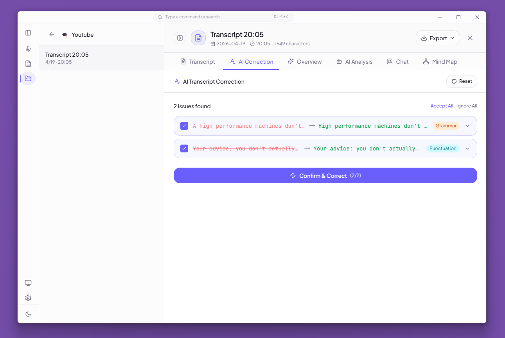

<div align="center">


---

システム音声キャプチャ | 12 種の ASR プロバイダー | ローカルファーストの AI 振り返りワークスペース

[English](./README.md) | [简体中文](./README_ZH.md) | [繁體中文](./README_TW.md) | 日本語

[](https://github.com/XimilalaXiang/DeLive/releases)
[](https://github.com/XimilalaXiang/DeLive/blob/main/LICENSE)
[](https://github.com/XimilalaXiang/DeLive/releases)
[](https://github.com/XimilalaXiang/DeLive/releases)
[](https://github.com/XimilalaXiang/DeLive/releases)
[](https://github.com/XimilalaXiang/DeLive/releases)
[](https://github.com/XimilalaXiang/DeLive)
[](https://docs.delive.me/)

🌐 **[公式サイト](https://delive.me)** · 📖 **[ドキュメント](https://docs.delive.me/)** · 📋 **[はじめる](https://docs.delive.me/guide/getting-started)** · ⬇️ **[ダウンロード](https://github.com/XimilalaXiang/DeLive/releases/latest)**

</div>

DeLive は、PC で再生中の音声をそのまま文字起こしできるデスクトップアプリです。12 種の ASR プロバイダーに対応し、会議・講義・配信・動画・ポッドキャストなどの音声を取り込んで、履歴をローカルに保存します。録音後は AI による補正、要約、Q&A、チャット、マインドマップで内容を振り返れます。音声・動画ファイルのアップロード文字起こしにも対応しています。

<div align="center">

| リアルタイム文字起こし | 字幕ウィンドウ | MCP 連携 |
|:---:|:---:|:---:|
| 12 種の ASR に対応 | ドラッグ可能・常時最前面 | AI ツールから DeLive にアクセス |
|  |  |  |

| AI 概要 | AI 補正 | AI チャット |
|:---:|:---:|:---:|
| 要約・ToDo・キーワード・章立て | すぐに補正 / 確認して補正 | 引用付きの複数スレッド対話 |
|  |  |  |

</div>

## 🎯 主な機能

- **システム音声キャプチャ** — ブラウザ動画、ライブ配信、会議、講義、ポッドキャストなどの再生音声を取り込み
- **12 種の ASR プロバイダー** — Soniox、Volcengine、Groq、SiliconFlow、Mistral AI、Deepgram、AssemblyAI、ElevenLabs、Gladia、Cloudflare Workers AI、ローカル OpenAI 互換、ローカル whisper.cpp
- **ファイル文字起こし** — 音声・動画ファイルをアップロードして、10 種のクラウドエンジンで文字起こし
- **AI 振り返り** — 文字起こし補正、要約、Q&A、複数スレッドチャット、マインドマップ
- **字幕ウィンドウ** — 原文・翻訳・二言語表示に対応した常時最前面ウィンドウ
- **Soniox の二言語・話者機能** — リアルタイム翻訳、二言語字幕、話者分離
- **トピック管理** — セッションをプロジェクト単位で整理
- **ローカルファースト** — セッション、タグ、トピック、設定はローカル保存。S3/WebDAV バックアップは任意
- **Open API & MCP** — REST API、WebSocket、MCP サーバーで外部 AI ツールと連携
- **クロスプラットフォーム** — Windows、macOS、Linux に対応

> 📖 詳細は [ドキュメント](https://docs.delive.me/guide/what-is-delive) をご覧ください。

## 📥 ダウンロード

<div align="center">

[](https://github.com/XimilalaXiang/DeLive/releases/latest)
[](https://github.com/XimilalaXiang/DeLive/releases/latest)
[](https://github.com/XimilalaXiang/DeLive/releases/latest)

</div>

| OS | 配布形式 |
|----|----------|
| Windows | `.exe` インストーラー、ポータブル `.exe` |
| macOS | `.dmg`、`.zip`（Intel x64 / Apple Silicon arm64） |
| Linux | `.AppImage`、`.deb` |

## 🔌 対応 ASR プロバイダー

| プロバイダー | 種別 | 方式 | ファイル | 特徴 |
|-------------|------|------|----------|------|
| **Soniox V4** | クラウド | リアルタイム | 対応 | トークン単位の文字起こし、翻訳、二言語字幕、話者分離 |
| **Volcengine** | クラウド | リアルタイム | 対応 | 中国語に強く、内蔵プロキシで利用可能 |
| **ElevenLabs** | クラウド | リアルタイム | 対応 | Scribe v2 Realtime、99 言語 |
| **Mistral AI** | クラウド | リアルタイム | 対応 | Voxtral Realtime |
| **Gladia** | クラウド | リアルタイム | 対応 | Solaria-1、100+ 言語、低遅延 |
| **Deepgram** | クラウド | リアルタイム | 対応 | Nova-3 / Nova-2 |
| **AssemblyAI** | クラウド | リアルタイム | 対応 | Universal-3 Pro |
| **Cloudflare Workers AI** | クラウド | バッチ | 対応 | Whisper ベース、低コスト・無料枠あり |
| **SiliconFlow** | クラウド | バッチ | 対応 | SenseVoice、TeleSpeech、Qwen Omni |
| **Groq** | クラウド | バッチ | 対応 | Whisper large-v3-turbo / large-v3 |
| **ローカル OpenAI 互換** | ローカル | バッチ | — | Ollama などの互換サービスに対応 |
| **ローカル whisper.cpp** | ローカル | Electron 管理 | — | モデルとバイナリを DeLive が管理 |

> 📖 設定方法：[API Key ガイド](https://docs.delive.me/guide/api-keys) · [プロバイダー比較](https://docs.delive.me/guide/providers)

## 🚀 クイックスタート

```bash
git clone https://github.com/XimilalaXiang/DeLive.git
cd DeLive
npm run install:all
npm run dev
```

> 📖 開発ガイド：[セットアップ](https://docs.delive.me/development/setup) · [ビルド](https://docs.delive.me/development/build) · [テスト](https://docs.delive.me/development/testing)

## 🏗️ システム構成

DeLive は Electron ベースのデスクトップアプリです。React の画面から音声キャプチャを開始し、Provider 管理層を通じて各 ASR エンジンへ音声を送信します。セッション履歴や設定はローカルに保存され、必要に応じて REST API、WebSocket、MCP 経由で外部ツールから利用できます。

> 📖 詳細：[アーキテクチャ概要](https://docs.delive.me/architecture/overview) · [プロバイダー](https://docs.delive.me/architecture/providers) · [Electron IPC](https://docs.delive.me/architecture/electron-ipc) · [データフロー](https://docs.delive.me/architecture/data) · [セキュリティ](https://docs.delive.me/architecture/security)

## 📁 プロジェクト構成

```text
DeLive/
├── electron/          # Electron メインプロセス、ウィンドウ、トレイ、IPC、更新、runtime、Open API サーバー
├── frontend/          # React 画面、Provider、Store、UI コンポーネント、テスト
├── shared/            # 共通 TypeScript 型とプロキシ関連 helper
├── server/            # デバッグ用の独立プロキシサーバー
├── mcp/               # AI エージェント向け MCP サーバー
├── skills/            # Agent Skill 定義
├── scripts/           # アイコン生成、runtime 準備、release notes
├── docs/              # VitePress ドキュメントサイト
├── landing/           # ランディングページ
└── package.json
```

> 📖 詳細：[プロジェクト構成](https://docs.delive.me/development/structure)

## 🔧 技術スタック

| レイヤー | 技術 |
|----------|------|
| デスクトップ | Electron 40 |
| フロントエンド | React 18.3 + TypeScript 5.6 + Vite 6 |
| スタイリング | Tailwind CSS 3.4 |
| 状態管理 | Zustand 4.5 |
| テスト | Vitest 4（314 テスト / 32 ファイル） |
| 永続化 | IndexedDB、localStorage、Electron safeStorage |
| パッケージング | electron-builder + GitHub Actions |

## 🌐 Open API & MCP

DeLive はローカル REST API、リアルタイム WebSocket、MCP サーバーを提供します。これらはデフォルトでは無効で、必要に応じて Bearer Token 認証を設定できます。

> 📖 API リファレンス：[REST](https://docs.delive.me/api/rest) · [WebSocket](https://docs.delive.me/api/websocket) · [MCP サーバー](https://docs.delive.me/api/mcp) · [認証](https://docs.delive.me/api/authentication) · [Agent Skill](https://docs.delive.me/api/agent-skill)

## ⚠️ 注意事項

- **システム要件**：Windows 10+、macOS 13+、または PulseAudio loopback 対応の Linux。
- **プロバイダープロキシ**は Electron に内蔵されています。通常利用で別サーバーを起動する必要はありません。
- **トレイ動作**：メインウィンドウを閉じると、アプリは終了せずトレイに隠れます。
- **自動更新**：Windows、macOS、Linux AppImage に対応しています。

### 🛡️ Windows SmartScreen の警告

初回起動時に SmartScreen の警告が表示される場合があります。**詳細情報** → **実行** をクリックしてください。

## 📄 ライセンス

Apache License 2.0

## 🙏 謝辞

- [BiBi-Keyboard](https://github.com/BryceWG/BiBi-Keyboard) — マルチプロバイダー構成の参考
- [ByteDance](https://www.bytedance.com) — Volcengine 音声認識サービスと Lark AI Campus Challenge のサポート
- [LINUX.DO](https://linux.do) コミュニティ — 多くの知見と温かいサポートをいただきました

---

<div align="center">

[](https://www.star-history.com/#XimilalaXiang/DeLive&type=date&legend=top-left)

**Made by [XimilalaXiang](https://github.com/XimilalaXiang)**

</div>
