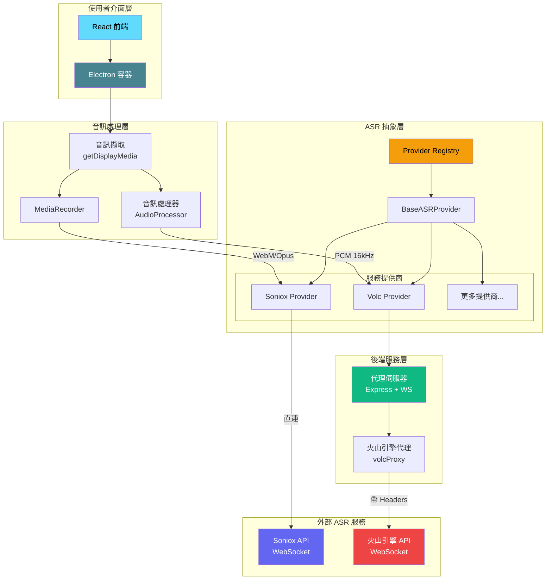

# DeLive 🎙️

**[English](./README.md) | [简体中文](./README_ZH.md) | 繁體中文 | [日本語](./README_JA.md)**

**Windows 桌面音訊即時轉錄系統** - 支援多 ASR 服務提供商

擷取您的電腦正在播放的任何聲音（瀏覽器影片、線上會議、Podcast 等），即時轉錄為文字。


## ✨ 功能特色

- 🎯 **即時轉錄** - 擷取系統音訊，即時轉換為文字
- 🔌 **多服務商支援** - 支援 Soniox、火山引擎等多個 ASR 服務提供商
- 🌍 **多語言支援** - 支援中文、英文及 60+ 種語言
- 📚 **歷史記錄** - 按日期/時間分組，支援自訂標題和標籤
- 📤 **匯出功能** - 一鍵匯出為 TXT 檔案
- 🎨 **深色/淺色主題** - 支援主題切換，保護眼睛
- 🖥️ **現代化介面** - 無邊框視窗，自訂標題列
- 🚀 **開機自啟動** - 可選開機自動啟動，最小化到系統匣
- 💾 **資料備份** - 支援匯入/匯出資料，輕鬆遷移
- 🔄 **自動更新** - 支援自動檢查和下載更新

## 🏗️ 系統架構



### 架構說明

| 層級 | 元件 | 說明 |
|------|------|------|
| **使用者介面層** | React + Electron | 提供現代化的桌面應用程式介面 |
| **音訊處理層** | AudioProcessor / MediaRecorder | 根據 ASR 服務要求處理音訊格式 |
| **ASR 抽象層** | Provider Registry | 統一的 ASR 服務介面，支援動態切換提供商 |
| **後端服務層** | Express + WebSocket | 為需要自訂 Headers 的服務提供代理 |
| **外部服務** | Soniox / 火山引擎 | 實際的語音辨識雲端服務 |

## 🔌 支援的 ASR 服務

| 服務商 | 狀態 | 特點 |
|--------|------|------|
| **Soniox** | ✅ 支援 | 高精度、多語言、直連 WebSocket |
| **火山引擎** | ✅ 支援 | 中文優化、透過代理連線 |
| *更多服務商* | 🔜 規劃中 | 可擴充架構，易於新增提供商 |

## 🚀 快速開始

### 前置需求

- Node.js 18+
- ASR 服務 API 金鑰（任選一個）:
  - [Soniox API 金鑰](https://console.soniox.com)
  - [火山引擎 APP ID 和 Access Token](https://console.volcengine.com/speech/app)

### 安裝

```bash
# 複製專案
git clone https://github.com/XimilalaXiang/DeLive.git
cd DeLive

# 安裝所有依賴
npm run install:all
```

### 開發模式

```bash
# 啟動後端伺服器（火山引擎需要）
cd server && npm run dev

# 在另一個終端機啟動前端 + Electron
npm run dev
```

### 打包建置

```bash
# 打包 Windows 應用程式
npm run dist:win
```

打包後的檔案位於 `release/` 目錄：
- `DeLive-x.x.x-x64.exe` - 安裝程式
- `DeLive-x.x.x-portable.exe` - 可攜式版本

## 📖 使用步驟

1. **選擇服務商** - 點擊設定，選擇您的 ASR 服務提供商
2. **設定 API 金鑰** - 輸入對應服務商的 API 金鑰
3. **測試設定** - 點擊「測試設定」驗證設定是否正確
4. **開始錄製** - 點擊「開始錄製」按鈕
5. **選擇音訊來源** - 在彈出的視窗中選擇要分享的螢幕/視窗（需勾選「分享音訊」）
6. **即時轉錄** - 系統將自動擷取音訊並顯示轉錄結果
7. **停止錄製** - 點擊「停止錄製」按鈕，轉錄內容將自動儲存到歷史記錄

## 📁 專案結構

```
DeLive/
├── electron/              # Electron 主程序
│   ├── main.ts               # 主程序進入點
│   └── preload.ts            # 預載入腳本
├── frontend/              # React 前端
│   ├── src/
│   │   ├── components/       # UI 元件
│   │   ├── hooks/            # 自訂 Hooks
│   │   ├── providers/        # ASR 服務提供商實作
│   │   │   ├── base.ts           # 基礎類別
│   │   │   ├── registry.ts       # 提供商註冊表
│   │   │   └── implementations/  # 各服務商實作
│   │   ├── stores/           # Zustand 狀態管理
│   │   ├── types/            # TypeScript 型別
│   │   │   └── asr/              # ASR 相關型別定義
│   │   ├── utils/            # 工具函式
│   │   │   └── audioProcessor.ts # 音訊處理器
│   │   └── i18n/             # 國際化
│   └── ...
├── server/                # 後端代理服務
│   └── src/
│       ├── index.ts          # Express 伺服器
│       └── volcProxy.ts      # 火山引擎 WebSocket 代理
├── build/                 # 應用程式圖示資源
├── scripts/               # 建置腳本
└── package.json
```

## 🔧 技術堆疊

| 層級 | 技術 |
|------|------|
| 桌面框架 | Electron 40 |
| 前端 | React 18 + TypeScript + Vite |
| 樣式 | Tailwind CSS |
| 狀態管理 | Zustand |
| 後端 | Express + ws |
| ASR 引擎 | Soniox V3 / 火山引擎 |
| 打包工具 | electron-builder |

## ⌨️ 快捷鍵

| 快捷鍵 | 功能 |
|--------|------|
| `Ctrl+Shift+D` | 顯示/隱藏主視窗 |

## 🔧 新增 ASR 服務商

DeLive 採用可擴充的提供商架構，新增服務商只需：

1. 在 `frontend/src/providers/implementations/` 建立新的 Provider 類別
2. 繼承 `BaseASRProvider` 並實作必要方法
3. 在 `registry.ts` 中註冊新提供商
4. 如果服務需要自訂 Headers，在 `server/src/` 新增相應代理

詳細指南請參考現有實作（如 `SonioxProvider.ts` 和 `VolcProvider.ts`）。

## ⚠️ 注意事項

1. **系統需求** - Windows 10/11 64位元
2. **API 配額** - 注意各服務商的 API 使用配額限制
3. **火山引擎** - 需要啟動後端伺服器（`cd server && npm run dev`）
4. **系統匣行為** - 點擊關閉按鈕會最小化到系統匣，右鍵系統匣圖示選擇「結束」完全關閉

## 📄 授權條款

MIT License

## 🙏 致謝

- [Soniox](https://soniox.com) - 提供強大的語音辨識 API
- [火山引擎](https://www.volcengine.com) - 提供中文優化的語音辨識服務
- [BiBi-Keyboard](https://github.com/BryceWG/BiBi-Keyboard) - 多服務商架構參考
- [Electron](https://www.electronjs.org/) - 跨平台桌面應用程式框架
- [React](https://react.dev/) - 使用者介面函式庫
- [Tailwind CSS](https://tailwindcss.com/) - CSS 框架

---

Made with ❤️ by [XimilalaXiang](https://github.com/XimilalaXiang)
