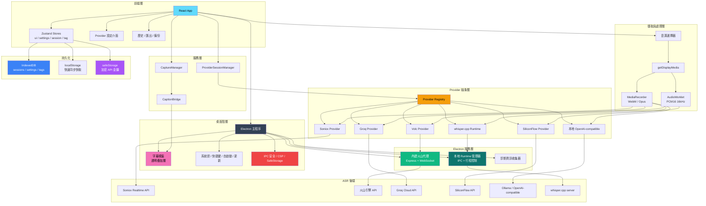

<div align="center">


# DeLive

**系統級音訊擷取 | 雲端與本地 ASR 一體化桌面應用**

[English](./README.md) | [简体中文](./README_ZH.md) | 繁體中文 | [日本語](./README_JA.md)

[](https://github.com/XimilalaXiang/DeLive/releases)
[](https://github.com/XimilalaXiang/DeLive/blob/main/LICENSE)
[](https://github.com/XimilalaXiang/DeLive/releases)
[](https://github.com/XimilalaXiang/DeLive/releases)
[](https://github.com/XimilalaXiang/DeLive/releases)
[](https://github.com/XimilalaXiang/DeLive/releases)
[](https://github.com/XimilalaXiang/DeLive)

[核心功能](#-核心功能) • [快速開始](#-快速開始) • [系統架構](#-系統架構) • [支援的 ASR 服務](#-支援的-asr-服務)

</div>

只要電腦能播放出聲音，DeLive 就能擷取這段系統音訊，送到你選擇的 ASR 後端，並把轉錄內容保存在本機，還能把已完成會話進一步整理成 AI briefing，方便後續回顧、檢索與匯出。

<div align="center">

</div>

## 🎯 核心功能

- **系統級音訊擷取**：適用於瀏覽器影片、直播、會議、課程與任何可分享系統音訊的場景。
- **6 種 ASR 後端**：內建 Soniox、火山引擎、Groq、SiliconFlow、本地 OpenAI-compatible、本地 `whisper.cpp`。
- **依 Provider 自動切換音訊管線**：在 `MediaRecorder` 與 `AudioWorklet` PCM16 處理之間切換。
- **本地模型工作流**：支援本地服務偵測、模型列表、Ollama 一鍵拉取，以及 `whisper.cpp` binary / 模型導入與下載。
- **懸浮字幕視窗**：透明、置頂、可拖曳與鎖定，並可自訂樣式。
- **會話級 AI 後處理**：支援配置 OpenAI-compatible briefing 生成，為已完成會話產生摘要、行動項、關鍵詞、章節、標題建議與標籤建議。
- **歷史、標籤與匯出**：支援 AI briefing 卡片、搜尋、TXT / SRT / VTT 匯出與資料備份。
- **桌面級整合**：系統匣、全域快捷鍵、開機自啟動、更新檢查、中英文介面。
- **安全加固**：IPC 發送者驗證、內容安全策略（CSP）、導覽守衛、路徑白名單、API 金鑰透過作業系統級 `safeStorage` 加密儲存。
- **一鍵診斷匯出**：收集系統資訊、脫敏設定和近期日誌為 JSON 檔案，方便問題排查。

## 🏗️ 系統架構


```mermaid
graph TB
    subgraph "桌面殼層"
        EM[Electron 主程序]
        CAP[字幕視窗<br/>透明疊加層]
        DESK[系統匣 / 快捷鍵 / 自啟動 / 更新]
        SEC[IPC 安全 / CSP / SafeStorage]
    end

    subgraph "前端層"
        UI[React App]
        STORES[Zustand Stores<br/>ui / settings / session / tag]
        CFG[Provider 設定介面]
        HIS[歷史 / 匯出 / 備份]
    end

    subgraph "服務層"
        CAPMGR[CaptureManager]
        CAPBR[CaptionBridge]
        PROVSESS[ProviderSessionManager]
    end

    subgraph "擷取與處理層"
        SRC[音源選擇器]
        GDM[getDisplayMedia]
        MR[MediaRecorder<br/>WebM / Opus]
        AP[AudioWorklet<br/>PCM16 16kHz]
    end

    subgraph "Provider 抽象層"
        REG[Provider Registry]
        SON[Soniox Provider]
        VOL[Volc Provider]
        GRQ[Groq Provider]
        SIL[SiliconFlow Provider]
        LOA[本地 OpenAI-compatible]
        WCP[whisper.cpp Runtime]
    end

    subgraph "Electron 服務層"
        PROXY[內建火山代理<br/>Express + WebSocket]
        RTM[本地 Runtime 管理器<br/>IPC + 行程控制]
        DIAG[診斷資訊收集器]
    end

    subgraph "ASR 後端"
        SONIOX[Soniox Realtime API]
        VOLC[火山引擎 API]
        GROQAPI[Groq Cloud API]
        SILAPI[SiliconFlow API]
        OPENAI[Ollama / OpenAI-compatible]
        WHISPER[whisper.cpp server]
    end

    subgraph "持久化"
        IDB[IndexedDB<br/>sessions / settings / tags]
        LS[localStorage<br/>快速同步快取]
        SAFE[safeStorage<br/>加密 API 金鑰]
    end

    UI --> STORES
    UI --> CFG
    UI --> HIS
    UI --> SRC
    SRC --> GDM
    GDM --> MR
    GDM --> AP

    UI --> CAPMGR
    UI --> PROVSESS
    PROVSESS --> REG
    REG --> SON
    REG --> VOL
    REG --> GRQ
    REG --> SIL
    REG --> LOA
    REG --> WCP

    MR --> SON
    MR --> LOA
    AP --> VOL
    AP --> WCP
    MR --> GRQ
    MR --> SIL

    SON --> SONIOX
    VOL --> PROXY
    PROXY --> VOLC
    GRQ --> GROQAPI
    SIL --> SILAPI
    LOA --> OPENAI
    WCP --> RTM
    RTM --> WHISPER

    STORES --> IDB
    STORES --> LS
    STORES --> SAFE
    UI --> EM
    EM --> CAP
    EM --> PROXY
    EM --> RTM
    EM --> DESK
    EM --> SEC
    EM --> DIAG
    CAPMGR --> CAPBR
    CAPBR --> CAP

    style UI fill:#61dafb,color:#000
    style EM fill:#334155,color:#fff
    style CAP fill:#f472b6,color:#000
    style REG fill:#f59e0b,color:#000
    style PROXY fill:#10b981,color:#fff
    style RTM fill:#0f766e,color:#fff
    style SEC fill:#ef4444,color:#fff
    style SAFE fill:#a855f7,color:#fff
    style IDB fill:#3b82f6,color:#fff
```

### 架構說明

| 層級 | 主要元件 | 說明 |
|------|----------|------|
| 桌面殼層 | Electron 主程序、系統匣、更新器、字幕窗、IPC 安全、診斷模組 | 負責原生桌面能力、IPC 與作業系統級加密 |
| 前端層 | React、Zustand（4 個 Store）、設定頁、歷史面板 | 管理錄製流程與會話狀態 |
| 服務層 | `CaptureManager`、`CaptionBridge`、`ProviderSessionManager` | 從單體 hook 解耦的單一職責服務 |
| 擷取與處理層 | `getDisplayMedia`、`MediaRecorder`、`AudioWorklet` | 依 Provider 能力切換音訊路徑 |
| Provider 抽象層 | 註冊表 + 6 個 Provider 實作 | 統一雲端與本地轉錄介面 |
| Electron 服務層 | 內建火山代理、本地 runtime 管理器、診斷收集器 | 處理自訂 Header 代理、本地行程生命週期和診斷資訊 |
| 持久化 | IndexedDB（主存）+ localStorage（同步快取）+ safeStorage（金鑰） | 雙寫自動恢復；API 金鑰透過 OS 鑰匙圈加密 |

## 🔌 支援的 ASR 服務

| 服務 | 類型 | 音訊路徑 | 說明 |
|------|------|----------|------|
| **Soniox V4** | 雲端 | `MediaRecorder` → WebSocket | Token 級即時轉錄，多語言 |
| **火山引擎** | 雲端 | PCM16 → 內建代理 → WebSocket | 中文最佳化，代理負責補齊 Header |
| **Groq** | 雲端 | `MediaRecorder` → REST API | Whisper large-v3-turbo / large-v3，整段重轉寫 |
| **SiliconFlow** | 雲端 | `MediaRecorder` → REST API | SenseVoice、TeleSpeech、Qwen Omni，整段重轉寫 |
| **本地 OpenAI-compatible** | 本地服務 | `MediaRecorder` → `/v1/audio/transcriptions` | 適配 Ollama 或其他相容閘道，支援模型偵測和可選一鍵拉取 |
| **本地 whisper.cpp** | 本地 runtime | PCM16 → 本地 `/inference` | 內建或使用者導入 `whisper-server`，支援 `.bin` / `.gguf` 模型 |

## 🚀 快速開始

### 前置需求

- Node.js 18+
- 選擇一種後端：
  - **Soniox**：[soniox.com](https://soniox.com) 的 API Key
  - **火山引擎**：APP ID + Access Token
  - **Groq**：[groq.com](https://groq.com) 的 API Key
  - **SiliconFlow**：[siliconflow.cn](https://siliconflow.cn) 的 API Key
  - **本地 OpenAI-compatible**：提供 `/v1/models` 與 `/v1/audio/transcriptions` 的本地服務（如 Ollama）
  - **本地 whisper.cpp**：`whisper-server` binary + 本地模型，或在 DeLive 內下載/導入

### 安裝

```bash
git clone https://github.com/XimilalaXiang/DeLive.git
cd DeLive
npm run install:all
```

### 開發模式

```bash
npm run dev
```

桌面端正常開發時，火山引擎代理已內建於 Electron 主程序。只有在你要單獨除錯代理時，才需要：

```bash
npm run dev:server
```

### 打包構建

```bash
npm run dist:win     # Windows (NSIS 安裝包 + 可攜版)
npm run dist:mac     # macOS (DMG + zip, x64 + arm64)
npm run dist:linux   # Linux (AppImage + deb)
npm run dist:all     # 全平台
```

產物位於 `release/`。

### 執行測試

```bash
cd frontend && npm test
```

透過 Vitest 執行 180 個單元測試，涵蓋 Provider 設定、字幕匯出、轉錄穩定器、視窗批次處理、AI 後處理解析、儲存工具和 BaseASRProvider 事件系統。

### 可選：預置 `whisper.cpp`

```bash
npm run fetch:whisper-runtime -- --target win32
npm run stage:whisper-runtime -- --binary /path/to/whisper-server --target linux
```

如果打包時已存在 `local-runtimes/whisper_cpp/whisper-server(.exe)`，安裝包會一併帶上；否則也可在 UI 中後續導入或下載。

## 📖 使用方式

### 雲端 Provider

1. 在設定中選擇一個雲端 Provider（Soniox V4、火山引擎、Groq 或 SiliconFlow）。
2. 輸入憑證並執行 **測試配置**。
3. 點擊 **開始錄製**，選擇要分享的視窗或螢幕並勾選音訊。
4. 即時結果會顯示在主視窗，也可同步至懸浮字幕視窗。

### AI Briefing

1. 打開 **設定 → 一般設定**，啟用 **AI 後處理**。
2. 配置 OpenAI-compatible 的 `Base URL`、`Model` 和可選 API Key。
3. 在歷史記錄中打開任意一個已完成會話。
4. 點擊 **生成 AI 摘要**，生成摘要、行動項、關鍵詞、章節、標題建議與標籤建議。
5. 如果建議合適，可以直接在會話預覽中一鍵套用標題或標籤。

### 本地 OpenAI-compatible

1. 選擇 **本地 OpenAI-compatible**。
2. 填入 **Base URL** 與 **Model**。
3. 先偵測服務，再檢查模型；若是 Ollama，可直接一鍵拉取模型。

### 本地 `whisper.cpp`

1. 選擇 **本地 whisper.cpp**。
2. 準備 `whisper-server` binary，或使用內建推薦流程下載官方資產。
3. 選擇、導入或下載 `.bin` / `.gguf` 模型。
4. 啟動 runtime 或執行 **測試配置** 後再錄製。

### 字幕、歷史與匯出

- 開啟懸浮字幕視窗，自訂字型、顏色、字級、寬度、陰影和位置。
- 在歷史面板中重新命名會話、打標籤、搜尋紀錄，並生成 AI briefing 卡片。
- 在歷史預覽中可直接套用 AI 建議的標題與標籤。
- 匯出 TXT、SRT 或 VTT。
- 在設定面板中匯入 / 匯出全部本地資料，用於備份和轉移。

### 診斷資訊

遇到問題時，打開 **設定 → 一般 → 診斷資訊**，點擊 **匯出診斷包**。會產生一個 JSON 檔案，包含系統資訊、脫敏後的設定和近期日誌，方便分享給開發者排查問題。

## 📁 專案結構

```text
DeLive/
├── electron/                         # Electron 主程序與 IPC
│   ├── main.ts                       # 應用入口、視窗建立、IPC 註冊
│   ├── preload.ts                    # Context Bridge（渲染程序安全 API）
│   ├── mainWindow.ts                 # 主視窗建立、CSP 注入
│   ├── captionWindow.ts              # 懸浮字幕視窗控制器
│   ├── captionIpc.ts                 # 字幕操作 IPC handler
│   ├── appIpc.ts                     # 通用 IPC（版本號、系統匣、自啟動、檔案選擇）
│   ├── volcProxy.ts                  # 內建 Express + WebSocket 火山引擎代理
│   ├── localRuntime.ts               # whisper.cpp runtime 控制器
│   ├── localRuntimeIpc.ts            # 本地 runtime 操作 IPC handler
│   ├── ipcSecurity.ts                # 可信視窗驗證、CSP、導覽守衛、路徑白名單
│   ├── safeStorageIpc.ts             # API 金鑰加密儲存（Electron safeStorage）
│   ├── diagnosticsIpc.ts             # 日誌攔截與診斷包匯出
│   ├── tray.ts                       # 系統匣圖示與選單
│   └── shortcuts.ts                  # 全域快捷鍵
├── frontend/
│   ├── caption.html                  # 字幕視窗入口
│   ├── src/
│   │   ├── components/               # UI 元件（17 個檔案）
│   │   ├── hooks/                    # useASR — ASR 編排 hook
│   │   ├── services/                 # CaptureManager、CaptionBridge、ProviderSessionManager
│   │   ├── providers/                # Provider 註冊表 + 6 個實作
│   │   ├── stores/                   # Zustand 狀態管理（ui、settings、session、tag）
│   │   ├── utils/                    # 音訊、儲存、Provider 設定、字幕匯出等工具
│   │   ├── types/                    # ASR 型別與各廠商型別定義
│   │   └── i18n/                     # 介面翻譯（中文、英文）
│   ├── public/                       # 靜態資源（AudioWorklet 處理器、favicon）
│   └── vitest.config.ts              # 測試設定
├── local-runtimes/
│   └── whisper_cpp/                  # 可選的預置 whisper.cpp runtime 資源
├── scripts/                          # 圖示產生、runtime 拉取/預置、release notes
├── server/                           # 獨立火山引擎代理（供除錯使用）
├── .github/workflows/release.yml     # CI/CD：tag 推送觸發構建與 GitHub Release
└── package.json
```

## 🔧 技術棧

| 層級 | 技術 |
|------|------|
| 桌面應用 | Electron 40 |
| 前端 | React 18 + TypeScript 5.6 + Vite 6 |
| 樣式 | Tailwind CSS 3.4 |
| 狀態管理 | Zustand 4.5（4 個聚焦 Store） |
| 測試 | Vitest 4（180 個單元測試） |
| 音訊處理 | AudioWorklet（ScriptProcessorNode 回退） |
| 桌面服務 | Electron 內建 Express + ws |
| 持久化 | IndexedDB + localStorage + Electron safeStorage |
| ASR 後端 | Soniox V4、火山引擎、Groq、SiliconFlow、OpenAI-compatible 本地 ASR、whisper.cpp |
| 打包 | electron-builder (NSIS / DMG / AppImage) |
| CI/CD | GitHub Actions |

## 🔒 安全

| 特性 | 說明 |
|------|------|
| 上下文隔離 | `contextIsolation: true`，`nodeIntegration: false` |
| IPC 發送者驗證 | 所有敏感 IPC handler 驗證呼叫者為可信視窗 |
| 內容安全策略 | 透過 `webRequest.onHeadersReceived` 注入 CSP，本地模型連線安全放行 |
| 導覽守衛 | `will-navigate` 阻擋意外 URL 載入 |
| 路徑白名單 | `path-exists` IPC 限制在安全目錄（userData、home、desktop 等） |
| API 金鑰加密 | 透過 Electron `safeStorage`（Windows DPAPI / macOS Keychain）加密儲存 |

## ⌨️ 快捷鍵

| 快捷鍵 | 功能 |
|--------|------|
| `Ctrl+Shift+D` / `Cmd+Shift+D` | 顯示或隱藏主視窗 |

## ⚠️ 注意事項

1. **系統需求**：Windows 10+、macOS 13+、或具備 PulseAudio loopback 的 Linux。
2. **火山引擎代理**：桌面端正常使用時不需要另啟後端，Electron 會自帶代理。
3. **本地 OpenAI-compatible**：模型偵測依賴 `/v1/models`，轉錄依賴 `/v1/audio/transcriptions`。
4. **`whisper.cpp` 模式**：預置 binary 不是必需，可在執行時自行導入或下載。
5. **系統匣行為**：關閉主視窗會縮到系統匣，需從系統匣選單完全退出。
6. **開機自啟動**：支援 Windows 和 macOS。
7. **自動更新**：支援 Windows、macOS 和 Linux AppImage。

### 🛡️ Windows SmartScreen 提示

首次執行 DeLive 時，Windows 可能彈出 SmartScreen 警告。這對未簽署或新發佈的桌面應用是正常現象。

1. 點擊 **更多資訊**。
2. 點擊 **仍要執行**。

## 📄 授權

Apache License 2.0

## 🙏 致謝

- [Soniox](https://soniox.com) — 即時語音辨識 API
- [火山引擎](https://www.volcengine.com) — 中文語音辨識
- [Groq](https://groq.com) — 高效能 Whisper 推論
- [SiliconFlow](https://siliconflow.cn) — SenseVoice 與多模態 ASR
- [Ollama](https://ollama.com) — 本地模型工作流
- [`whisper.cpp`](https://github.com/ggml-org/whisper.cpp) — 本地開源 runtime
- [BiBi-Keyboard](https://github.com/BryceWG/BiBi-Keyboard) — 多 Provider 架構靈感
