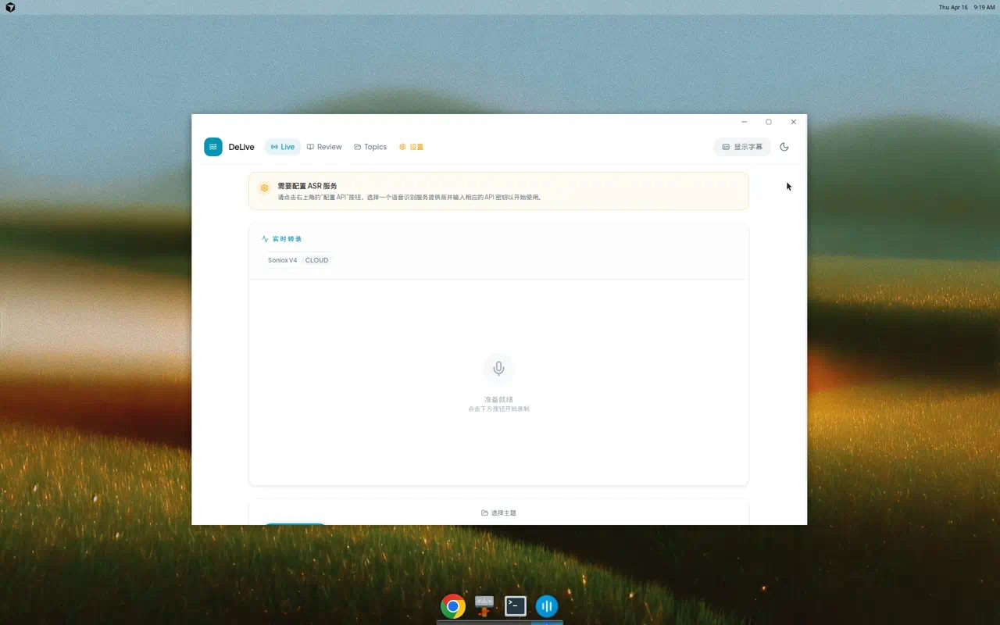
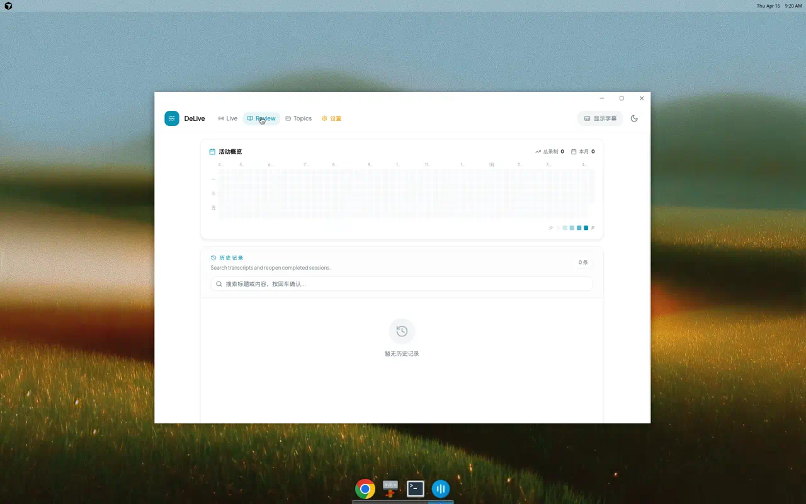
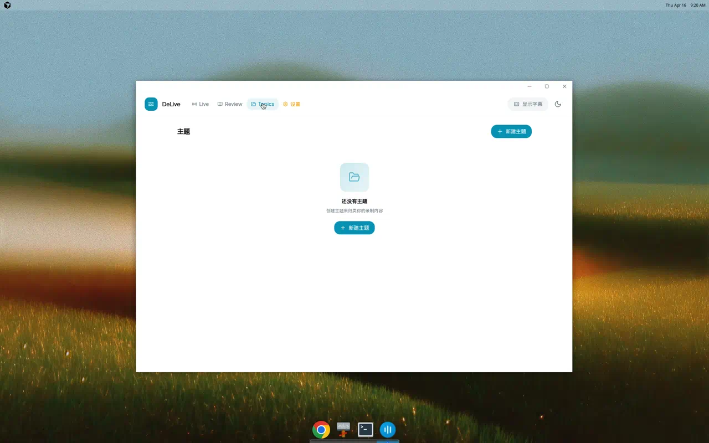
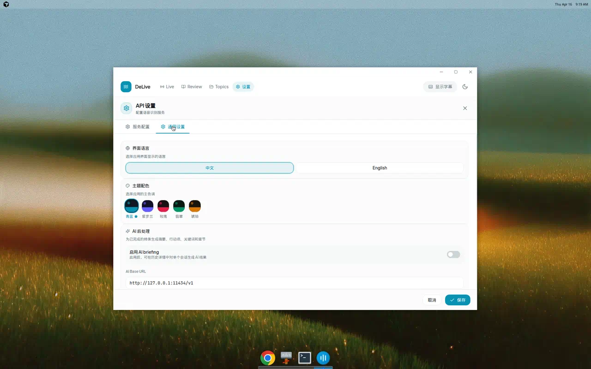
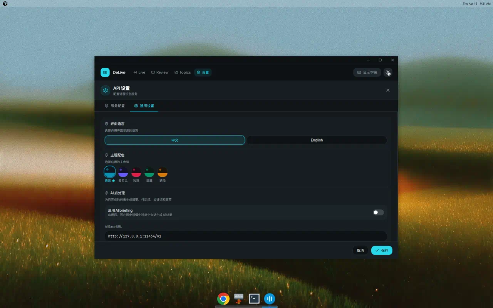
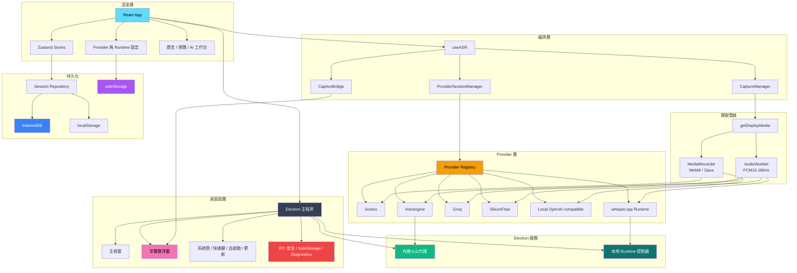

<div align="center">


# DeLive

**系統音訊擷取 | 多 Provider ASR | 本地優先的 AI 複盤工作台**

[English](./README.md) | [简体中文](./README_ZH.md) | 繁體中文 | [日本語](./README_JA.md)

[](https://github.com/XimilalaXiang/DeLive/releases)
[](https://github.com/XimilalaXiang/DeLive/blob/main/LICENSE)
[](https://github.com/XimilalaXiang/DeLive/releases)
[](https://github.com/XimilalaXiang/DeLive/releases)
[](https://github.com/XimilalaXiang/DeLive/releases)
[](https://github.com/XimilalaXiang/DeLive/releases)
[](https://github.com/XimilalaXiang/DeLive)

</div>

DeLive 是一個面向系統音訊的桌面轉錄工作台。它會擷取電腦正在播放的聲音，按所選 Provider 的能力選擇最合適的轉錄鏈路，把會話保存在本機，並在錄製結束後提供完整的 AI 複盤工作台——支援富文本 Markdown 對話、結構化 briefing、會話問答和思維導圖整理。

<div align="center">

#

| 即時轉錄 | 複盤與歷史 | 主題管理 |
|:---:|:---:|:---:|
| 支援多 Provider 切換的即時轉錄工作台 | 帶日曆檢視和搜尋的會話歷史 | 基於專案的會話歸類管理 |
|  |  |  |

| 主題與自訂 | 深色模式 |
|:---:|:---:|
| 5 套配色主題，完整明/暗模式支援 | 所有檢視均支援深色模式 |
|  |  |

#

</div>

## 目錄

- [核心功能](#-核心功能)
- [下載安裝](#-下載安裝)
- [支援的 ASR Provider](#-支援的-asr-provider)
- [快速開始](#-快速開始)
- [使用說明](#-使用說明)
- [專案組成](#-專案組成)
- [系統架構](#-系統架構)
- [技術棧](#-技術棧)
- [安全](#-安全)
- [擴充 Provider](#-擴充-provider)
- [注意事項](#%EF%B8%8F-注意事項)
- [授權](#-授權)
- [致謝](#-致謝)

## 🎯 核心功能

- [x] **系統音訊擷取** — 網頁影片、直播、會議、課程、播客，只要共享系統音訊即可接入
- [x] **6 條 ASR 路徑統一在一個 UI 裡** — Soniox、火山引擎、Groq、矽基流動、本地 OpenAI-compatible、本地 `whisper.cpp`
- [x] **按 Provider 能力自動切換音訊管線** — 根據後端要求在 `MediaRecorder` 和 `AudioWorklet` PCM16 之間切換
- [x] **同一應用內涵蓋 3 種執行模式** — 即時流式、視窗批次處理重轉寫、Electron 管理的本地 runtime
- [x] **完整會話生命週期管理** — 草稿會話、錄製中自動儲存、異常中斷恢復、已完成歷史紀錄
- [x] **懸浮字幕視窗** — 獨立始終置頂視窗，支援原文 / 翻譯 / 雙語模式和樣式自訂
- [x] **Soniox 專屬雙語與說話人能力** — 即時翻譯、雙語字幕、發言人區分、按 speaker 分組預覽
- [x] **AI 複盤工作台（Review Desk）** — 全頁檢視，動畫標籤列導覽（Overview、Transcript、Chat、Mind Map）
- [x] **富文本 AI 對話** — 多執行緒對話，GFM Markdown 渲染，語法高亮程式碼區塊，訊息懸停操作列等
- [x] **結構化 AI briefing** — 摘要、行動項、關鍵詞、章節、標題/標籤建議及帶引用問答
- [x] **思維導圖** — 基於 Markmap-compatible Markdown 產生，支援編輯，可匯出 SVG / PNG
- [x] **主題功能** — 將會話整理到帶 emoji 和描述的專案容器中
- [x] **本地模型工作流** — 偵測本地服務、發現模型、Ollama 一鍵拉取、`whisper.cpp` 資源匯入與下載
- [x] **5 套配色主題** — 青藍、紫羅蘭、玫瑰、綠色、琥珀，均支援完整明/暗模式
- [x] **本地優先的資料儲存** — 會話、標籤、主題、設定保存在 IndexedDB / localStorage；金鑰透過 `safeStorage` 保存
- [x] **桌面整合** — 系統匣、全域快捷鍵、開機自啟動、更新檢查、診斷匯出
- [x] **安全加固** — 可信視窗 IPC 校驗、CSP 注入、導覽守衛、路徑白名單、金鑰加密儲存
- [x] **跨平台** — Windows、macOS、Linux

## 📥 下載安裝

取得最新版本：

<div align="center">

[](https://github.com/XimilalaXiang/DeLive/releases/latest)
[](https://github.com/XimilalaXiang/DeLive/releases/latest)
[](https://github.com/XimilalaXiang/DeLive/releases/latest)

</div>

| 平台 | 檔案 |
|------|------|
| Windows | `.exe` 安裝包、可攜式 `.exe` |
| macOS | `.dmg`（Intel x64 和 Apple Silicon arm64） |
| Linux | `.AppImage`、`.deb` |

> 所有下載均可在 [Releases](https://github.com/XimilalaXiang/DeLive/releases/latest) 頁面取得。

## 🔌 支援的 ASR Provider

| Provider | 類型 | 傳輸模式 | 音訊路徑 | 亮點 |
|----------|------|----------|----------|------|
| **Soniox V4** | 雲端 | 即時流式 | `MediaRecorder` (`webm/opus`) → WebSocket | token 級即時轉錄、即時翻譯、雙語字幕、多發言人辨識 |
| **火山引擎** | 雲端 | 即時流式 | `AudioWorklet` PCM16 → 內建代理 → WebSocket | 中文場景友善；代理在 Electron 側補齊必要 Header |
| **Groq** | 雲端 | 視窗批次處理重轉寫 | `AudioWorklet` PCM16 → WAV → REST | 基於 Whisper 的準即時會話更新路徑 |
| **矽基流動** | 雲端 | 視窗批次處理重轉寫 | `AudioWorklet` PCM16 → WAV → REST | SenseVoice、TeleSpeech、Qwen Omni 等模型路徑 |
| **本地 OpenAI-compatible** | 本地服務 | 視窗批次處理重轉寫 | `MediaRecorder` (`webm/opus`) → `/v1/audio/transcriptions` | 適配 Ollama 或其他相容閘道，支援服務/模型偵測和可選 Ollama 拉取 |
| **本地 `whisper.cpp`** | 本地 runtime | Electron 管理的本地 runtime | `AudioWorklet` PCM16 → 本地 `/inference` | 直接啟動 `whisper-server`，管理 binary 與模型資源，全本地執行 |

## 🚀 快速開始

### 前置需求

- Node.js 18+（CI 中使用 Node 20）
- 任意一種 Provider 路徑：
  - **Soniox**：[soniox.com](https://soniox.com) 的 API Key
  - **火山引擎**：APP ID 和 Access Token
  - **Groq**：[groq.com](https://groq.com) 的 API Key
  - **矽基流動**：[siliconflow.cn](https://siliconflow.cn) 的 API Key
  - **本地 OpenAI-compatible**：暴露 `/v1/models` 與 `/v1/audio/transcriptions` 的本地服務
  - **本地 `whisper.cpp`**：`whisper-server` + 本地 `.bin` / `.gguf` 模型，或直接讓 DeLive 匯入/下載

### 安裝

```bash
git clone https://github.com/XimilalaXiang/DeLive.git
cd DeLive
npm run install:all
```

### 開發

```bash
npm run dev
```

`npm run dev` 會同時啟動 Vite 和 Electron。火山引擎代理已內建在 Electron 主程序中，正常桌面開發不需要單獨後端。

如需單獨除錯代理：

```bash
npm run dev:server
```

### 品質檢查

```bash
npm run check
```

`npm run check` 會執行前端 lint、前端測試和完整構建。

如果只想跑前端測試：

```bash
npm run test:frontend
```

目前測試狀態：**22 個測試檔案、184 個測試案例全部通過**，涵蓋 Provider 設定、轉錄狀態/穩定化、字幕匯出、會話生命週期與倉儲、儲存以及 AI 後處理解析。

### 打包

```bash
npm run dist:win
npm run dist:mac
npm run dist:linux
npm run dist:all
```

構建產物輸出到 `release/`。

### 可選：打包時預置 `whisper.cpp`

```bash
npm run fetch:whisper-runtime -- --target win32
npm run stage:whisper-runtime -- --binary /path/to/whisper-server --target linux
```

如果構建時 `local-runtimes/whisper_cpp/whisper-server(.exe)` 已存在，`electron-builder` 會把它作為額外資源帶進安裝包。即便沒有預置，終端使用者也仍然可以在 UI 中自行匯入或下載 binary / 模型。

## 📖 使用說明

### 典型錄製流程

1. 開啟設定，選擇一個 Provider。
2. 填寫憑證或本地 runtime 資訊，並點擊 **測試設定**。
3. 點擊 **開始錄製**。
4. 選擇要共享的螢幕或視窗，並確認勾選共享音訊。
5. 在主視窗和懸浮字幕視窗裡檢視中間結果與最終結果。
6. 停止錄製後，從歷史紀錄開啟會話繼續複盤、做 AI 操作或匯出。

### 懸浮字幕

- 可以從主介面開啟或關閉懸浮字幕視窗。
- 支援字型、顏色、寬度、行數、陰影和位置調整。
- 當 Provider 回傳翻譯文本時，可切換原文、翻譯、雙語三種模式。
- 支援拖曳 / 互動狀態切換，便於擺放字幕視窗位置。

### 主題

將錄製按專案式主題歸類管理：

1. 從導覽列開啟 **主題** 標籤頁。
2. 建立主題，填寫名稱、emoji 圖示和選填描述。
3. 有兩種方式開始錄製進主題：
   - 在主題卡片上點擊 **錄製新會話** —— 跳轉到 Live 並預選該主題。
   - 在 Live 檢視中，點擊錄製控制項上方的 **選擇主題** 連結並選擇主題。
4. 所選主題會以徽章形式顯示在錄製按鈕上方，錄製會自動歸屬到該主題。
5. 已有會話可在 Review 的 **Overview** 標籤頁中移入或移出主題。
6. 主題內的會話不會出現在預設 Review 列表中，但全域搜尋仍可找到。

### AI 複盤工作台

已完成會話在獨立全頁 Review Desk（非彈窗）中開啟，配備帶滑動動畫的標籤列和鍵盤箭頭導覽：

- **Overview 標籤頁**：AI briefing — 摘要、行動項、關鍵詞、章節、標題/標籤建議，一鍵套用
- **Transcript 標籤頁**：左側時間戳、彩色說話人標籤、連續同一說話人合併、懸停高亮、SRT/VTT/TXT 匯出
- **Chat 標籤頁**：多執行緒 AI 對話 — GFM Markdown 渲染（語法高亮程式碼區塊、一鍵複製）、使用者/AI 頭像、懸停操作、跳動圓點動畫、自動伸縮輸入框、浮動回底部按鈕、單條執行緒刪除
- **Mind Map 標籤頁**：產生 Markmap-compatible Markdown，本地編輯，匯出 SVG / PNG
- **中繼資料操作**：套用建議標題/標籤，重新命名 diarization 會話的 speaker 標籤

### 本地 OpenAI-compatible 服務

1. 選擇 **本地 OpenAI-compatible**。
2. 填寫 `Base URL` 和 `Model`。
3. 用本地模型引導偵測服務並列出已安裝模型。
4. 如果偵測出來是 Ollama，DeLive 可以直接一鍵拉取所選模型。

### 本地 `whisper.cpp` Runtime

1. 選擇 **本地 whisper.cpp**。
2. 透過匯入現有 `whisper-server` 或下載官方 release 資產準備 runtime binary。
3. 透過選擇、匯入或下載 `.bin` / `.gguf` 檔案準備模型。
4. 啟動 runtime 或執行 **測試設定**。
5. 之後錄製方式與其他 Provider 一致，Electron 會透過 IPC 管理 runtime 生命週期。

### 歷史、備份與恢復

- 會話支援重新命名、打標籤、按主題歸類、搜尋，以及匯出 TXT、SRT、VTT。
- 錄製草稿會自動儲存；如果應用中斷，下次啟動可以恢復未完成會話。
- 支援匯入 / 匯出全部本地資料，用於備份和轉移。
- 診斷匯出會產生一個脫敏 JSON，包含系統資訊和近期日誌，便於排障。

## 🧩 專案組成

| 模組 | 關鍵檔案 | 職責 |
|------|----------|------|
| 桌面殼層 | `electron/main.ts`, `electron/mainWindow.ts`, `electron/captionWindow.ts`, `electron/tray.ts`, `electron/shortcuts.ts` | 啟動 Electron，管理主視窗、字幕視窗、系統匣、快捷鍵、更新和應用生命週期。 |
| 渲染層應用 | `frontend/src/App.tsx`, `frontend/src/components/*`, `frontend/src/i18n/*` | 主介面、設定、錄製、歷史、預覽、主題和字幕控制 UI；工作區檢視（Live / Review Desk / Topics / Settings）由 Zustand 驅動。 |
| 主題元件 | `frontend/src/components/TopicsView.tsx`, `frontend/src/components/TopicDetailView.tsx`, `frontend/src/components/TopicDialog.tsx`, `frontend/src/components/TopicPicker.tsx` | 主題列表、主題詳情、建立/編輯主題對話框、錄製時選擇主題。 |
| ASR 編排層 | `frontend/src/hooks/useASR.ts`, `frontend/src/services/captureManager.ts`, `frontend/src/services/providerSession.ts`, `frontend/src/services/captionBridge.ts` | 解析 Provider 設定、啟動正確的音訊擷取鏈路、轉發轉錄事件，並同步到懸浮字幕。 |
| Provider 抽象層 | `frontend/src/providers/registry.ts`, `frontend/src/providers/implementations/*` | 把 6 個後端統一到同一套 contract 和 capability 模型。 |
| 會話智慧層 | `frontend/src/stores/sessionStore.ts`, `frontend/src/stores/topicStore.ts`, `frontend/src/services/aiPostProcess.ts`, `frontend/src/components/ReviewDeskView.tsx`, `frontend/src/components/PreviewModal.tsx` | 會話持久化、主題管理、自動儲存/恢復、AI briefing、問答、思維導圖、標籤和 speaker 名稱編輯。 |
| Review Desk UI | `frontend/src/components/review/SessionTabBar.tsx`, `frontend/src/components/review/OverviewTab.tsx`, `frontend/src/components/review/TranscriptTab.tsx`, `frontend/src/components/review/ChatTab.tsx`, `frontend/src/components/review/MindMapTab.tsx`, `frontend/src/components/review/MarkdownRenderer.tsx` | 動畫標籤列（含鍵盤導覽）、各標籤頁檢視、GFM Markdown 渲染（含語法高亮）和思維導圖編輯。 |
| 共享 UI 系統 | `frontend/src/components/ui/*` | Button、Badge、Switch、EmptyState、StatusIndicator、DialogShell 原語，五套主題的語義色彩 token。 |
| 本地模型 / runtime 工具層 | `frontend/src/utils/localModelSetup.ts`, `frontend/src/utils/localRuntimeManager.ts`, `frontend/src/components/LocalModelSetupGuide.tsx`, `frontend/src/components/BundledRuntimeSetupGuide.tsx`, `electron/localRuntime.ts` | 偵測本地服務、檢查模型、支援 Ollama 拉取、管理 `whisper.cpp` 資源匯入/下載/啟動/停止。 |
| 共享契約層 | `shared/electronApi.ts`, `electron/preload.ts`, `shared/volcProxyCore.ts` | 定義 renderer 與 main 的型別化橋接介面，以及火山代理共享協議輔助邏輯。 |
| 除錯與發佈支援 | `server/`, `scripts/`, `.github/workflows/release.yml` | 獨立火山代理除錯、圖示/運行時預置指令碼、release notes 產生、tag 觸發的多平台構建發佈。 |
| 設計參考 | `design-system/delive/MASTER.md` | 產品與視覺參考資料，不參與執行階段邏輯。 |

## 🔄 錄製生命週期

1. `App.tsx` 啟動後初始化儲存、主題、設定、標籤和歷史會話。
2. `useASR` 呼叫 `ProviderSessionManager`，根據當前 Provider 的能力解析連線方式。
3. `CaptureManager` 透過 `getDisplayMedia` 取得系統音訊，並在 `MediaRecorder` 與 `AudioWorklet` PCM16 之間做選擇。
4. Provider 回傳的事件寫入 `sessionStore`，`CaptionBridge` 同時把穩定文本和非最終文本同步到懸浮字幕視窗。
5. `sessionStore` 會持續構建會話快照、自動儲存草稿，並在下次啟動時恢復被中斷的會話。
6. 已完成會話進入歷史區，可進一步做轉錄複盤、AI 摘要、問答、思維導圖、標籤整理和匯出。

## 🏗️ 系統架構


```mermaid
graph TB
    subgraph "桌面殼層"
        EM[Electron 主程序]
        WIN[主視窗]
        CAP[字幕懸浮窗]
        DESK[系統匣 / 快捷鍵 / 自啟動 / 更新]
        SEC[IPC 安全 / SafeStorage / Diagnostics]
    end

    subgraph "渲染層"
        UI[React App]
        STORES[Zustand Stores]
        CFG[Provider 與 Runtime 設定]
        PREV[歷史 / 預覽 / AI 工作台]
    end

    subgraph "編排層"
        ASR[useASR]
        CAPMGR[CaptureManager]
        PROVSESS[ProviderSessionManager]
        CAPBR[CaptionBridge]
    end

    subgraph "擷取管線"
        GDM[getDisplayMedia]
        MR[MediaRecorder<br/>WebM / Opus]
        AP[AudioWorklet<br/>PCM16 16kHz]
    end

    subgraph "Provider 層"
        REG[Provider Registry]
        SON[Soniox]
        VOL[Volcengine]
        GRQ[Groq]
        SIL[SiliconFlow]
        LOA[Local OpenAI-compatible]
        WCP[whisper.cpp Runtime]
    end

    subgraph "Electron 服務"
        PROXY[內建火山代理]
        RTM[本地 Runtime 控制器]
    end

    subgraph "持久化"
        REPO[Session Repository]
        IDB[IndexedDB]
        LS[localStorage]
        SAFE[safeStorage]
    end

    UI --> STORES
    UI --> CFG
    UI --> PREV
    UI --> ASR

    ASR --> CAPMGR
    ASR --> PROVSESS
    ASR --> CAPBR

    CAPMGR --> GDM
    GDM --> MR
    GDM --> AP

    PROVSESS --> REG
    REG --> SON
    REG --> VOL
    REG --> GRQ
    REG --> SIL
    REG --> LOA
    REG --> WCP

    MR --> SON
    MR --> LOA
    AP --> VOL
    AP --> GRQ
    AP --> SIL
    AP --> WCP

    VOL --> PROXY
    WCP --> RTM

    STORES --> REPO
    REPO --> IDB
    REPO --> LS
    CFG --> SAFE

    UI --> EM
    EM --> WIN
    EM --> CAP
    EM --> DESK
    EM --> SEC
    EM --> PROXY
    EM --> RTM
    CAPBR --> CAP

    style UI fill:#61dafb,color:#000
    style EM fill:#334155,color:#fff
    style CAP fill:#f472b6,color:#000
    style REG fill:#f59e0b,color:#000
    style PROXY fill:#10b981,color:#fff
    style RTM fill:#0f766e,color:#fff
    style SEC fill:#ef4444,color:#fff
    style SAFE fill:#a855f7,color:#fff
    style IDB fill:#3b82f6,color:#fff
```

### 架構說明

| 層級 | 主要元件 | 說明 |
|------|----------|------|
| 桌面殼層 | Electron 主程序、主視窗、字幕視窗、系統匣、更新、診斷 | 負責原生生命週期、音源選擇、字幕疊加和系統整合。 |
| 渲染層 | React UI、Zustand stores、歷史/預覽/主題工作台、設定面板 | 負責錄製流程、設定、會話複盤、主題管理與使用者互動。 |
| 編排層 | `useASR`、`CaptureManager`、`ProviderSessionManager`、`CaptionBridge` | 讓擷取、Provider 和 UI 解耦。 |
| Provider 層 | 註冊表 + 6 個實作 | 同時涵蓋即時雲端、視窗批次處理雲端、本地服務和本地 runtime。 |
| Electron 服務 | 內建火山代理、本地 runtime 控制器、safe-storage IPC、diagnostics IPC | 提供瀏覽器環境無法直接完成的能力。 |
| 持久化 | Session Repository、IndexedDB、localStorage、`safeStorage` | 自動儲存草稿、恢復中斷會話，並將金鑰與一般設定分開儲存。 |
| 共享契約 | 型別化 preload bridge 與共享 helper | 讓 renderer/main 的介面顯式可維護。 |

## 📁 專案結構

```text
DeLive/
├── electron/                         # Electron 主程序、視窗、系統匣、IPC、更新、本地 runtime 控制
├── frontend/                         # React 渲染層、Provider、Store、UI 元件、測試
├── shared/                           # preload/renderer/main 共用的 TypeScript 契約與代理 helper
├── server/                           # 主要用於除錯的獨立火山引擎代理
├── local-runtimes/                   # 可選的預置 runtime 資源（供 whisper.cpp 打包）
├── scripts/                          # 圖示產生、runtime 取得/預置、release notes
├── design-system/                    # 設計參考資料
├── assets/                           # README 與品牌素材
├── build/                            # electron-builder 圖示與打包資源
├── .github/workflows/release.yml     # tag 觸發的品質檢查 + 發佈流程
├── README.md
└── package.json
```

這裡省略了 `dist-electron/`、`release/`、依賴目錄等產生產物。

## 🔧 技術棧

| 層級 | 技術 |
|------|------|
| 桌面應用 | Electron 40 |
| 前端 | React 18.3 + TypeScript 5.6 + Vite 6 |
| 樣式 | Tailwind CSS 3.4 |
| 狀態管理 | Zustand 4.5 |
| 測試 | Vitest 4 |
| 音訊處理 | `MediaRecorder`、`AudioWorklet`、WAV 轉換工具 |
| 桌面服務 | Electron 主程序 IPC、Express、`ws` |
| 持久化 | IndexedDB、localStorage、Electron `safeStorage` |
| AI 複盤 | OpenAI-compatible chat completions（briefing / 問答 / 思維導圖） |
| 打包 | `electron-builder` |
| 發佈自動化 | GitHub Actions tag 工作流 |

## 🔒 安全

| 特性 | 說明 |
|------|------|
| 上下文隔離 | `contextIsolation: true`，`nodeIntegration: false` |
| 可信 IPC 傳送者 | 敏感 handler 會校驗呼叫者是否為註冊過的可信視窗 |
| 內容安全策略 | 在 Electron 層注入 CSP，只放行必要的連線目標 |
| 導覽守衛 | 阻止渲染層意外跳轉到非預期 URL |
| 路徑白名單 | 檔案路徑檢查僅允許 `userData`、home、desktop、downloads、documents 等安全根目錄 |
| 金鑰儲存 | 系統支援時透過 Electron `safeStorage` 保存 API Key |
| 診斷脫敏 | 匯出的診斷 JSON 會先清洗疑似金鑰欄位 |

## ⌨️ 快捷鍵

| 快捷鍵 | 功能 |
|--------|------|
| `Ctrl+Shift+D` / `Cmd+Shift+D` | 顯示或隱藏主視窗 |

## 🔧 擴充 Provider

1. 在 `frontend/src/providers/implementations/` 下新增 Provider 實作。
2. 正確宣告 `ASRProviderInfo`、必填欄位和 capability 標記。
3. 在 `frontend/src/providers/registry.ts` 註冊。
4. 如果支援設定驗證，在 `frontend/src/utils/providerConfigTest.ts` 增加對應邏輯。
5. 如果是本地服務或本地 runtime 路徑，在 `frontend/src/utils/localModelSetup.ts` 或 `frontend/src/utils/localRuntimeManager.ts` 接入配套能力。
6. 如果需要自訂 Header 或原生程序控制，在 `electron/` 側補充支援。

## ⚠️ 注意事項

1. **系統需求**：Windows 10+、macOS 13+、或具備 PulseAudio loopback 的 Linux。
2. **火山引擎代理**：正常桌面使用無需單獨後端，Electron 會自動啟動內建代理。
3. **本地 OpenAI-compatible 模式**：模型發現依賴 `/v1/models`，轉錄依賴 `/v1/audio/transcriptions`。
4. **`whisper.cpp` 模式**：預置 binary 只是可選項，使用者也可以執行階段後續匯入或下載。
5. **系統匣行為**：關閉主視窗預設會隱藏到系統匣，而不是直接結束。
6. **開機自啟動**：目前支援 Windows 和 macOS。
7. **自動更新**：支援 Windows、macOS 和 Linux AppImage。

### 🛡️ Windows SmartScreen 提示

首次執行 DeLive 時，Windows 可能彈出 SmartScreen 警告。這對未簽署或新發佈的桌面應用是正常現象。

1. 點擊 **更多資訊**。
2. 點擊 **仍要執行**。

也可以直接審查原始碼，或者自行校驗發佈產物。

## 📄 授權

Apache License 2.0

## 🙏 致謝

- [Soniox](https://soniox.com) — 即時語音辨識 API
- [火山引擎](https://www.volcengine.com) — 中文語音辨識
- [Groq](https://groq.com) — 高效能 Whisper 推論
- [矽基流動](https://siliconflow.cn) — 語音與多模態 ASR 服務
- [Ollama](https://ollama.com) — 本地模型工作流
- [`whisper.cpp`](https://github.com/ggml-org/whisper.cpp) — 本地開源 runtime
- [BiBi-Keyboard](https://github.com/BryceWG/BiBi-Keyboard) — 多 Provider 架構靈感

---

<div align="center">

[](https://www.star-history.com/#XimilalaXiang/DeLive&type=date&legend=top-left)

**Made by [XimilalaXiang](https://github.com/XimilalaXiang)**

</div>
