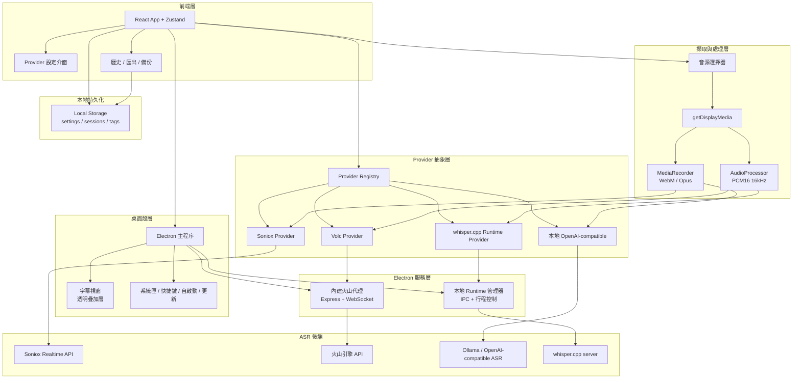

<div align="center">


# DeLive

**系統級音訊擷取 | 雲端與本地 ASR 一體化桌面應用**

[English](./README.md) | [简体中文](./README_ZH.md) | 繁體中文 | [日本語](./README_JA.md)

[](https://github.com/XimilalaXiang/DeLive/releases)
[](https://github.com/XimilalaXiang/DeLive/blob/main/LICENSE)
[](https://github.com/XimilalaXiang/DeLive/releases)
[](https://github.com/XimilalaXiang/DeLive/releases)
[](https://github.com/XimilalaXiang/DeLive/releases)
[](https://github.com/XimilalaXiang/DeLive/releases)
[](https://github.com/XimilalaXiang/DeLive)

[核心功能](#-核心功能) • [快速開始](#-快速開始) • [系統架構](#-系統架構) • [支援的-asr-服務](#-支援的-asr-服務)

</div>

只要電腦能播放出聲音，DeLive 就能擷取這段系統音訊，送到你選擇的 ASR 後端，並把轉錄內容保存在本機，方便後續整理、檢索與匯出。

<div align="center">

</div>

## 🎯 核心功能

- **系統級音訊擷取**：適用於瀏覽器影片、直播、會議、課程與任何可分享系統音訊的場景。
- **雲端與本地 ASR 共存**：內建 Soniox、火山引擎、本地 OpenAI-compatible、本地 `whisper.cpp`。
- **依 Provider 自動切換音訊管線**：在 `MediaRecorder` 與 PCM16 `AudioProcessor` 之間切換。
- **本地模型工作流**：支援本地服務偵測、模型列表、Ollama 一鍵拉取，以及 `whisper.cpp` binary / 模型導入與下載。
- **懸浮字幕視窗**：透明、置頂、可拖曳與鎖定，並可自訂樣式。
- **歷史、標籤與匯出**：支援搜尋、TXT / SRT 匯出與資料備份。

## 🏗️ 系統架構


```mermaid
graph TB
    subgraph "桌面殼層"
        EM[Electron 主程序]
        CAP[字幕視窗<br/>透明疊加層]
        DESK[系統匣 / 快捷鍵 / 自啟動 / 更新]
    end

    subgraph "前端層"
        UI[React App + Zustand]
        CFG[Provider 設定介面]
        HIS[歷史 / 匯出 / 備份]
    end

    subgraph "擷取與處理層"
        SRC[音源選擇器]
        GDM[getDisplayMedia]
        MR[MediaRecorder<br/>WebM / Opus]
        AP[AudioProcessor<br/>PCM16 16kHz]
    end

    subgraph "Provider 抽象層"
        REG[Provider Registry]
        SON[Soniox Provider]
        VOL[Volc Provider]
        LOA[本地 OpenAI-compatible]
        WCP[whisper.cpp Runtime Provider]
    end

    subgraph "Electron 服務層"
        PROXY[內建火山代理<br/>Express + WebSocket]
        RTM[本地 Runtime 管理器<br/>IPC + 行程控制]
    end

    subgraph "ASR 後端"
        SONIOX[Soniox Realtime API]
        VOLC[火山引擎 API]
        OPENAI[Ollama / OpenAI-compatible ASR]
        WHISPER[whisper.cpp server]
    end

    subgraph "本地持久化"
        STORE[Local Storage<br/>settings / sessions / tags]
    end

    UI --> CFG
    UI --> HIS
    UI --> SRC
    SRC --> GDM
    GDM --> MR
    GDM --> AP

    UI --> REG
    REG --> SON
    REG --> VOL
    REG --> LOA
    REG --> WCP

    MR --> SON
    MR --> LOA
    AP --> VOL
    AP --> WCP

    SON --> SONIOX
    VOL --> PROXY
    PROXY --> VOLC
    LOA --> OPENAI
    WCP --> RTM
    RTM --> WHISPER

    UI --> STORE
    HIS --> STORE
    UI --> EM
    EM --> CAP
    EM --> PROXY
    EM --> RTM
    EM --> DESK
```

### 架構說明

| 層級 | 主要元件 | 說明 |
|------|----------|------|
| 桌面殼層 | Electron、系統匣、更新器、字幕窗 | 負責原生桌面能力與 IPC |
| 前端層 | React、Zustand、設定頁、歷史面板 | 管理錄製流程與會話狀態 |
| 擷取與處理層 | `getDisplayMedia`、`MediaRecorder`、`AudioProcessor` | 依 Provider 能力切換音訊路徑 |
| Provider 抽象層 | 註冊表 + 4 個 Provider | 統一本地與雲端轉錄介面 |
| Electron 服務層 | 內建火山代理、本地 runtime 管理器 | 處理自訂 Header 與本地行程生命週期 |

## 🔌 支援的 ASR 服務

| 服務 | 類型 | 音訊路徑 | 說明 |
|------|------|----------|------|
| **Soniox V4** | 雲端 | `MediaRecorder` -> WebSocket | 多語言即時轉錄 |
| **火山引擎** | 雲端 | PCM16 -> 內建代理 -> WebSocket | 中文優化 |
| **本地 OpenAI-compatible** | 本地服務 | `MediaRecorder` -> `/v1/audio/transcriptions` | 適用 Ollama 或其他相容服務 |
| **本地 whisper.cpp** | 本地 runtime | PCM16 -> 本地 `/inference` | 實驗性，支援 binary / 模型導入與下載 |

## 🚀 快速開始

### 前置需求

- Node.js 18+
- 選擇一種後端：
  - Soniox API Key
  - 火山引擎 APP ID + Access Token
  - 提供 `/v1/models` 與 `/v1/audio/transcriptions` 的本地 OpenAI-compatible ASR
  - `whisper.cpp` server binary 與本地模型，或直接在 DeLive 內下載 / 導入

### 安裝

```bash
git clone https://github.com/XimilalaXiang/DeLive.git
cd DeLive
npm run install:all
```

### 開發模式

```bash
npm run dev
```

桌面端正常開發時，火山引擎代理已內建於 `electron/main.ts`。只有在你要單獨除錯代理時，才需要：

```bash
npm run dev:server
```

### 打包構建

```bash
npm run dist:win
npm run dist:mac
npm run dist:linux
```

### 可選：預置 `whisper.cpp`

```bash
npm run fetch:whisper-runtime -- --target win32
npm run stage:whisper-runtime -- --binary /path/to/whisper-server --target linux
```

如果打包時已存在 `local-runtimes/whisper_cpp/whisper-server(.exe)`，安裝包會一併帶上；否則也可在 UI 中後續導入或下載。

## 📖 使用方式

### 雲端 Provider

1. 在設定中選擇 `Soniox V4` 或 `火山引擎`。
2. 輸入憑證並執行 `測試配置`。
3. 點擊 `開始錄製`，選擇要分享的視窗或螢幕並勾選音訊。

### 本地 OpenAI-compatible

1. 選擇 `本地 OpenAI-compatible`。
2. 填入 `Base URL` 與 `Model`。
3. 先偵測服務，再檢查模型；若是 Ollama，可直接一鍵拉取模型。

### 本地 `whisper.cpp`

1. 選擇 `本地 whisper.cpp`。
2. 準備 `whisper-server` binary，或使用內建推薦流程下載官方資產。
3. 選擇、導入或下載 `.bin` / `.gguf` 模型。
4. 啟動 runtime 或執行 `測試配置` 後再錄製。

## 📁 專案結構

```text
DeLive/
├── electron/                       # Electron 主程序與 IPC
├── frontend/                       # React 前端與字幕視窗入口
├── local-runtimes/whisper_cpp/    # 可選的預置 whisper.cpp 資源
├── scripts/                        # runtime 拉取 / 預置腳本
├── server/                         # 獨立代理服務，供除錯使用
└── package.json
```

## 🔧 技術棧

| 層級 | 技術 |
|------|------|
| 桌面應用 | Electron 40 |
| 前端 | React 18 + TypeScript + Vite |
| 樣式 | Tailwind CSS |
| 狀態管理 | Zustand |
| 桌面服務 | Electron 內建 Express + ws |
| ASR 後端 | Soniox V4、火山引擎、OpenAI-compatible、本地 `whisper.cpp` |

## ⚠️ 注意事項

1. **系統需求**：Windows 10+、macOS 13+、或具備 PulseAudio loopback 的 Linux。
2. **火山引擎代理**：桌面端正常使用時不需要另啟後端，Electron 會自帶代理。
3. **本地 OpenAI-compatible**：模型偵測依賴 `/v1/models`，轉錄依賴 `/v1/audio/transcriptions`。
4. **`whisper.cpp` 模式**：預置 binary 不是必需，可在執行時自行導入或下載。
5. **托盤行為**：關閉主視窗會縮到系統匣，需從系統匣選單完全退出。

## 📄 授權

Apache License 2.0

## 🙏 致謝

- [Soniox](https://soniox.com)
- [火山引擎](https://www.volcengine.com)
- [Ollama](https://ollama.com)
- [`whisper.cpp`](https://github.com/ggml-org/whisper.cpp)
- [BiBi-Keyboard](https://github.com/BryceWG/BiBi-Keyboard)
