<div align="center">


# DeLive

**系统音频捕获 | 多 Provider ASR | 本地优先的 AI 复盘工作台**

[English](./README.md) | 简体中文 | [繁體中文](./README_TW.md) | [日本語](./README_JA.md)

[](https://github.com/XimilalaXiang/DeLive/releases)
[](https://github.com/XimilalaXiang/DeLive/blob/main/LICENSE)
[](https://github.com/XimilalaXiang/DeLive/releases)
[](https://github.com/XimilalaXiang/DeLive/releases)
[](https://github.com/XimilalaXiang/DeLive/releases)
[](https://github.com/XimilalaXiang/DeLive/releases)
[](https://github.com/XimilalaXiang/DeLive)
[](https://docs.delive.me/zh/)

</div>

<div align="center">

🌐 **[官方网站](https://delive.me)** · 📖 **[项目文档](https://docs.delive.me/zh/)** · ⬇️ **[立即下载](https://github.com/XimilalaXiang/DeLive/releases/latest)**

</div>

DeLive 是一个面向系统音频的桌面转录工作台。它会把电脑正在播放的声音捕获下来，按所选 Provider 的能力选择最合适的转录链路，把会话保存在本地，并在录制结束后提供完整的 AI 复盘工作台——支持富文本 Markdown 对话、结构化 briefing、会话问答和思维导图整理。

<div align="center">

#

| 实时转录 | 复盘与历史 | 主题管理 |
|:---:|:---:|:---:|
| 带悬浮字幕窗的实时转录 | 带活动热力图和搜索的会话历史 | 基于项目的会话归类管理 |
| 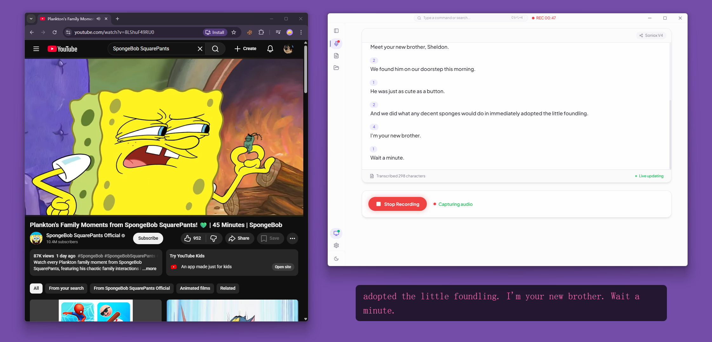 | 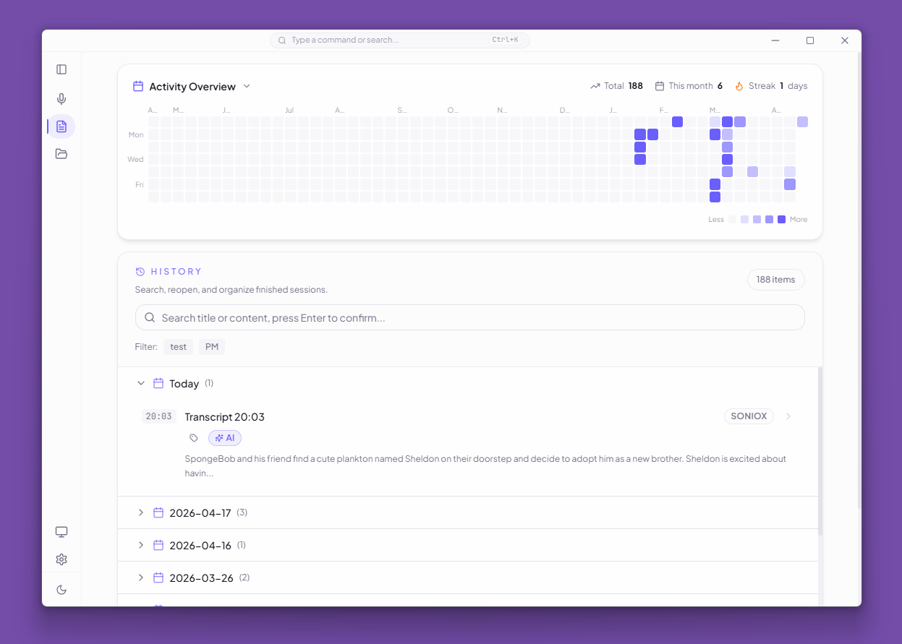 | 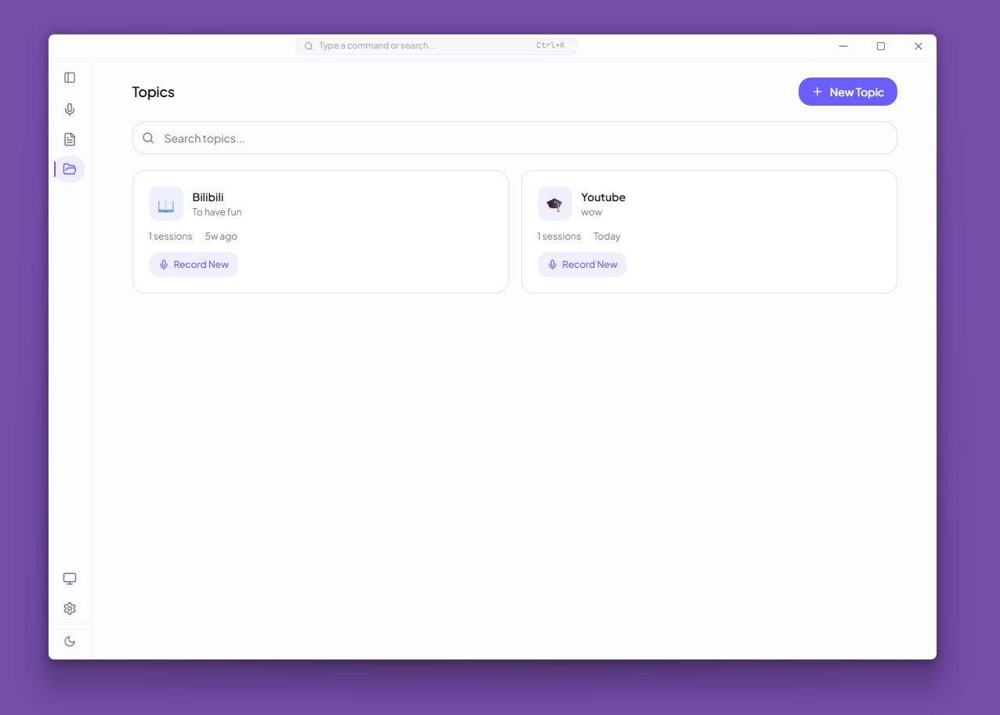 |

| AI 概览 | AI 对话 | 字幕样式设置 |
|:---:|:---:|:---:|
| 摘要、行动项、关键词与章节 | 多线程对话，带引用片段 | 字幕样式编辑器，实时预览 |
| 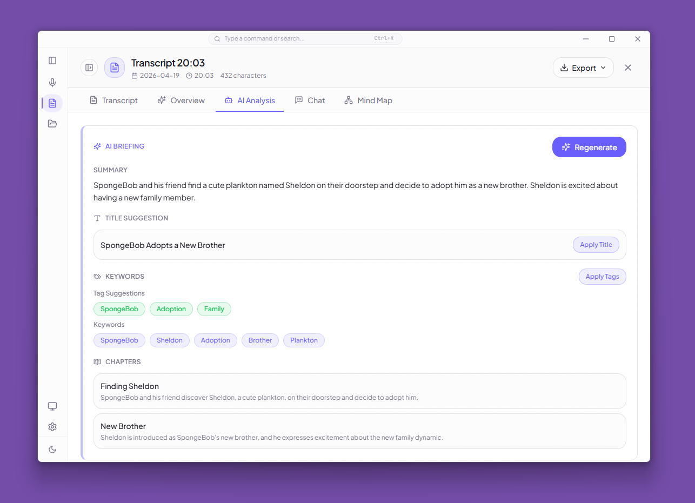 | 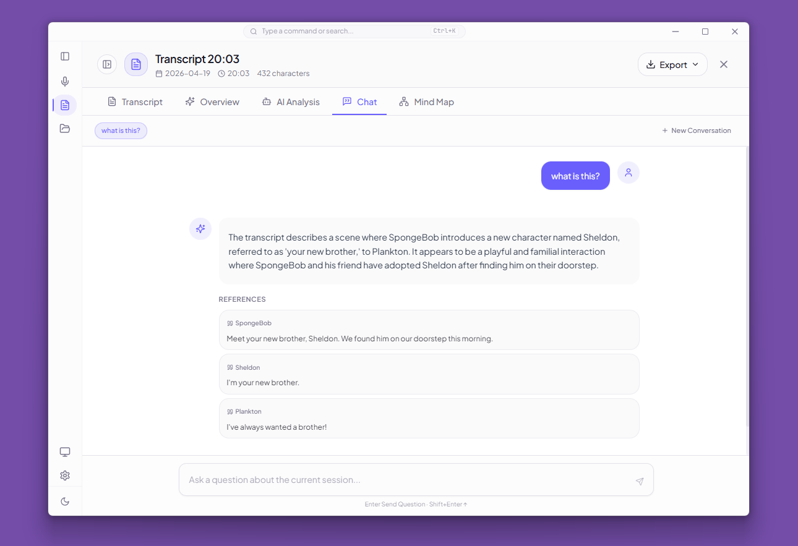 | 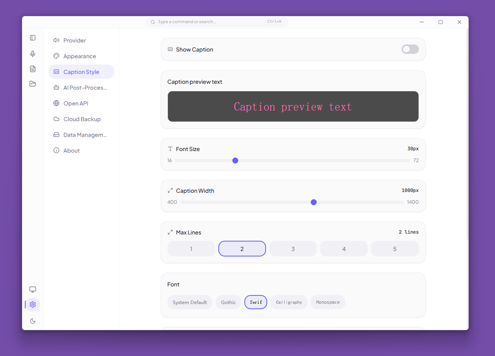 |

| 思维导图 | 转录详情 | MCP 集成 |
|:---:|:---:|:---:|
| 从转录内容自动生成思维导图 | 带时间戳和说话人识别的转录文本 | 外部 AI 工具通过 MCP 协议访问 DeLive |
| 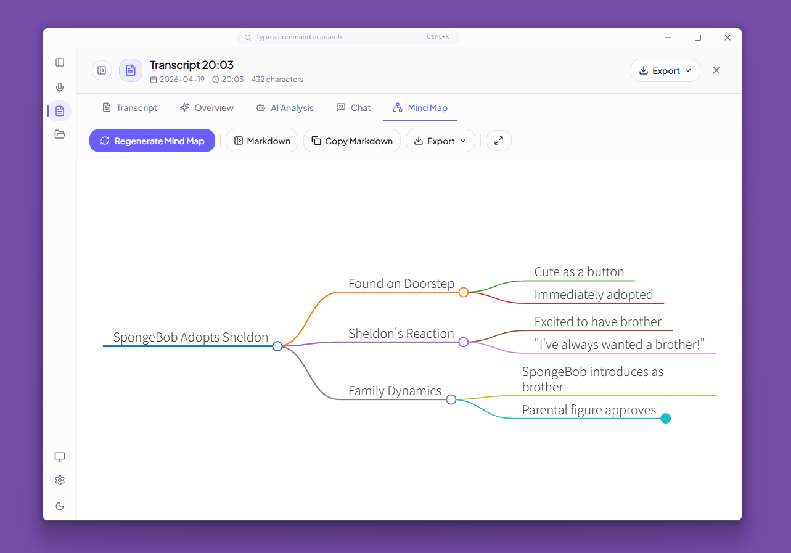 | 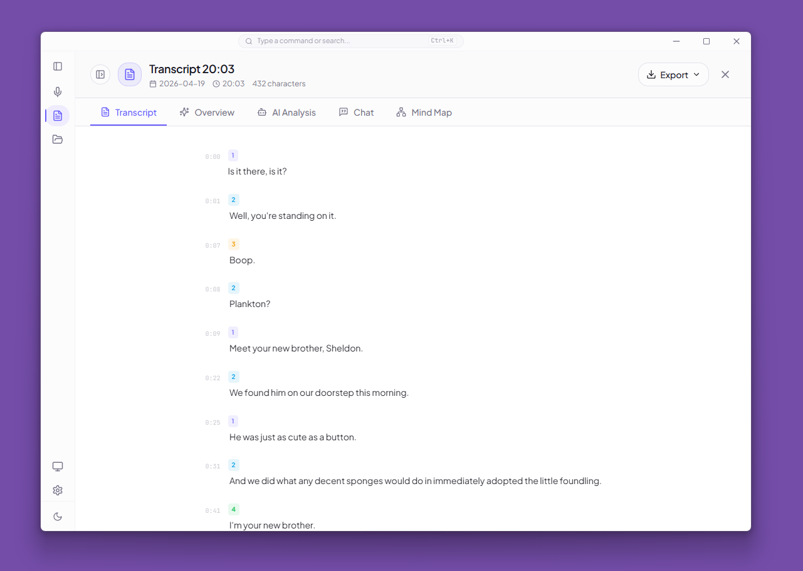 | 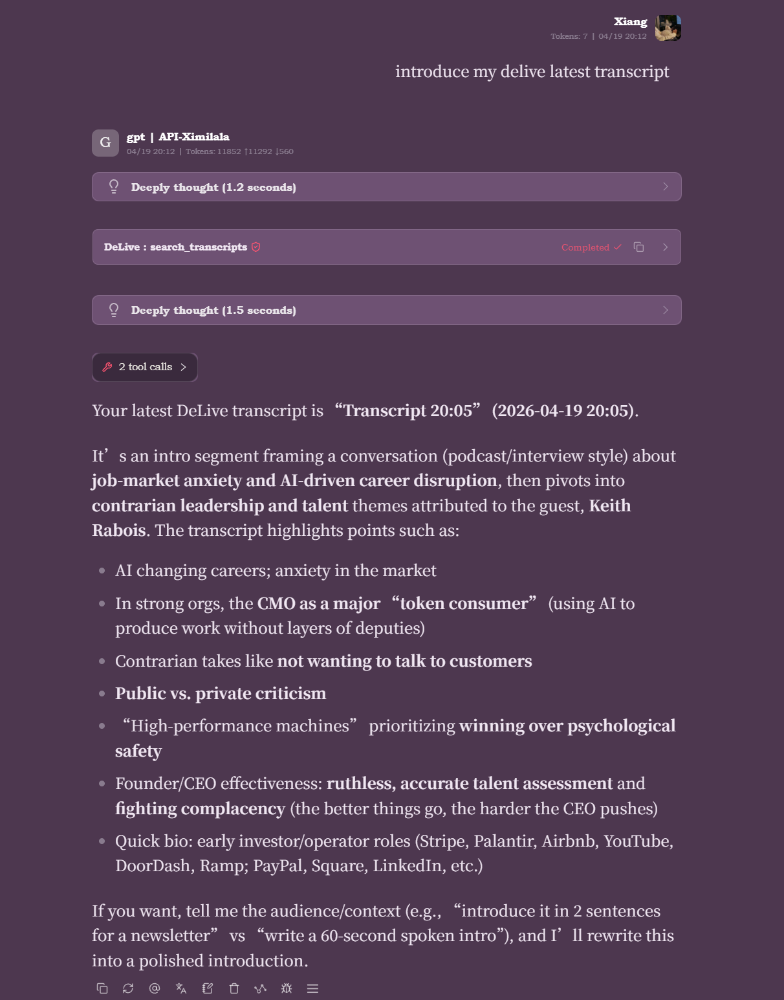 |

| 设置 | 字幕悬浮窗 |
|:---:|:---:|
| Provider 配置与凭证管理 | 可拖拽的置顶字幕悬浮窗 |
| 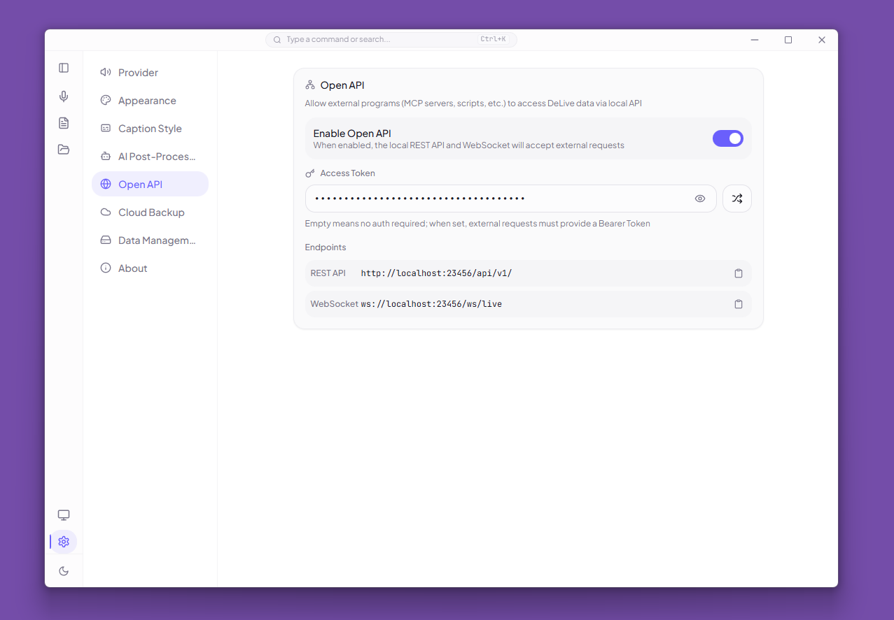 | 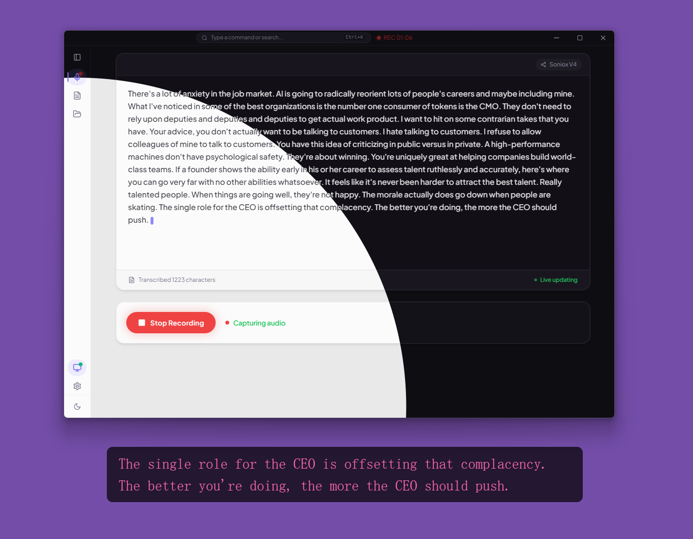 |

#

</div>

## 目录

- [核心功能](#-核心功能)
- [下载安装](#-下载安装)
- [支持的 ASR Provider](#-支持的-asr-provider)
- [快速开始](#-快速开始)
- [使用说明](#-使用说明)
- [项目组成](#-项目组成)
- [系统架构](#-系统架构)
- [技术栈](#-技术栈)
- [安全](#-安全)
- [开放 API 与 MCP 生态](#-开放-api-与-mcp-生态)
- [扩展 Provider](#-扩展-provider)
- [注意事项](#%EF%B8%8F-注意事项)
- [许可证](#-许可证)
- [致谢](#-致谢)

## 🎯 核心功能

- [x] **系统音频采集** — 网页视频、直播、会议、课程、播客，只要共享系统音频即可接入
- [x] **6 条 ASR 路径统一在一个 UI 里** — Soniox、火山引擎、Groq、硅基流动、本地 OpenAI-compatible、本地 `whisper.cpp`
- [x] **按 Provider 能力自动切换音频管线** — 根据后端要求在 `MediaRecorder` 和 `AudioWorklet` PCM16 之间切换
- [x] **同一应用内覆盖 3 种执行模式** — 实时流式、窗口批处理重转写、Electron 管理的本地 runtime
- [x] **完整会话生命周期管理** — 草稿会话、录制中自动保存、异常中断恢复、已完成历史记录
- [x] **悬浮字幕窗** — 独立始终置顶窗口，支持原文 / 翻译 / 双语模式和样式自定义
- [x] **Soniox 专属双语与说话人能力** — 实时翻译、双语字幕、发言人区分、按 speaker 分组预览
- [x] **AI 复盘工作台（Review Desk）** — 全页视图，动画标签栏导航（Overview、Transcript、Chat、Mind Map）
- [x] **富文本 AI 对话** — 多线程对话，GFM Markdown 渲染，语法高亮代码块，消息悬停操作栏等
- [x] **结构化 AI briefing** — 摘要、行动项、关键词、章节、标题/标签建议及带引用问答
- [x] **思维导图** — 基于 Markmap-compatible Markdown 生成，支持编辑，可导出 SVG / PNG
- [x] **主题功能** — 将会话归类到带 emoji 和描述的项目容器中
- [x] **本地模型工作流** — 探测本地服务、发现模型、Ollama 一键拉取、`whisper.cpp` 资源导入与下载
- [x] **5 套配色主题** — 青蓝、紫罗兰、玫瑰、绿色、琥珀，均支持完整明/暗模式
- [x] **本地优先的数据存储与可选云备份** — 会话、标签、主题、设置保存在 IndexedDB / localStorage；支持 S3-compatible / WebDAV 备份流程；密钥通过 `safeStorage` 保存
- [x] **桌面集成** — 托盘、全局快捷键、开机自启动、更新检查、诊断导出
- [x] **安全加固** — 可信窗口 IPC 校验、CSP 注入、导航守卫、路径白名单、密钥加密存储
- [x] **开放 API 与 MCP 生态** — 本地 REST API、实时 WebSocket、MCP 服务器、Token 鉴权、Agent Skill 定义
- [x] **跨平台** — Windows、macOS、Linux

## 📥 下载安装

获取最新版本：

<div align="center">

[](https://github.com/XimilalaXiang/DeLive/releases/latest)
[](https://github.com/XimilalaXiang/DeLive/releases/latest)
[](https://github.com/XimilalaXiang/DeLive/releases/latest)

</div>

| 平台 | 文件 |
|------|------|
| Windows | `.exe` 安装包、便携版 `.exe` |
| macOS | `.dmg`、`.zip`（Intel x64 和 Apple Silicon arm64） |
| Linux | `.AppImage`、`.deb` |

> 所有下载均可在 [Releases](https://github.com/XimilalaXiang/DeLive/releases/latest) 页面获取。

## 🔌 支持的 ASR Provider

| Provider | 类型 | 传输模式 | 音频路径 | 亮点 |
|----------|------|----------|----------|------|
| **Soniox V4** | 云端 | 实时流式 | `MediaRecorder` (`webm/opus`) → WebSocket | token 级实时转录、实时翻译、双语字幕、多发言人识别 |
| **火山引擎** | 云端 | 实时流式 | `AudioWorklet` PCM16 → 内置代理 → WebSocket | 中文场景友好；代理在 Electron 侧补齐必须 Header |
| **Groq** | 云端 | 窗口批处理重转写 | `AudioWorklet` PCM16 → WAV → REST | 基于 Whisper 的准实时会话更新路径 |
| **硅基流动** | 云端 | 窗口批处理重转写 | `AudioWorklet` PCM16 → WAV → REST | SenseVoice、TeleSpeech、Qwen Omni 等模型路径 |
| **本地 OpenAI-compatible** | 本地服务 | 窗口批处理重转写 | `MediaRecorder` (`webm/opus`) → `/v1/audio/transcriptions` | 适配 Ollama 或其他兼容网关，支持服务/模型探测和可选 Ollama 拉取 |
| **本地 `whisper.cpp`** | 本地 runtime | Electron 管理的本地 runtime | `AudioWorklet` PCM16 → 本地 `/inference` | 直接启动 `whisper-server`，管理 binary 与模型资源，全本地运行 |

## 🚀 快速开始

### 前置要求

- Node.js 18+（CI 中使用 Node 20）
- 任意一种 Provider 路径：
  - **Soniox**：[soniox.com](https://soniox.com) 的 API Key
  - **火山引擎**：APP ID 和 Access Token
  - **Groq**：[groq.com](https://groq.com) 的 API Key
  - **硅基流动**：[siliconflow.cn](https://siliconflow.cn) 的 API Key
  - **本地 OpenAI-compatible**：暴露 `/v1/models` 与 `/v1/audio/transcriptions` 的本地服务
  - **本地 `whisper.cpp`**：`whisper-server` + 本地 `.bin` / `.gguf` 模型，或直接让 DeLive 导入/下载

### 安装

```bash
git clone https://github.com/XimilalaXiang/DeLive.git
cd DeLive
npm run install:all
```

### 开发

```bash
npm run dev
```

`npm run dev` 会同时启动 Vite 和 Electron。火山引擎代理已内置在 Electron 主进程中，正常桌面开发不需要单独后端。

如需单独调试代理：

```bash
npm run dev:server
```

### 质量检查

```bash
npm run check
```

`npm run check` 会执行前端 lint、前端测试和完整构建。

如果只想跑前端测试：

```bash
npm run test:frontend
```

当前测试状态：**29 个测试文件、256 个测试用例全部通过**，覆盖 Provider 配置、转录状态/稳定化、字幕导出、会话生命周期与仓储、存储、云备份、Open API IPC 响应以及 AI 后处理解析。

### 打包

```bash
npm run dist:win
npm run dist:mac
npm run dist:linux
npm run dist:all
```

构建产物输出到 `release/`。

### 可选：打包时预置 `whisper.cpp`

```bash
npm run fetch:whisper-runtime -- --target win32
npm run stage:whisper-runtime -- --binary /path/to/whisper-server --target linux
```

如果构建时 `local-runtimes/whisper_cpp/whisper-server(.exe)` 已存在，`electron-builder` 会把它作为额外资源带进安装包。即便没有预置，终端用户也仍然可以在 UI 中自行导入或下载 binary / 模型。

## 📖 使用说明

### 典型录制流程

1. 打开设置，选择一个 Provider。
2. 填写凭据或本地 runtime 信息，并点击 **测试配置**。
3. 点击 **开始录制**。
4. 选择要共享的屏幕或窗口，并确认勾选共享音频。
5. 在主窗口和悬浮字幕窗里查看中间结果与最终结果。
6. 停止录制后，从历史记录打开会话继续复盘、做 AI 操作或导出。

### 悬浮字幕

- 可以从主界面开启或关闭悬浮字幕窗。
- 支持字体、颜色、宽度、行数、阴影和位置调整。
- 当 Provider 返回翻译文本时，可切换原文、翻译、双语三种模式。
- 支持拖动 / 交互状态切换，便于摆放字幕窗位置。

### 主题

将录制按项目式主题归类管理：

1. 从导航栏打开 **主题** 标签页。
2. 创建主题，填写名称、emoji 图标和可选描述。
3. 有两种方式开始录制进主题：
   - 在主题卡片上点击 **录制新会话** —— 跳转到 Live 并预选该主题。
   - 在 Live 视图中，点击录制控件上方的 **选择主题** 链接并选择主题。
4. 所选主题会以徽章形式显示在录制按钮上方，录制会自动归属到该主题。
5. 已有会话可在 Review 的 **Overview** 标签页中移入或移出主题。
6. 主题内的会话不会出现在默认 Review 列表中，但全局搜索仍可找到。

### AI 复盘工作台

已完成会话在独立全页 Review Desk（非弹窗）中打开，配备带滑动动画的标签栏和键盘箭头导航：

- **Overview 标签页**：AI briefing — 摘要、行动项、关键词、章节、标题/标签建议，一键应用
- **Transcript 标签页**：左侧时间戳、彩色说话人标签、连续同一说话人合并、悬停高亮、TXT/Markdown/SRT/VTT 导出
- **Chat 标签页**：多线程 AI 对话 — GFM Markdown 渲染（语法高亮代码块、一键复制）、用户/AI 头像、悬停操作、跳动圆点动画、自动伸缩输入框、浮动回底部按钮、单条线程删除
- **Mind Map 标签页**：生成 Markmap-compatible Markdown，本地编辑，导出 SVG / PNG
- **元数据操作**：应用建议标题/标签，重命名 diarization 会话的 speaker 标签

### 本地 OpenAI-compatible 服务

1. 选择 **本地 OpenAI-compatible**。
2. 填写 `Base URL` 和 `Model`。
3. 用本地模型引导探测服务并列出已安装模型。
4. 如果探测出来是 Ollama，DeLive 可以直接一键拉取所选模型。

### 本地 `whisper.cpp` Runtime

1. 选择 **本地 whisper.cpp**。
2. 通过导入现有 `whisper-server` 或下载官方 release 资产准备 runtime binary。
3. 通过选择、导入或下载 `.bin` / `.gguf` 文件准备模型。
4. 启动 runtime 或执行 **测试配置**。
5. 之后录制方式与其他 Provider 一致，Electron 会通过 IPC 管理 runtime 生命周期。

### 历史、备份与恢复

- 会话支持重命名、打标签、按主题归类、搜索，以及导出 TXT、Markdown、SRT、VTT。
- 录制草稿会自动保存；如果应用中断，下次启动可以恢复未完成会话。
- 支持导入 / 导出全部本地数据，用于备份和迁移。
- 可选云备份支持在 **设置 > 云备份** 中将会话、主题、标签和设置上传到 S3-compatible 或 WebDAV，并可远程列出 / 恢复 / 删除备份。
- 诊断导出会生成一个脱敏 JSON，包含系统信息和最近日志，便于排障。

## 🧩 项目组成

| 模块 | 关键文件 | 职责 |
|------|----------|------|
| 桌面壳层 | `electron/main.ts`, `electron/mainWindow.ts`, `electron/captionWindow.ts`, `electron/tray.ts`, `electron/shortcuts.ts`, `electron/desktopSource.ts`, `electron/autoUpdater.ts`, `electron/ipcSecurity.ts` | 启动 Electron，管理主窗、字幕窗、托盘、快捷键、桌面源选取、更新器、IPC 安全和应用生命周期。 |
| 渲染层应用 | `frontend/src/App.tsx`, `frontend/src/components/*`, `frontend/src/i18n/*` | 主界面、设置、录制、历史、主题、预览和字幕控制 UI；工作区视图（Live / Review Desk / Topics / Settings）由 Zustand 驱动。 |
| ASR 编排层 | `frontend/src/hooks/useASR.ts`, `frontend/src/services/captureManager.ts`, `frontend/src/services/providerSession.ts`, `frontend/src/services/captionBridge.ts` | 解析 Provider 配置、启动正确的音频采集链路、转发转录事件，并同步到悬浮字幕。 |
| Provider 抽象层 | `frontend/src/providers/registry.ts`, `frontend/src/providers/implementations/*` | 把 6 个后端统一到同一套 contract 和 capability 模型。 |
| 状态管理 | `frontend/src/stores/sessionStore.ts`, `frontend/src/stores/topicStore.ts`, `frontend/src/stores/uiStore.ts`, `frontend/src/stores/settingsStore.ts`, `frontend/src/stores/tagStore.ts`, `frontend/src/stores/transcriptStore.ts` | Zustand store 分片：会话、主题、UI 状态、设置、标签，以及用于向后兼容的统一 facade。 |
| 会话智能层 | `frontend/src/services/aiPostProcess.ts`, `frontend/src/components/ReviewDeskView.tsx`, `frontend/src/components/PreviewModal.tsx` | AI briefing、问答、思维导图、标签和 speaker 名称编辑。 |
| 主题组件 | `frontend/src/components/TopicsView.tsx`, `frontend/src/components/TopicDetailView.tsx`, `frontend/src/components/TopicDialog.tsx`, `frontend/src/components/TopicPicker.tsx` | 主题卡片网格浏览、单主题会话列表、CRUD 弹窗，以及 Live 视图中的主题选择器。 |
| Review Desk UI | `frontend/src/components/review/SessionTabBar.tsx`, `frontend/src/components/review/SessionHeader.tsx`, `frontend/src/components/review/OverviewTab.tsx`, `frontend/src/components/review/TranscriptTab.tsx`, `frontend/src/components/review/ChatTab.tsx`, `frontend/src/components/review/MindMapTab.tsx`, `frontend/src/components/review/MarkdownRenderer.tsx` | 动画标签栏（含键盘导航）、会话头部（多格式导出 TXT/Markdown/SRT/VTT）、各标签页视图、GFM Markdown 渲染（含语法高亮）和思维导图编辑。 |
| 设置 UI | `frontend/src/components/ApiKeyConfig.tsx`, `frontend/src/components/settings/*` | 多分组设置工作区：Provider 配置、外观、字幕样式、AI 后处理、Open API、云备份、数据导入导出，以及关于/更新面板。 |
| Runtime UI | `frontend/src/components/runtime/BundledRuntimeSummaryCard.tsx`, `frontend/src/components/runtime/BundledRuntimeAdvancedPanel.tsx` | `whisper.cpp` 运行时的状态卡片和高级管理面板。 |
| 共享 UI 系统 | `frontend/src/components/ui/*` | Button、Badge、Switch、EmptyState、StatusIndicator、DialogShell 原语，五套主题的语义色彩 token。 |
| 本地模型 / runtime 工具层 | `frontend/src/utils/localModelSetup.ts`, `frontend/src/utils/localRuntimeManager.ts`, `frontend/src/components/LocalModelSetupGuide.tsx`, `frontend/src/components/BundledRuntimeSetupGuide.tsx`, `electron/localRuntime.ts`, `electron/localRuntimeFiles.ts`, `electron/localRuntimeShared.ts`, `electron/localRuntimeIpc.ts` | 探测本地服务、检查模型、支持 Ollama 拉取、管理 `whisper.cpp` 资源导入/下载/文件管理/启动/停止。 |
| Electron IPC 层 | `electron/appIpc.ts`, `electron/captionIpc.ts`, `electron/safeStorageIpc.ts`, `electron/updaterIpc.ts`, `electron/diagnosticsIpc.ts`, `electron/apiIpc.ts` | 模块化 IPC 处理器：应用生命周期、字幕窗控制、密钥存储、自动更新、诊断导出和 Open API 数据桥接。 |
| Open API 层 | `electron/apiServer.ts`, `electron/apiBroadcast.ts`, `frontend/src/hooks/useApiIpcResponder.ts` | REST API 端点、WebSocket 实时转录广播、渲染层 IPC 响应器。 |
| MCP 与 Agent 生态 | `mcp/delive-mcp-server.js`, `skills/delive-transcript-analyzer/SKILL.md` | MCP 服务器封装 DeLive 为 Tools/Resources、Agent Skill 定义。 |
| 共享契约层 | `shared/electronApi.ts`, `electron/preload.ts`, `shared/volcProxyCore.ts` | 定义 renderer 与 main 的类型化桥接接口，以及火山代理共享协议辅助逻辑。 |
| 调试与发布支持 | `server/`, `scripts/`, `.github/workflows/release.yml`, `.github/workflows/ci.yml` | 独立火山代理调试、图标/运行时预置脚本、持续集成和 tag 触发的多平台构建发布。 |

## 🔄 录制生命周期

1. `App.tsx` 启动后初始化存储、主题、设置、标签和历史会话。
2. `useASR` 调用 `ProviderSessionManager`，根据当前 Provider 的能力解析连接方式。
3. `CaptureManager` 通过 `getDisplayMedia` 获取系统音频，并在 `MediaRecorder` 与 `AudioWorklet` PCM16 之间做选择。
4. Provider 返回的事件写入 `sessionStore`，`CaptionBridge` 同时把稳定文本和非最终文本同步到悬浮字幕窗。
5. `sessionStore` 会持续构建会话快照、自动保存草稿，并在下次启动时恢复被中断的会话。
6. 已完成会话进入历史区，可进一步做转录复盘、AI 摘要、问答、思维导图、标签整理和导出。

## 🏗️ 系统架构

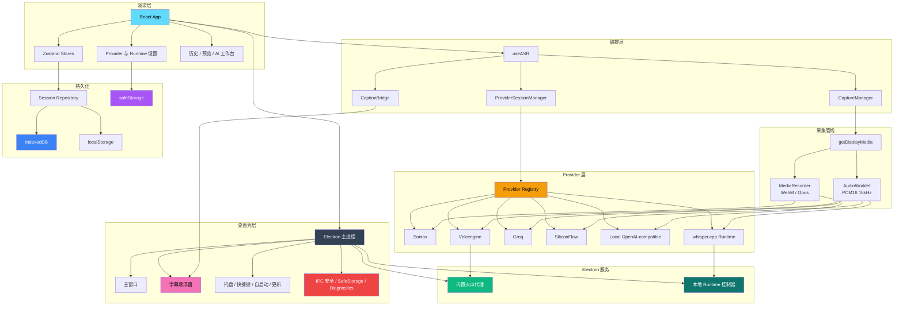

### 架构说明

| 层级 | 主要组件 | 说明 |
|------|----------|------|
| 桌面壳层 | Electron 主进程、主窗、字幕窗、托盘、更新、诊断 | 负责原生生命周期、音源选择、字幕叠加和系统集成。 |
| 渲染层 | React UI、Zustand stores、历史/预览工作台、主题管理、设置面板 | 负责录制流程、配置、主题归类、会话复盘和用户交互。 |
| 编排层 | `useASR`、`CaptureManager`、`ProviderSessionManager`、`CaptionBridge` | 让采集、Provider 和 UI 解耦。 |
| Provider 层 | 注册表 + 6 个实现 | 同时覆盖实时云端、窗口批处理云端、本地服务和本地 runtime。 |
| Electron 服务 | 内置火山代理、本地 runtime 控制器、safe-storage IPC、diagnostics IPC | 提供浏览器环境无法直接完成的能力。 |
| 持久化 | Session Repository、IndexedDB、localStorage、`safeStorage` | 自动保存草稿、恢复中断会话，并将密钥与普通设置分开存储。 |
| 共享契约 | 类型化 preload bridge 与共享 helper | 让 renderer/main 的接口显式可维护。 |

## 📁 项目结构

```text
DeLive/
├── electron/                         # Electron 主进程、窗口、托盘、IPC、更新、本地 runtime 控制、Open API 服务器
├── frontend/                         # React 渲染层、Provider、Store、UI 组件、测试
├── shared/                           # preload/renderer/main 共用的 TypeScript 契约与代理 helper
├── server/                           # 主要用于调试的独立火山引擎代理
├── mcp/                              # 独立 MCP 服务器，供 AI Agent 使用（Claude、Cursor 等）
├── skills/                           # Agent Skill 定义
├── local-runtimes/                   # 可选的预置 runtime 资源（供 whisper.cpp 打包）
├── scripts/                          # 图标生成、runtime 获取/预置、release notes
├── assets/                           # README 与品牌素材
├── build/                            # electron-builder 图标与打包资源
├── .github/workflows/ci.yml          # Push/PR 持续集成流程
├── .github/workflows/release.yml     # tag 触发的质量检查 + 发布流程
├── README.md
└── package.json
```

这里省略了 `dist-electron/`、`release/`、依赖目录等生成产物。

## 🔧 技术栈

| 层级 | 技术 |
|------|------|
| 桌面应用 | Electron 40 |
| 前端 | React 18.3 + TypeScript 5.6 + Vite 6 |
| 样式 | Tailwind CSS 3.4 |
| 状态管理 | Zustand 4.5 |
| 测试 | Vitest 4 |
| 音频处理 | `MediaRecorder`、`AudioWorklet`、WAV 转换工具 |
| 桌面服务 | Electron 主进程 IPC、Express、`ws` |
| 持久化 | IndexedDB、localStorage、Electron `safeStorage` |
| AI 复盘 | OpenAI-compatible chat completions（briefing / 问答 / 思维导图） |
| 打包 | `electron-builder` |
| 发布自动化 | GitHub Actions tag 工作流 |

## 🔒 安全

| 特性 | 说明 |
|------|------|
| 上下文隔离 | `contextIsolation: true`，`nodeIntegration: false` |
| 可信 IPC 发送者 | 敏感 handler 会校验调用者是否为注册过的可信窗口 |
| 内容安全策略 | 在 Electron 层注入 CSP，只放行必要的连接目标 |
| 导航守卫 | 阻止渲染层意外跳转到非预期 URL |
| 路径白名单 | 文件路径检查仅允许 `userData`、home、desktop、downloads、documents 等安全根目录 |
| 密钥存储 | 系统支持时通过 Electron `safeStorage` 保存 API Key |
| Open API 门控 | 本地 REST API 和 WebSocket 默认关闭；启用后可选 Bearer Token 鉴权 |
| 诊断脱敏 | 导出的诊断 JSON 会先清洗疑似密钥字段 |

## ⌨️ 快捷键

| 快捷键 | 功能 |
|--------|------|
| `Ctrl+Shift+D` / `Cmd+Shift+D` | 显示或隐藏主窗口 |

## 🌐 开放 API 与 MCP 生态

DeLive 通过本地 API 对外开放转录数据，外部工具、脚本和 AI Agent 可以编程式地访问会话历史、实时字幕和录制状态。

### 开启 API

1. 进入 **设置 > 开放 API**
2. 打开 **启用开放 API** 开关
3. 可选：设置 **访问令牌** 进行鉴权（推荐）

### REST API

启用后，以下端点可用于 `http://localhost:23456/api/v1/`：

| 端点 | 说明 |
|------|------|
| `GET /health` | 健康检查（始终可访问，即使 API 已关闭） |
| `GET /sessions` | 列出会话，支持搜索、过滤和分页 |
| `GET /sessions/:id` | 会话完整详情，含转录文本和 AI 摘要 |
| `GET /sessions/:id/transcript` | 纯文本转录 |
| `GET /sessions/:id/summary` | AI 摘要、行动项和思维导图 |
| `GET /topics` | 列出所有主题 |
| `GET /tags` | 列出所有标签 |
| `GET /status` | 当前录制状态 |

如设置了 Token，请在请求头中附加 `Authorization: Bearer <token>`。

### WebSocket

实时转录流通过 `ws://localhost:23456/ws/live` 推送。鉴权方式：`?token=<token>` 查询参数或 `Authorization` 请求头。

### MCP 服务器

独立的 MCP 服务器（`mcp/delive-mcp-server.js`）将 DeLive API 封装为 AI Agent 可用的 Tools 和 Resources。使用 **stdio** 传输，兼容所有支持 MCP 的客户端。

配置前先安装 MCP 服务器依赖：

```bash
cd mcp && npm install
```

#### Claude Desktop / Claude Code

添加到 `claude_desktop_config.json`：

```json
{
  "mcpServers": {
    "delive": {
      "command": "node",
      "args": ["C:/path/to/DeLive/mcp/delive-mcp-server.js"],
      "env": {
        "DELIVE_API_URL": "http://localhost:23456",
        "DELIVE_API_TOKEN": "在设置中获取的 Token"
      }
    }
  }
}
```

#### Cursor

添加到 `.cursor/mcp.json`（项目级）或 `~/.cursor/mcp.json`（全局）：

```json
{
  "mcpServers": {
    "delive": {
      "command": "node",
      "args": ["C:/path/to/DeLive/mcp/delive-mcp-server.js"],
      "env": {
        "DELIVE_API_URL": "http://localhost:23456",
        "DELIVE_API_TOKEN": "在设置中获取的 Token"
      }
    }
  }
}
```

#### Cherry Studio

1. 打开 **设置 > MCP 服务器 > 添加**。
2. 选择 **stdio** 类型。
3. 填写：
   - **命令**：`node`
   - **参数**：`C:/path/to/DeLive/mcp/delive-mcp-server.js`
   - **环境变量**：`DELIVE_API_URL=http://localhost:23456`、`DELIVE_API_TOKEN=your-token`
4. 保存并启用。

#### OpenAI Codex CLI / 其他 MCP 客户端

任何支持 stdio 传输的 MCP 客户端都可以使用相同模式：

```bash
DELIVE_API_URL=http://localhost:23456 \
DELIVE_API_TOKEN=your-token \
node /path/to/DeLive/mcp/delive-mcp-server.js
```

| 变量 | 默认值 | 说明 |
|------|--------|------|
| `DELIVE_API_URL` | `http://localhost:23456` | DeLive REST API 基础 URL |
| `DELIVE_API_TOKEN` | *(空)* | 鉴权 Bearer Token |

> **注意**：MCP 服务器需要 DeLive 正在运行且 **Open API 已启用**。Token 在 DeLive **设置 > 开放 API** 中配置。

完整的 Tools 和 Resources 参考详见 [`mcp/`](./mcp/)。

### Agent Skill

Agent Skill 定义位于 [`skills/delive-transcript-analyzer/SKILL.md`](./skills/delive-transcript-analyzer/SKILL.md)，为 AI Agent 提供使用 DeLive 的结构化指引。

## 🔧 扩展 Provider

1. 在 `frontend/src/providers/implementations/` 下新增 Provider 实现。
2. 正确声明 `ASRProviderInfo`、必填字段和 capability 标记。
3. 在 `frontend/src/providers/registry.ts` 注册。
4. 如果支持配置验证，在 `frontend/src/utils/providerConfigTest.ts` 增加对应逻辑。
5. 如果是本地服务或本地 runtime 路径，在 `frontend/src/utils/localModelSetup.ts` 或 `frontend/src/utils/localRuntimeManager.ts` 接入配套能力。
6. 如果需要自定义 Header 或原生进程控制，在 `electron/` 侧补充支持。

## ⚠️ 注意事项

1. **系统要求**：Windows 10+、macOS 13+、或具备 PulseAudio loopback 的 Linux。
2. **火山引擎代理**：正常桌面使用无需单独后端，Electron 会自动启动内置代理。
3. **本地 OpenAI-compatible 模式**：模型发现依赖 `/v1/models`，转录依赖 `/v1/audio/transcriptions`。
4. **`whisper.cpp` 模式**：预置 binary 只是可选项，用户也可以运行时后续导入或下载。
5. **托盘行为**：关闭主窗口默认会隐藏到托盘，而不是直接退出。
6. **开机自启动**：当前支持 Windows 和 macOS。
7. **自动更新**：支持 Windows、macOS 和 Linux AppImage。

### 🛡️ Windows SmartScreen 提示

首次运行 DeLive 时，Windows 可能弹出 SmartScreen 警告。这对未签名或新发布的桌面应用是正常现象。

1. 点击 **更多信息**。
2. 点击 **仍要运行**。

也可以直接审查源码，或者自行校验发布产物。

## 📄 许可证

Apache License 2.0

## 🙏 致谢

- [Soniox](https://soniox.com) — 实时语音识别 API
- [火山引擎](https://www.volcengine.com) — 中文语音识别
- [Groq](https://groq.com) — 高性能 Whisper 推理
- [硅基流动](https://siliconflow.cn) — 语音与多模态 ASR 服务
- [Ollama](https://ollama.com) — 本地模型工作流
- [`whisper.cpp`](https://github.com/ggml-org/whisper.cpp) — 本地开源 runtime
- [BiBi-Keyboard](https://github.com/BryceWG/BiBi-Keyboard) — 多 Provider 架构灵感

---

<div align="center">

[](https://www.star-history.com/#XimilalaXiang/DeLive&type=date&legend=top-left)

**Made by [XimilalaXiang](https://github.com/XimilalaXiang)**

</div>
