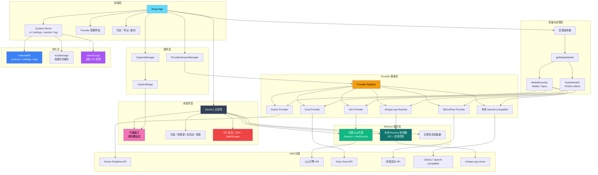

<div align="center">


# DeLive

**系统级音频捕获 | 云端与本地 ASR 一体化桌面应用**

[English](./README.md) | 简体中文 | [繁體中文](./README_TW.md) | [日本語](./README_JA.md)

[](https://github.com/XimilalaXiang/DeLive/releases)
[](https://github.com/XimilalaXiang/DeLive/blob/main/LICENSE)
[](https://github.com/XimilalaXiang/DeLive/releases)
[](https://github.com/XimilalaXiang/DeLive/releases)
[](https://github.com/XimilalaXiang/DeLive/releases)
[](https://github.com/XimilalaXiang/DeLive/releases)
[](https://github.com/XimilalaXiang/DeLive)

[核心功能](#-核心功能) • [快速开始](#-快速开始) • [系统架构](#-系统架构) • [支持的 ASR 服务](#-支持的-asr-服务)

</div>

只要电脑能播放出声音，DeLive 就能把这段系统音频捕获下来，送到你选定的 ASR 后端，并把转录结果保存在本地，供继续整理、检索和导出。

<div align="center">

</div>

## 🎯 核心功能

- **系统级音频捕获**：适用于网页视频、直播、会议、课程和任何能共享系统音频的播放场景。
- **6 种 ASR 后端**：内置 Soniox、火山引擎、Groq、硅基流动、本地 OpenAI-compatible、本地 `whisper.cpp` 六条路径。
- **按 Provider 自动切换音频管线**：根据后端要求，在 `MediaRecorder` 与 `AudioWorklet` PCM16 处理之间自动切换。
- **本地模型工作流**：支持探测本地服务、列出已安装模型、Ollama 一键拉取，以及 `whisper.cpp` binary / 模型导入与下载。
- **悬浮字幕窗口**：独立透明窗口、始终置顶，可拖动、锁定，并自定义样式。
- **Soniox 双语字幕与说话人视图**：支持原文 / 翻译 / 双语显示模式，以及按说话人分组的历史预览。
- **历史记录与导出**：当前 UI 支持标签、搜索、TXT / SRT 导出，代码层已具备 VTT 生成能力。
- **桌面级集成**：系统托盘、全局快捷键、开机自启动、更新检查、中英文界面。
- **安全加固**：IPC 发送者验证、内容安全策略（CSP）、导航守卫、路径白名单、API 密钥通过操作系统级 `safeStorage` 加密存储。
- **一键诊断导出**：收集系统信息、脱敏配置和最近日志到 JSON 文件，方便问题排查。

## 🏗️ 系统架构



### 架构说明

| 层级 | 主要组件 | 说明 |
|------|----------|------|
| 桌面壳层 | Electron 主进程、托盘、更新器、字幕窗、IPC 安全、诊断模块 | 负责原生桌面能力、IPC 和操作系统级加密 |
| 前端层 | React、Zustand（4 个 Store）、配置页、历史面板 | 管理录制流程、设置与会话状态 |
| 服务层 | `CaptureManager`、`CaptionBridge`、`ProviderSessionManager` | 从单体 hook 解耦的单一职责服务 |
| 采集与处理层 | `getDisplayMedia`、`MediaRecorder`、`AudioWorklet` | 按 Provider 能力切换音频编码路径 |
| Provider 抽象层 | 注册表 + 6 个 Provider 实现 | 统一云端与本地转录接口 |
| Electron 服务层 | 内置火山代理、本地 runtime 管理器、诊断收集器 | 处理自定义 Header 代理、本地进程生命周期和诊断信息 |
| 持久化 | IndexedDB（主存）+ localStorage（同步缓存）+ safeStorage（密钥） | 双写自动恢复；API 密钥通过 OS 钥匙链加密 |

## 🔌 支持的 ASR 服务

| 服务 | 类型 | 音频路径 | 说明 |
|------|------|----------|------|
| **Soniox V4** | 云端 | `MediaRecorder` → WebSocket | Token 级实时转录、实时翻译、双语字幕、多发言人识别 |
| **火山引擎** | 云端 | PCM16 → 内置代理 → WebSocket | 中文优化，代理负责补齐 Header |
| **Groq** | 云端 | `MediaRecorder` → REST API | Whisper large-v3-turbo / large-v3，整段重转写 |
| **硅基流动** | 云端 | `MediaRecorder` → REST API | SenseVoice、TeleSpeech、Qwen Omni，整段重转写 |
| **本地 OpenAI-compatible** | 本地服务 | `MediaRecorder` → `/v1/audio/transcriptions` | 适配 Ollama 或其他兼容网关，支持模型探测和可选一键拉取 |
| **本地 whisper.cpp** | 本地 runtime | PCM16 → 本地 `/inference` | 内置或用户导入 `whisper-server`，支持 `.bin` / `.gguf` 模型 |

## 🚀 快速开始

### 前置要求

- Node.js 18+
- 任选一种后端路径：
  - **Soniox**：[soniox.com](https://soniox.com) 的 API Key
  - **火山引擎**：APP ID + Access Token
  - **Groq**：[groq.com](https://groq.com) 的 API Key
  - **硅基流动**：[siliconflow.cn](https://siliconflow.cn) 的 API Key
  - **本地 OpenAI-compatible**：提供 `/v1/models` 与 `/v1/audio/transcriptions` 的本地服务（如 Ollama）
  - **本地 whisper.cpp**：`whisper-server` binary + 本地模型文件，或在 DeLive 里直接下载/导入

### 安装

```bash
git clone https://github.com/XimilalaXiang/DeLive.git
cd DeLive
npm run install:all
```

### 开发模式

```bash
npm run dev
```

`npm run dev` 会同时启动 Vite 和 Electron。火山引擎代理已内置在 Electron 主进程中，不需要额外的后端服务。

如需单独调试代理：

```bash
npm run dev:server
```

### 打包构建

```bash
npm run dist:win     # Windows (NSIS 安装包 + 便携版)
npm run dist:mac     # macOS (DMG + zip, x64 + arm64)
npm run dist:linux   # Linux (AppImage + deb)
npm run dist:all     # 全平台
```

产物位于 `release/`。

### 运行测试

```bash
cd frontend && npm test
```

通过 Vitest 运行 149 个单元测试，覆盖 Provider 配置、字幕导出、转录稳定器、窗口批处理、存储工具和 BaseASRProvider 事件系统。

### 可选：打包时预置 `whisper.cpp`

```bash
npm run fetch:whisper-runtime -- --target win32
npm run stage:whisper-runtime -- --binary /path/to/whisper-server --target linux
```

如果构建时 `local-runtimes/whisper_cpp/whisper-server(.exe)` 已存在，`electron-builder` 会把它一起打进安装包。即便没有预置，终端用户也仍然可以在应用内导入或下载 binary / 模型。

## 📖 使用说明

### 云端 Provider

1. 打开设置，选择一个云端 Provider（Soniox V4、火山引擎、Groq 或硅基流动）。
2. 填写凭据并点击 **测试配置**。
3. 点击 **开始录制**。
4. 选择要共享的屏幕或窗口，并确保勾选共享音频。
5. 实时结果会显示在主窗口，也可以同步到悬浮字幕窗口。使用 Soniox 时，还可以切换翻译 / 双语字幕模式，并查看按说话人分组的转录。

### 本地 OpenAI-compatible

1. 选择 **本地 OpenAI-compatible**。
2. 填写 **Base URL** 和 **Model**。
3. 使用本地模型引导先探测服务，再检测已安装模型。
4. 如果探测结果是 Ollama，可以直接在应用里一键拉取模型。

### 本地 `whisper.cpp` Runtime

1. 选择 **本地 whisper.cpp**。
2. 准备 runtime binary：导入已有 `whisper-server`，或者加载推荐官方 release 资产并下载。
3. 准备模型：选择、导入或下载本地 `.bin` / `.gguf` 模型文件。
4. 启动 runtime 或执行 **测试配置**。
5. 之后的录制流程与其他 Provider 一致，DeLive 会通过 Electron IPC 管理本地 runtime。

### 字幕、历史与导出

- 开启悬浮字幕窗口，自定义字体、颜色、字号、宽度、阴影和位置。
- 使用 Soniox 时，可切换原文 / 翻译 / 双语字幕模式，并在历史预览里按说话人查看分段。
- 在历史面板中重命名会话、打标签、搜索记录。
- 当前 UI 可导出 TXT、SRT；代码层已包含 VTT 生成能力，后续可继续补齐更多导出入口。
- 在设置面板中导入 / 导出全部本地数据，用于备份和迁移。

### 诊断信息

遇到问题时，打开 **设置 → 通用设置 → 诊断信息**，点击 **导出诊断包**。会生成一个 JSON 文件，包含系统信息、脱敏后的配置和最近日志，方便分享给开发者排查问题。

## 📁 项目结构

```text
DeLive/
├── electron/                         # Electron 主进程与 IPC
│   ├── main.ts                       # 应用入口、窗口创建、IPC 注册
│   ├── preload.ts                    # Context Bridge（渲染进程安全 API）
│   ├── mainWindow.ts                 # 主窗口创建、CSP 注入
│   ├── captionWindow.ts              # 悬浮字幕窗口控制器
│   ├── captionIpc.ts                 # 字幕操作 IPC handler
│   ├── appIpc.ts                     # 通用 IPC（版本号、托盘、自启动、文件选择）
│   ├── desktopSource.ts              # getDisplayMedia 屏幕/窗口捕获
│   ├── volcProxy.ts                  # 内置 Express + WebSocket 火山引擎代理
│   ├── localRuntime.ts               # whisper.cpp runtime 控制器
│   ├── localRuntimeIpc.ts            # 本地 runtime 操作 IPC handler
│   ├── autoUpdater.ts                # electron-updater 配置
│   ├── updaterIpc.ts                 # 更新检查与下载 IPC
│   ├── ipcSecurity.ts                # 可信窗口验证、CSP、导航守卫、路径白名单
│   ├── safeStorageIpc.ts             # API 密钥加密存储（Electron safeStorage）
│   ├── diagnosticsIpc.ts             # 日志拦截与诊断包导出
│   ├── tray.ts                       # 系统托盘图标与菜单
│   └── shortcuts.ts                  # 全局快捷键
├── frontend/
│   ├── caption.html                  # 字幕窗口入口
│   ├── src/
│   │   ├── components/               # UI 组件
│   │   ├── hooks/                    # useASR — ASR 编排 hook
│   │   ├── services/                 # CaptureManager、CaptionBridge、ProviderSessionManager
│   │   ├── providers/                # Provider 注册表 + 6 个实现
│   │   ├── stores/                   # Zustand 状态管理（ui、settings、session、tag）
│   │   ├── utils/                    # 音频、存储、Provider 配置、字幕导出等工具
│   │   ├── types/                    # ASR 类型与各厂商类型定义
│   │   └── i18n/                     # 界面翻译（中文、英文）
│   ├── public/                       # 静态资源（AudioWorklet 处理器、favicon）
│   └── vitest.config.ts              # 测试配置
├── local-runtimes/
│   └── whisper_cpp/                  # 可选的预置 whisper.cpp runtime 资源
├── scripts/                          # 图标生成、runtime 拉取/预置、release notes
├── server/                           # 独立火山引擎代理（供调试使用）
├── .github/workflows/release.yml     # CI/CD：tag release 流水线（常规 push / PR CI 仍待补齐）
└── package.json
```

## 🔧 技术栈

| 层级 | 技术 |
|------|------|
| 桌面应用 | Electron 40 |
| 前端 | React 18 + TypeScript 5.6 + Vite 6 |
| 样式 | Tailwind CSS 3.4 |
| 状态管理 | Zustand 4.5（4 个聚焦 Store） |
| 测试 | Vitest 4（149 个单元测试） |
| 音频处理 | AudioWorklet（ScriptProcessorNode 回退） |
| 桌面服务 | Electron 内置 Express + ws |
| 持久化 | IndexedDB + localStorage + Electron safeStorage |
| ASR 后端 | Soniox V4、火山引擎、Groq、硅基流动、OpenAI-compatible 本地 ASR、whisper.cpp |
| 打包 | electron-builder (NSIS / DMG / AppImage) |
| CI/CD | GitHub Actions（当前为 tag release 流水线） |

## 🔒 安全

| 特性 | 说明 |
|------|------|
| 上下文隔离 | `contextIsolation: true`，`nodeIntegration: false` |
| IPC 发送者验证 | 所有敏感 IPC handler 验证调用者为可信窗口 |
| 内容安全策略 | 通过 `webRequest.onHeadersReceived` 注入 CSP，本地模型连接安全放行 |
| 导航守卫 | `will-navigate` 阻止意外 URL 加载 |
| 路径白名单 | `path-exists` IPC 限制在安全目录（userData、home、desktop 等） |
| API 密钥加密 | 通过 Electron `safeStorage`（Windows DPAPI / macOS Keychain）加密存储 |

## ⌨️ 快捷键

| 快捷键 | 功能 |
|--------|------|
| `Ctrl+Shift+D` / `Cmd+Shift+D` | 显示或隐藏主窗口 |

## 🔧 扩展 Provider

1. 在 `frontend/src/providers/implementations/` 新增 Provider 实现。
2. 正确声明 `ASRProviderInfo`、必填字段和能力标记。
3. 在 `frontend/src/providers/registry.ts` 注册。
4. 如果支持配置验证，在 `frontend/src/utils/providerConfigTest.ts` 增加测试逻辑。
5. 如果是本地服务或本地 runtime 路径，在 `frontend/src/utils/localModelSetup.ts` 或 `frontend/src/utils/localRuntimeManager.ts` 补齐管理逻辑。
6. 如果涉及自定义 Header 或本地进程控制，在 `electron/` 新增专用 IPC 模块。

## ⚠️ 注意事项

1. **系统要求**：Windows 10+、macOS 13+、或具备 PulseAudio loopback 的 Linux。
2. **火山引擎代理**：桌面端正常使用时不需要单独启动后端，Electron 会自动拉起内置代理。
3. **本地 OpenAI-compatible**：模型探测依赖 `/v1/models`，转录依赖 `/v1/audio/transcriptions`。
4. **`whisper.cpp` 模式**：预置 binary 只是可选项，用户也可以在运行时自行导入或下载。
5. **托盘行为**：关闭主窗口会最小化到托盘，需在托盘菜单中彻底退出。
6. **开机自启动**：当前支持 Windows 和 macOS。
7. **自动更新**：支持 Windows、macOS 和 Linux AppImage。

### 🛡️ Windows SmartScreen 提示

首次运行 DeLive 时，Windows 可能弹出 SmartScreen 警告。这对未签名或新发布的桌面应用是正常现象。

1. 点击 **更多信息**。
2. 点击 **仍要运行**。

你也可以直接审查源代码，或自行校验发布产物。

## 📄 许可证

Apache License 2.0

## 🙏 致谢

- [Soniox](https://soniox.com) — 实时语音识别 API
- [火山引擎](https://www.volcengine.com) — 中文语音识别
- [Groq](https://groq.com) — 高性能 Whisper 推理
- [硅基流动](https://siliconflow.cn) — SenseVoice 与多模态 ASR
- [Ollama](https://ollama.com) — 本地模型工作流
- [`whisper.cpp`](https://github.com/ggml-org/whisper.cpp) — 本地开源 runtime
- [BiBi-Keyboard](https://github.com/BryceWG/BiBi-Keyboard) — 多 Provider 架构灵感

---

<div align="center">

[](https://www.star-history.com/#XimilalaXiang/DeLive&type=date&legend=top-left)

**Made by [XimilalaXiang](https://github.com/XimilalaXiang)**

</div>
