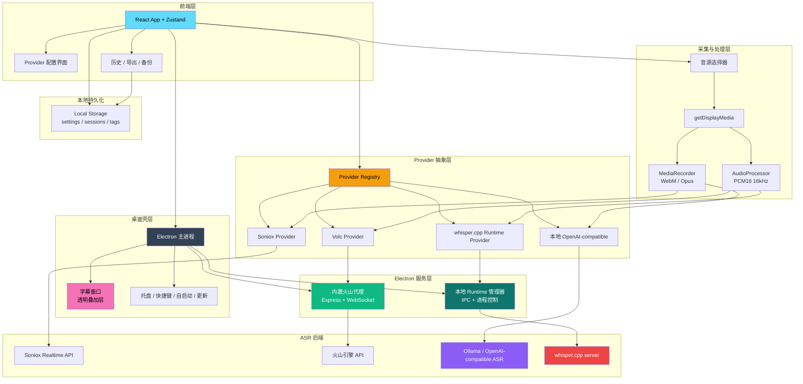

<div align="center">


# DeLive

**系统级音频捕获 | 云端与本地 ASR 一体化桌面应用**

[English](./README.md) | 简体中文 | [繁體中文](./README_TW.md) | [日本語](./README_JA.md)

[](https://github.com/XimilalaXiang/DeLive/releases)
[](https://github.com/XimilalaXiang/DeLive/blob/main/LICENSE)
[](https://github.com/XimilalaXiang/DeLive/releases)
[](https://github.com/XimilalaXiang/DeLive/releases)
[](https://github.com/XimilalaXiang/DeLive/releases)
[](https://github.com/XimilalaXiang/DeLive/releases)
[](https://github.com/XimilalaXiang/DeLive)

[核心功能](#-核心功能) • [快速开始](#-快速开始) • [系统架构](#-系统架构) • [支持的-asr-服务](#-支持的-asr-服务)

</div>

只要电脑能播放出声音，DeLive 就能把这段系统音频捕获下来，送到你选定的 ASR 后端，并把转录结果保存在本地，供继续整理、检索和导出。

<div align="center">

</div>

## 🎯 核心功能

- **系统级音频捕获**：适用于网页视频、直播、会议、课程和任何能共享系统音频的播放场景。
- **云端与本地 ASR 共存**：内置 Soniox、火山引擎、本地 OpenAI-compatible、本地 `whisper.cpp` 四条路径。
- **按 Provider 自动切换音频管线**：根据后端要求，在 `MediaRecorder` 与 PCM16 `AudioProcessor` 之间自动切换。
- **本地模型工作流**：支持探测本地服务、列出已安装模型、Ollama 一键拉取，以及 `whisper.cpp` binary / 模型导入与下载。
- **悬浮字幕窗口**：独立透明窗口、始终置顶，可拖动、锁定，并自定义样式。
- **历史记录与导出**：支持标签、搜索、TXT / SRT 导出。
- **桌面级集成**：系统托盘、全局快捷键、开机自启动、更新检查、中英文界面。

## 🏗️ 系统架构



### 架构说明

| 层级 | 主要组件 | 说明 |
|------|----------|------|
| 桌面壳层 | Electron 主进程、托盘、更新器、字幕窗 | 负责原生桌面能力和 IPC |
| 前端层 | React、Zustand、配置页、历史面板 | 管理录制流程、设置与会话状态 |
| 采集与处理层 | `getDisplayMedia`、`MediaRecorder`、`AudioProcessor` | 按 Provider 能力切换音频编码路径 |
| Provider 抽象层 | 注册表 + 4 个 Provider 实现 | 统一云端与本地转录接口 |
| Electron 服务层 | 内置火山代理、本地 runtime 管理器 | 处理自定义 Header 代理与本地进程生命周期 |
| 本地持久化 | 浏览器本地存储 | 保存设置、会话、标签等数据 |

## 🔌 支持的 ASR 服务

| 服务 | 类型 | 音频路径 | 说明 |
|------|------|----------|------|
| **Soniox V4** | 云端 | `MediaRecorder` -> WebSocket | Token 级实时转录，多语言 |
| **火山引擎** | 云端 | PCM16 -> 内置代理 -> WebSocket | 中文优化，代理负责补齐 Header |
| **本地 OpenAI-compatible** | 本地服务 | `MediaRecorder` -> `/v1/audio/transcriptions` | 适配 Ollama 或其他兼容网关，支持模型探测和可选一键拉取 |
| **本地 whisper.cpp** | 本地 runtime | PCM16 -> 本地 `/inference` | 实验性；支持 `whisper-server` binary 与 `.bin` / `.gguf` 模型导入或下载 |

## 🚀 快速开始

### 前置要求

- Node.js 18+
- 任选一种后端路径：
  - Soniox API Key
  - 火山引擎 APP ID + Access Token
  - 提供 `/v1/models` 与 `/v1/audio/transcriptions` 的本地 OpenAI-compatible ASR 服务
  - `whisper.cpp` server binary 与本地模型文件，或者直接在 DeLive 里下载 / 导入

### 安装

```bash
git clone https://github.com/XimilalaXiang/DeLive.git
cd DeLive
npm run install:all
```

### 开发模式

```bash
npm run dev
```

`npm run dev` 会同时启动 Vite 和 Electron。桌面端正常开发时，火山引擎代理已经内置在 `electron/main.ts` 中，不需要额外再起一个后端服务。

如果你要单独调试代理或做非 Electron 实验，再使用：

```bash
npm run dev:server
```

### 打包构建

```bash
npm run dist:win
npm run dist:mac
npm run dist:linux
```

产物位于 `release/`。

### 可选：打包时预置 `whisper.cpp`

```bash
# 拉取官方 release 资产到 local-runtimes/whisper_cpp/
npm run fetch:whisper-runtime -- --target win32

# 或者手动放入你自己的 whisper-server
npm run stage:whisper-runtime -- --binary /path/to/whisper-server --target linux
```

如果构建时 `local-runtimes/whisper_cpp/whisper-server(.exe)` 已存在，`electron-builder` 会把它一起打进安装包。即便没有预置，终端用户也仍然可以在应用内导入或下载 binary / 模型。

## 📖 使用说明

### 云端 Provider

1. 打开设置，选择 `Soniox V4` 或 `火山引擎`。
2. 填写凭据并点击 `测试配置`。
3. 点击 `开始录制`。
4. 选择要共享的屏幕或窗口，并确保勾选共享音频。
5. 实时结果会显示在主窗口，也可以同步到悬浮字幕窗口。

### 本地 OpenAI-compatible

1. 选择 `本地 OpenAI-compatible`。
2. 填写 `Base URL` 和 `Model`。
3. 使用本地模型引导先探测服务，再检测已安装模型。
4. 如果探测结果是 Ollama，可以直接在应用里一键拉取模型。

### 本地 `whisper.cpp` Runtime

1. 选择 `本地 whisper.cpp`。
2. 准备 runtime binary：导入已有 `whisper-server`，或者加载推荐官方 release 资产并下载。
3. 准备模型：选择、导入或下载本地 `.bin` / `.gguf` 模型文件。
4. 启动 runtime 或执行 `测试配置`。
5. 之后的录制流程与其他 Provider 一致，DeLive 会通过 Electron IPC 管理本地 runtime。

### 字幕、历史与导出

- 开启悬浮字幕窗口，自定义字体、颜色、字号、宽度、阴影和位置。
- 在历史面板中重命名会话、打标签、搜索记录。
- 导出 TXT 或 SRT。
- 在设置面板中导入 / 导出全部本地数据，用于备份和迁移。

## 📁 项目结构

```text
DeLive/
├── electron/                       # Electron 主进程与 IPC 桥
│   ├── main.ts                     # 内置代理、runtime 管理、托盘、更新
│   └── preload.ts                  # Renderer 可安全访问的 Electron API
├── frontend/
│   ├── caption.html                # 悬浮字幕窗口入口
│   ├── src/
│   │   ├── components/             # UI 面板与引导组件
│   │   ├── hooks/                  # 录制和 ASR 编排
│   │   ├── providers/              # 注册表与各 Provider 实现
│   │   ├── stores/                 # Zustand 状态管理
│   │   ├── utils/                  # 音频、存储、provider、本地 runtime 工具
│   │   └── i18n/                   # UI 语言资源
├── local-runtimes/
│   └── whisper_cpp/                # 可选的预置 whisper.cpp runtime 资源
├── scripts/                        # runtime 拉取 / 预置等脚本
├── server/                         # 独立代理服务，供调试 / 实验使用
└── package.json
```

## 🔧 技术栈

| 层级 | 技术 |
|------|------|
| 桌面应用 | Electron 40 |
| 前端 | React 18 + TypeScript + Vite |
| 样式 | Tailwind CSS |
| 状态管理 | Zustand |
| 桌面服务 | Electron 内置 Express + ws |
| ASR 后端 | Soniox V4、火山引擎、OpenAI-compatible 本地 ASR、`whisper.cpp` |
| 打包 | electron-builder |

## ⌨️ 快捷键

| 快捷键 | 功能 |
|--------|------|
| `Ctrl+Shift+D` / `Cmd+Shift+D` | 显示或隐藏主窗口 |

## 🔧 扩展 Provider

1. 在 `frontend/src/providers/implementations/` 新增 Provider 实现。
2. 正确声明 `ASRProviderInfo`、必填字段和能力标记。
3. 在 `frontend/src/providers/registry.ts` 注册。
4. 如果支持配置验证，在 `frontend/src/utils/providerConfigTest.ts` 增加测试逻辑。
5. 如果是本地服务或本地 runtime 路径，在 `frontend/src/utils/localModelSetup.ts` 或 `frontend/src/utils/localRuntimeManager.ts` 补齐管理逻辑。
6. 如果涉及自定义 Header 或本地进程控制，扩展 `electron/main.ts`；只有在还需要独立代理时，再同步到 `server/`。

## ⚠️ 注意事项

1. **系统要求**：Windows 10+、macOS 13+、或具备 PulseAudio loopback 的 Linux。
2. **火山引擎代理**：桌面端正常使用时不需要单独启动后端，Electron 会自动拉起内置代理。
3. **本地 OpenAI-compatible**：模型探测依赖 `/v1/models`，转录依赖 `/v1/audio/transcriptions`。
4. **`whisper.cpp` 模式**：预置 binary 只是可选项，用户也可以在运行时自行导入或下载。
5. **托盘行为**：关闭主窗口会最小化到托盘，需在托盘菜单中彻底退出。
6. **开机自启动**：当前支持 Windows 和 macOS。
7. **自动更新**：支持 Windows、macOS 和 Linux AppImage。

### 🛡️ Windows SmartScreen 提示

首次运行 DeLive 时，Windows 可能弹出 SmartScreen 警告。这对未签名或新发布的桌面应用是正常现象。

1. 点击 **更多信息**。
2. 点击 **仍要运行**。

你也可以直接审查源代码，或自行校验发布产物。

## 📄 许可证

Apache License 2.0

## 🙏 致谢

- [Soniox](https://soniox.com)
- [火山引擎](https://www.volcengine.com)
- [Ollama](https://ollama.com)
- [`whisper.cpp`](https://github.com/ggml-org/whisper.cpp)
- [BiBi-Keyboard](https://github.com/BryceWG/BiBi-Keyboard)

---

<div align="center">

[](https://www.star-history.com/#XimilalaXiang/DeLive&type=date&legend=top-left)

**Made by [XimilalaXiang](https://github.com/XimilalaXiang)**

</div>
