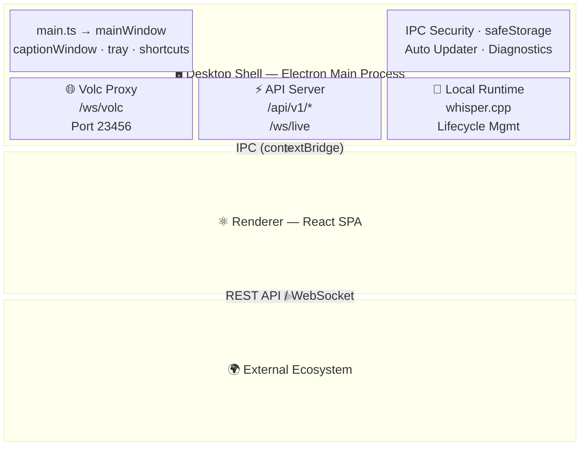
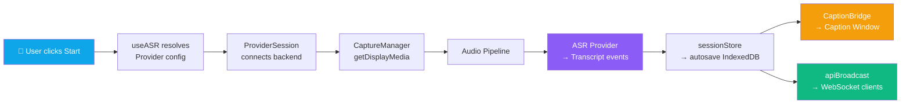
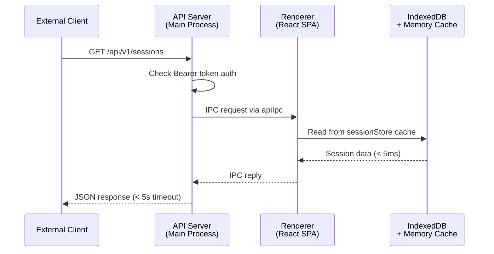
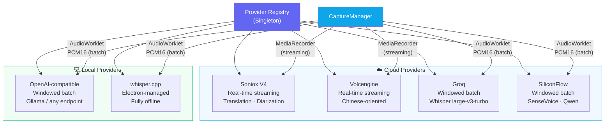

# System Overview

DeLive is an Electron desktop application with a clear separation between the **Main process** (Node.js runtime) and the **Renderer process** (Chromium browser context).

## Architecture Diagram

## Recording Data Flow

## API Request Flow

## Provider Architecture

## Key Architectural Decisions

### IndexedDB in Renderer

All session data lives in the Renderer's IndexedDB with an in-memory cache in `sessionRepository`. The Main process cannot access IndexedDB directly. When the API Server needs data, it sends an IPC request to the Renderer, which responds from the cache (< 5ms latency).

### Single HTTP Server

Port 23456 hosts the Volcengine WebSocket proxy (`/ws/volc`), the REST API (`/api/v1/*`), and the live transcript WebSocket (`/ws/live`) on a single `http.createServer()`.

### MCP as Separate Process

The MCP server is a standalone Node.js script, not embedded in Electron. Claude Desktop launches it as a child process. It communicates with DeLive via the REST API. This design means DeLive and the MCP server can crash independently.

### Provider Registry

Six ASR backends are registered in a singleton `ProviderRegistry`. Each provider implements a common `ASRProvider` contract but uses different audio formats and transport methods. The `CaptureManager` selects the right audio pipeline based on provider capabilities.

## Module Map

| Layer | Key Modules |
|-------|------------|
| Desktop Shell | `main.ts`, `mainWindow.ts`, `captionWindow.ts`, `tray.ts`, `shortcuts.ts` |
| IPC | `appIpc.ts`, `captionIpc.ts`, `safeStorageIpc.ts`, `updaterIpc.ts`, `diagnosticsIpc.ts`, `apiIpc.ts`, `localRuntimeIpc.ts` |
| API | `apiServer.ts`, `apiBroadcast.ts` |
| Proxy | `volcProxy.ts`, `shared/volcProxyCore.ts` |
| Renderer App | `App.tsx`, `components/*`, `i18n/*` |
| Orchestration | `useASR.ts`, `captureManager.ts`, `providerSession.ts`, `captionBridge.ts` |
| Providers | `registry.ts`, `base.ts`, `windowedBatch.ts`, `implementations/*` |
| State | `sessionStore.ts`, `settingsStore.ts`, `uiStore.ts`, `topicStore.ts`, `tagStore.ts`, `transcriptStore.ts` (backward-compat facade) |
| Persistence | `sessionRepository.ts`, `sessionStorage.ts`, `settingsStorage.ts`, `backupStorage.ts` |
| Contracts | `shared/electronApi.ts`, `electron/preload.ts` |
