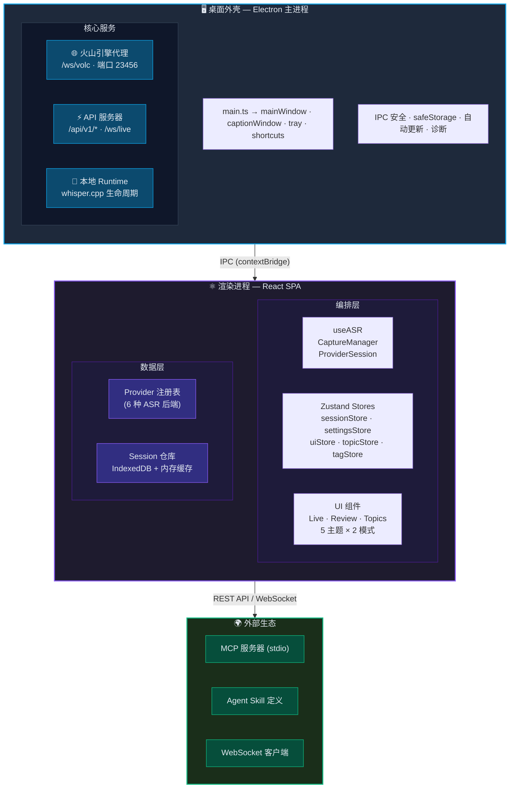
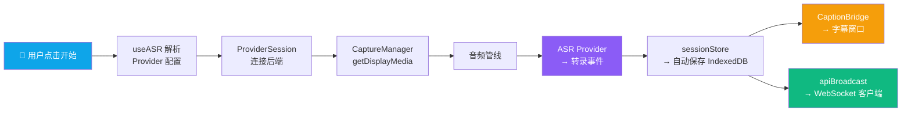
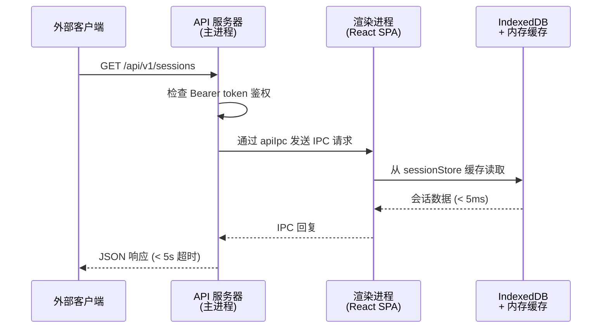
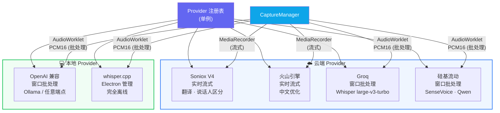

# 系统概览

DeLive 是一个 Electron 桌面应用，在 **主进程**（Node.js 运行时）和 **渲染进程**（Chromium 浏览器上下文）之间有清晰的分离。

## 架构图

## 录制数据流

## API 请求流程

## Provider 架构

## 关键架构决策

### Renderer 中的 IndexedDB

所有会话数据存储在渲染进程的 IndexedDB 中，配合 `sessionRepository` 中的内存缓存。主进程无法直接访问 IndexedDB。当 API 服务器需要数据时，通过 IPC 请求渲染进程，后者从缓存响应（< 5ms 延迟）。

### 单一 HTTP 服务器

端口 23456 在一个 `http.createServer()` 上托管火山引擎 WebSocket 代理（`/ws/volc`）、REST API（`/api/v1/*`）和实时转录 WebSocket（`/ws/live`）。

### MCP 作为独立进程

MCP 服务器是独立的 Node.js 脚本，未嵌入 Electron。Claude Desktop 将其作为子进程启动，通过 REST API 与 DeLive 通信。这种设计意味着 DeLive 和 MCP 服务器可以独立崩溃。

### Provider 注册机制

六种 ASR 后端注册在单例 `ProviderRegistry` 中。每个 Provider 实现通用的 `ASRProvider` 契约，但使用不同的音频格式和传输方法。`CaptureManager` 根据 Provider 能力选择合适的音频管线。

## 模块映射

| 层 | 关键模块 |
|----|---------|
| 桌面外壳 | `main.ts`, `mainWindow.ts`, `captionWindow.ts`, `tray.ts`, `shortcuts.ts` |
| IPC | `appIpc.ts`, `captionIpc.ts`, `safeStorageIpc.ts`, `updaterIpc.ts`, `diagnosticsIpc.ts`, `apiIpc.ts`, `localRuntimeIpc.ts` |
| API | `apiServer.ts`, `apiBroadcast.ts` |
| 代理 | `volcProxy.ts`, `shared/volcProxyCore.ts` |
| 渲染应用 | `App.tsx`, `components/*`, `i18n/*` |
| 编排 | `useASR.ts`, `captureManager.ts`, `providerSession.ts`, `captionBridge.ts` |
| Provider | `registry.ts`, `base.ts`, `windowedBatch.ts`, `implementations/*` |
| 状态 | `sessionStore.ts`, `settingsStore.ts`, `uiStore.ts`, `topicStore.ts`, `tagStore.ts`, `transcriptStore.ts`（向后兼容 facade） |
| 持久化 | `sessionRepository.ts`, `sessionStorage.ts`, `settingsStorage.ts`, `backupStorage.ts` |
| 契约 | `shared/electronApi.ts`, `electron/preload.ts` |
